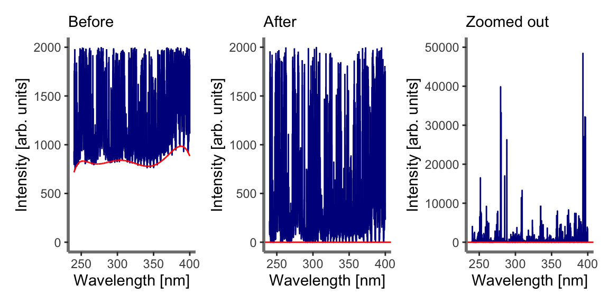

<!-- README.md is generated from README.Rmd. Please edit that file -->

# specProc

<!-- badges: start -->

[](https://lifecycle.r-lib.org/articles/stages.html#experimental)
<!-- badges: end -->

`specProc` package performs a number of pre-processing tasks commonly
used in laser-induced breakdown spectroscopy (LIBS). Collectively, these
are essential tools in LIBS calibration modeling, called chemometrics.
These include:

-   peak analysis
-   Spectral-based normalization
-   Smoothing and filtering
-   Robust Box-Cox and Yeo-Johnson transformation
-   Pearson or Spearman peaks correlation
-   Descriptive statistics such as mean, standard deviation and higher
    central moments
-   Statistical tests

## Installation

You can install the development version from
[GitHub](https://github.com/) with:

``` r
# install.packages("devtools")
devtools::install_github("ChristianGoueguel/specProc")
```

## Exemples

Loading `specProc` package.

``` r
library(specProc)
```

``` r
ssh = suppressPackageStartupMessages
ssh(library(tidyverse))
library(patchwork)
```

### Peak analysis

The package peak analysis capabilities include:

-   Baseline removal
-   Peaks detection
-   Fitting single, multiple or overlapping peaks

#### Baseline removal

When analyzing LIBS spectra, it is often more effective to subtract an
estimated baseline from the data. The estimate is constructed by fitting
a low-order polynomial function to the spectrum baseline. Then the
resulting curve fit result is subtracted from the data.

``` r
data(specData)
```

``` r
baseline_fit <- specData %>% 
  slice(1L) %>% 
  baselinerm(degree = 7)
```

``` r
str(baseline_fit, list.len = 5) 
#> List of 2
#>  $ spec: tibble [1 × 15,036] (S3: tbl_df/tbl/data.frame)
#>   ..$ 240.00205 : num 155
#>   ..$ 240.010279: num 172
#>   ..$ 240.018507: num 198
#>   ..$ 240.026736: num 213
#>   ..$ 240.034965: num 201
#>   .. [list output truncated]
#>  $ bkg : tibble [1 × 15,036] (S3: tbl_df/tbl/data.frame)
#>   ..$ 240.00205 : num 717
#>   ..$ 240.010279: num 717
#>   ..$ 240.018507: num 717
#>   ..$ 240.026736: num 717
#>   ..$ 240.034965: num 718
#>   .. [list output truncated]
```

``` r
background <- baseline_fit %>%
  pluck("bkg") %>%
  pivot_longer(cols = everything(), names_to = "wavelength", values_to = "intensity") %>%
  modify_at("wavelength", as.numeric)
```

Note: `plotSpec` is a `ggplot` based function available in this
`specProc` package to plot spectral data (see the documentation).

``` r
plot1 <- specData %>% 
  select(where(is.numeric)) %>%
  slice(1L) %>%
  plotSpec() +
  geom_line(data = background, aes(x = wavelength, y = intensity), colour = "red") +
  ylim(0, 2e3) +
  labs(subtitle = "Before")
```

``` r
plot2 <- baseline_fit %>%
  pluck("spec") %>% 
  select(where(is.numeric)) %>%
  slice(1L) %>%
  plotSpec() +
  ylim(0, 2e3) + 
  geom_hline(yintercept = 0, colour = "red") +
  labs(subtitle = "After")
```

``` r
plot1 | plot2 | plot2 + ylim(0, 50e3) + labs(subtitle = "Zoomed out")
```



#### Peaks detection

#### Peaks fitting

The idea of curve fitting is to find a mathematical model that fits your
data. We assume that you have theoretical reasons for picking a function
of a certain form. The curve fit finds the specific coefficients
(parameters) which make that function match your data as closely as
possible. For non-linear least-squares data fitting, Igor uses the
Levenberg-Marquardt algorithm to search for the minimum value of
chisquare. Chi-square defines a surface in a multidimensional error
space. The search process involves starting with an initial guess at the
coefficient values. Starting from the initial guesses, Igor searches for
the minimum value by travelling down hill from the starting point on the
chi-square surface.
