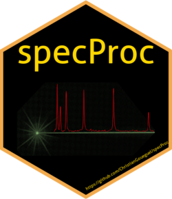
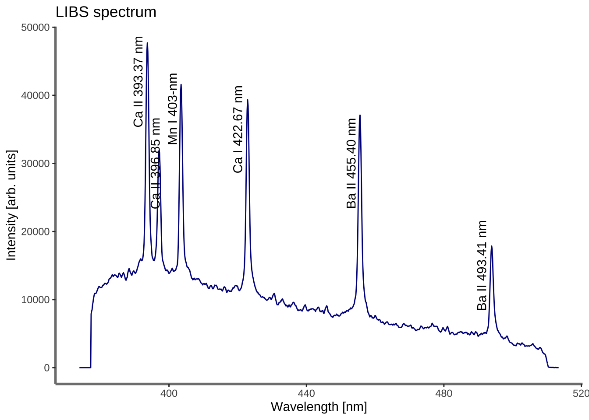
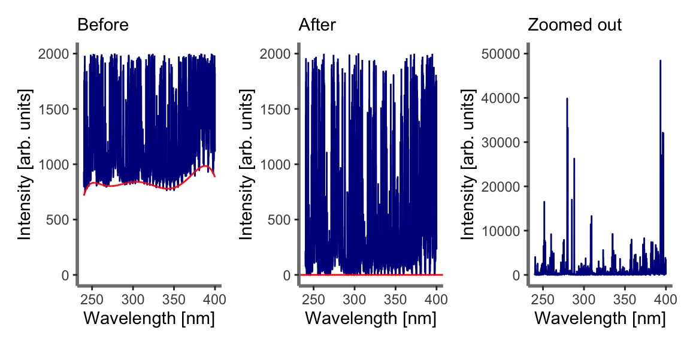

<!-- README.md is generated from README.Rmd. Please edit that file -->



# specProc

<!-- badges: start -->

[](https://lifecycle.r-lib.org/articles/stages.html#experimental)

<!-- badges: end -->

`specProc` package performs a number of pre-processing tasks commonly
used in laser-induced breakdown spectroscopy (LIBS). Collectively, these
are essential tools in LIBS calibration modeling. These include:

-   Baseline removal
-   Fitting single, multiple or overlapping peaks
-   Spectral-based normalization
-   Smoothing and filtering
-   Robust Box-Cox and Yeo-Johnson transformation
-   Pearson or Spearman peaks correlation
-   Descriptive statistics such as mean, standard deviation and higher
    central moments
-   Statistical tests

## Installation

You can install the development version from
[GitHub](https://github.com/) with:

``` r
# install.packages("devtools")
devtools::install_github("ChristianGoueguel/specProc")
```

## Exemples

Loading `specProc` package.

``` r
library(specProc)
```

``` r
ssh = suppressPackageStartupMessages
ssh(library(tidyverse))
ssh(library(magrittr))
library(patchwork)
```

### LIBS spectra in the 375–510 nm wavelength range

Prominent atomic and ionic emission lines of Mg, Ca, Ba and Mn were
identified using the NIST atomic lines database. The spectra show
emission lines from calcium, Ca II 393.37 nm, Ca II 396.85 nm and Ca I
422.67 nm, unresolved manganese triplet, Mn I 403.08 nm, Mn I 403.31 nm
and Mn I 403.45 nm, and barium ionic lines, Ba II 455.40 nm and Ba II
493.41 nm.

``` r
data("Ca_Mn_spec")
```

``` r
plot1 <- plotSpec(Ca_Mn_spec)
```

``` r
plot1 +
  annotate("text", x = 391, y = 4.2e4, angle = 90, label = "Ca II 393.37 nm") +
  annotate("text", x = 396, y = 3e4, angle = 90, label = "Ca II 396.85 nm") +
  annotate("text", x = 401, y = 3.8e4, angle = 90, label = "Mn I 403-nm") +
  annotate("text", x = 420, y = 3.5e4, angle = 90, label = "Ca I 422.67 nm") +
  annotate("text", x = 453, y = 3e4, angle = 90, label = "Ba II 455.40 nm") +
  annotate("text", x = 491, y = 1.5e4, angle = 90, label = "Ba II 493.41 nm") +
  ggtitle("LIBS spectrum")
```



Note: `plotSpec` is a `ggplot` based function available in the
`specProc` package to plot spectral data (see the documentation for more
details).

### Baseline removal

When analyzing LIBS spectra, it is often more effective to subtract an
estimated baseline from the data. The estimate is constructed by fitting
a low-order polynomial function to the spectrum baseline. Then the
resulting curve fit result is subtracted from the data.

``` r
baseline_fit <- Ca_Mn_spec %>%
  select(`390.03027`:`500.03397`) %>%
  baselinerm(degree = 7)
```

``` r
str(baseline_fit, list.len = 5) 
#> List of 2
#>  $ spec: tibble [1 × 808] (S3: tbl_df/tbl/data.frame)
#>   ..$ 390.03027: num 131
#>   ..$ 390.1666 : num 10.5
#>   ..$ 390.30292: num 0
#>   ..$ 390.43921: num 129
#>   ..$ 390.57553: num 197
#>   .. [list output truncated]
#>  $ bkg : tibble [1 × 808] (S3: tbl_df/tbl/data.frame)
#>   ..$ 390.03027: num 13831
#>   ..$ 390.1666 : num 13864
#>   ..$ 390.30292: num 13897
#>   ..$ 390.43921: num 13927
#>   ..$ 390.57553: num 13957
#>   .. [list output truncated]
```

``` r
background <- baseline_fit %>%
  pluck("bkg") %>%
  pivot_longer(
    cols = everything(), 
    names_to = "wavelength", 
    values_to = "intensity"
    ) %>%
  modify_at("wavelength", as.numeric)
```

``` r
plot2 <- Ca_Mn_spec %>%
  plotSpec() +
  geom_line(data = background, aes(x = wavelength, y = intensity), colour = "red")

plot3 <- baseline_fit %>%
  pluck("spec") %>% 
  plotSpec() +
  geom_hline(yintercept = 0, colour = "red")
```

``` r
plot2 | plot3
```



### Peaks fitting

Fitting of laser-induced breakdown spectroscopy (LIBS) spectral lines is
very important for accurate quantitative analysis. As such, the
Gaussian, Lorentzian and Voigt profile functions are often used to fit
the spectral lines. The idea of curve fitting is to find a mathematical
model that fits your data. It is assumed that you have theoretical or
experimental reasons for picking a function of a certain profile. The
`peakfit` function finds the specific parameters which make that
function match your data as closely as possible.

`peakfit` is based on the `minpack.lm::nlsLM` function that uses the
Levenberg-Marquardt algorithm for searching the minimum value of the
square of the sum of the residuals. The search process involves starting
with an initial guess at the parameters values.
