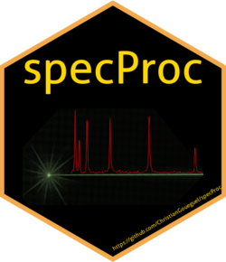
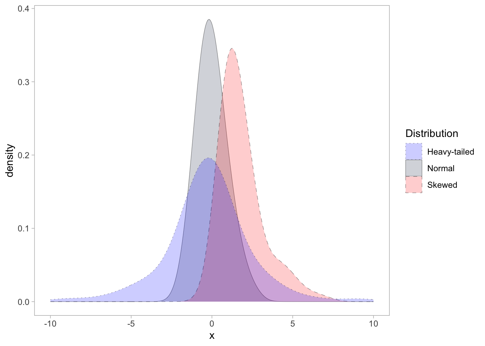
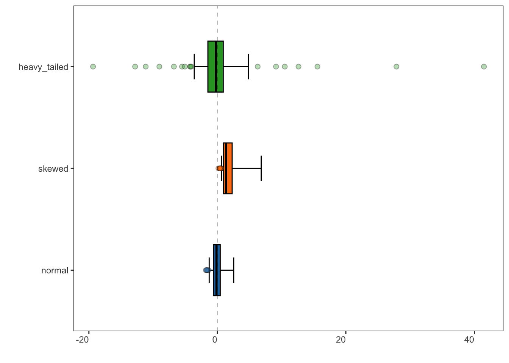
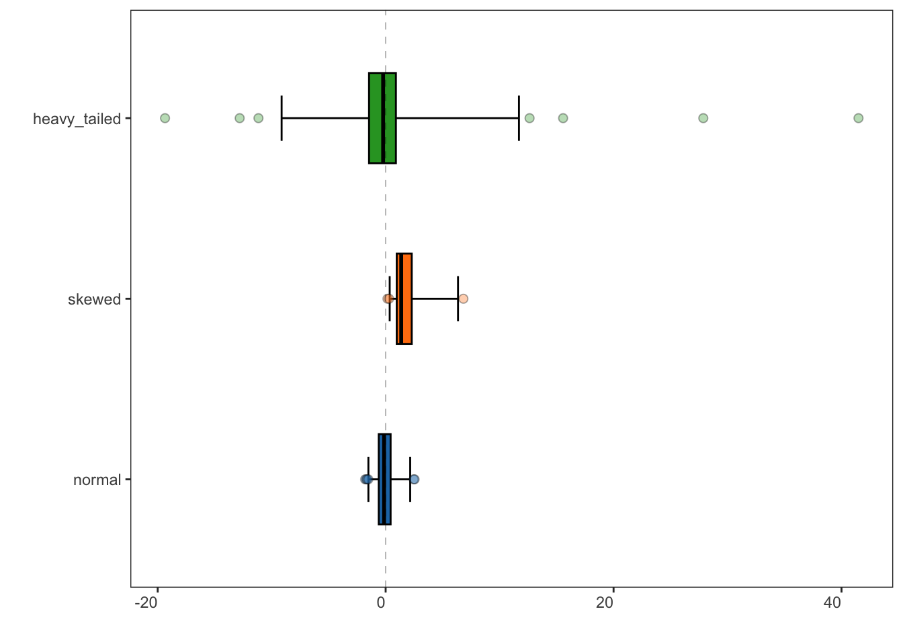
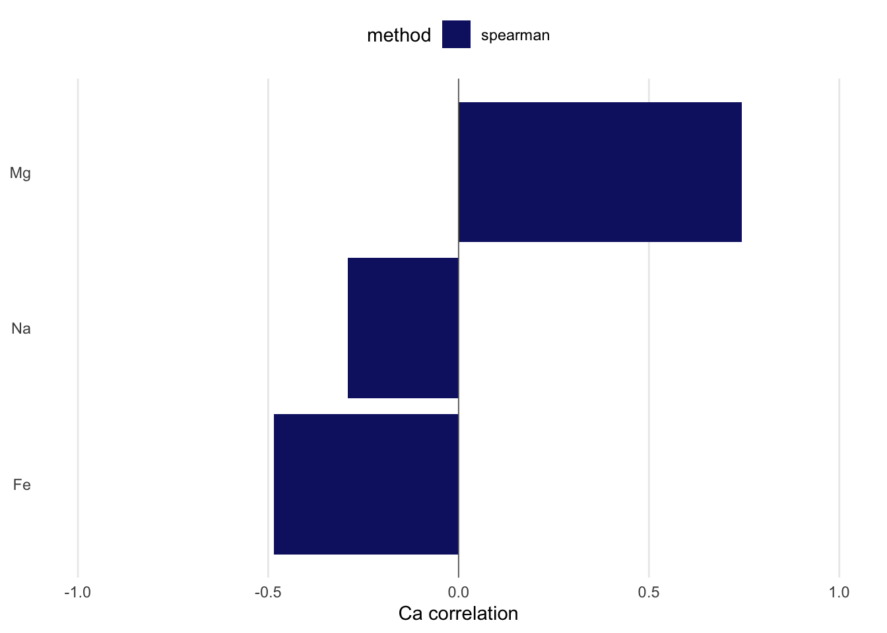
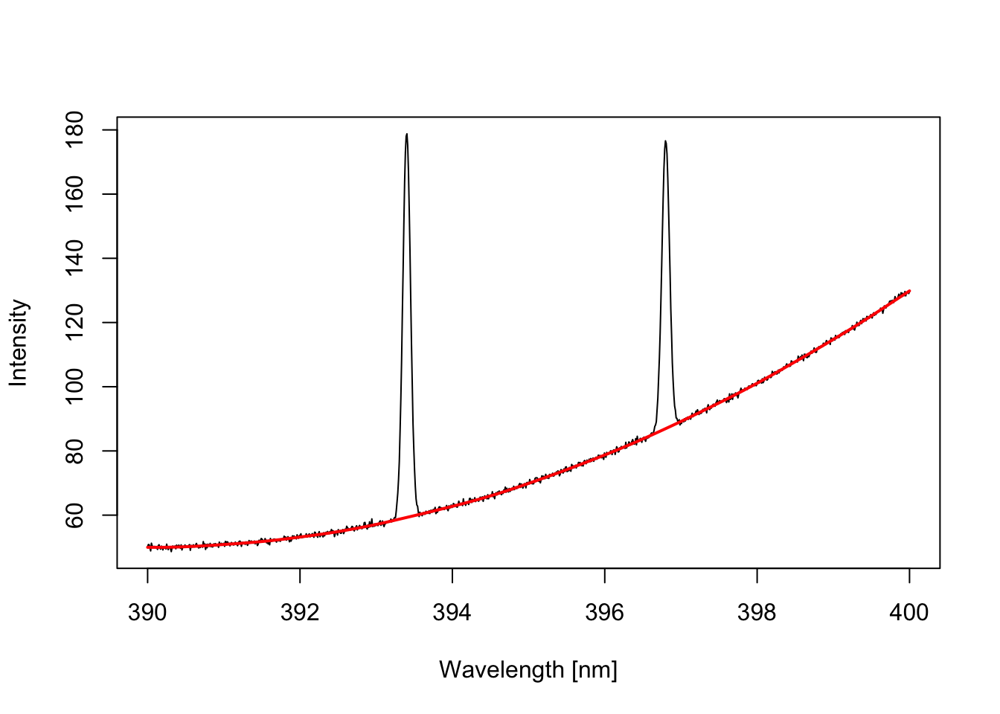
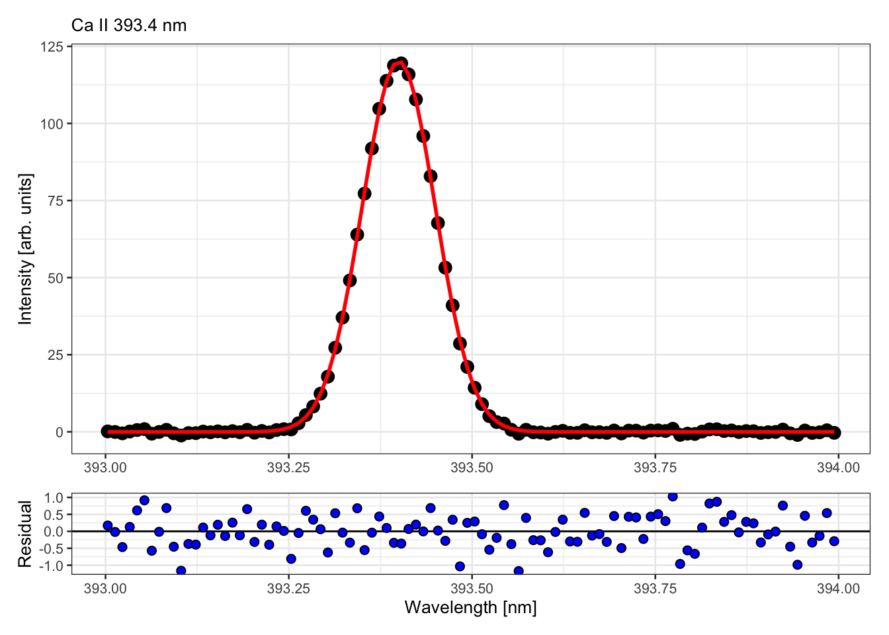

<!-- README.md is generated from README.Rmd. Please edit that file -->

<!-- badges: start -->

# specProc 

[](https://www.repostatus.org/#active)
[](https://lifecycle.r-lib.org/articles/stages.html#experimental)
[](https://opensource.org/licenses/MIT)
[](https://app.codecov.io/gh/ChristianGoueguel/specProc?branch=main)
[](https://github.com/ChristianGoueguel/specProc/actions/workflows/R-CMD-check.yaml)


<!-- badges: end -->

**Testing and experimenting.**

The `specProc` package performs a wide range of preprocessing tasks
essential for spectroscopic data analysis. Spectral preprocessing is
essential in ensuring accurate and reliable results by minimizing the
impact of various distortions and artifacts that can arise during data
acquisition or due to inherent characteristics of the sample or
instrument.

Some techniques are purely based on mathematical concepts, relying on
robust statistics and signal processing techniques. Other methods are
inspired by the physicochemical context of the dataset. These techniques
rely on domain knowledge and exploit the fundamental principles
governing the spectroscopic phenomenon used.

## Installation

You can install the development version from
[GitHub](https://github.com/) with:

``` r
install.packages("devtools")
devtools::install_github("ChristianGoueguel/specProc")
```

## Examples

``` r
set.seed(02301)
tbl <- data.frame(
  normal = stats::rnorm(100),
  skewed = stats::rgamma(100, shape = 2, scale = 1),
  heavy_tailed = stats::rcauchy(100, location = 0, scale = 1)
  )
```



### descriptive statistics

#### classical approach

``` r
specProc::summary_stats(tbl)
#> # A tibble: 3 × 14
#>   variable    mean  mode median   IQR    sd variance      cv     min   max range
#>   <chr>      <dbl> <dbl>  <dbl> <dbl> <dbl>    <dbl>   <dbl>   <dbl> <dbl> <dbl>
#> 1 normal      0    -0.4   -0.14  1.04  0.91     0.82 -2.66e4  -1.80   2.54  4.34
#> 2 skewed      1.83  6.82   1.37  1.32  1.32     1.73  7.20e1   0.160  6.82  6.66
#> 3 heavy_tai…  0.44 -1.74  -0.22  2.36  6.54    42.7   1.50e3 -19.4   41.5  60.9 
#> # ℹ 3 more variables: skewness <dbl>, kurtosis <dbl>, count <int>
```

#### robust approach

``` r
specProc::summary_stats(tbl, robust = TRUE)
#> # A tibble: 3 × 13
#>   variable    median   mad    Qn    Sn medcouple   LMC   RMC biloc biscale bivar
#>   <chr>        <dbl> <dbl> <dbl> <dbl>     <dbl> <dbl> <dbl> <dbl>   <dbl> <dbl>
#> 1 normal       -0.14  0.82  0.92  0.93      0.19  0.29  0.55 -0.07    0.91  0.82
#> 2 skewed        1.37  0.95  0.91  0.85      0.46  0.2   0.43  1.47    1.04  1.07
#> 3 heavy_tail…  -0.22  1.74  2.2   2.03      0.1   0.35  0.63 -0.2     2.08  4.31
#> # ℹ 2 more variables: rcv <dbl>, count <int>
```

### adjusted boxplot

``` r
specProc::adjusted_boxplot(tbl, xlabels.angle = 0) +
  ggplot2::geom_hline(yintercept = 0, linetype = "dashed", linewidth = 0.1) +
  ggplot2::coord_flip()
```



### generalized boxplot

``` r
specProc::generalized_boxplot(tbl, xlabels.angle = 0) +
  ggplot2::geom_hline(yintercept = 0, linetype = "dashed", linewidth = 0.1) +
  ggplot2::coord_flip()
```



### correlation

``` r
set.seed(1)
df <- data.frame(Ca = stats::rnorm(50))
df$Mg <- 0.8 * df$Ca + stats::rnorm(50, sd = 0.5)
df$Fe <- -0.5 * df$Ca + stats::rnorm(50, sd = 0.8)
df$Na <- stats::rnorm(50)
res <- specProc::correlation(df, Ca, method = "spearman", plot = TRUE)
res$correlation
#> # A tibble: 3 × 3
#>   variable .correlation method  
#>   <chr>           <dbl> <chr>   
#> 1 Mg              0.745 spearman
#> 2 Na             -0.291 spearman
#> 3 Fe             -0.485 spearman
res$plot
```



### baseline correction

``` r
wl <- seq(390, 400, length.out = 1000)
spectrum <- 50 + 0.8 * (wl - 390)^2 +
  120 * exp(-(wl - 393.4)^2 / 0.005) + 90 * exp(-(wl - 396.8)^2 / 0.005) +
  stats::rnorm(1000, sd = 0.5)
fit <- specProc::baseline_arpls(matrix(spectrum, nrow = 1), lambda = 1e5)

plot(wl, spectrum, type = "l", xlab = "Wavelength [nm]", ylab = "Intensity")
lines(wl, unlist(fit$background), col = "red", lwd = 2)
```



### peak fitting

``` r
window <- wl >= 393 & wl <= 394
lines_df <- as.data.frame(t(unlist(fit$correction)[window]))
names(lines_df) <- wl[window]
ca_line <- specProc::peak_fit(lines_df, profile = "voigt")
ca_line$tidied[[1]]
#> # A tibble: 5 × 5
#>   term    estimate std.error    statistic   p.value
#>   <chr>      <dbl>     <dbl>        <dbl>     <dbl>
#> 1 y0     -0.0417   0.0859         -0.485  6.29e-  1
#> 2 xc    393.       0.0000964 4081245.     0        
#> 3 wG      0.118    0.000903      130.     6.56e-109
#> 4 wL      0.000100 0.00140         0.0714 9.43e-  1
#> 5 A      15.1      0.0885        170.     6.94e-120
specProc::plot_fit(ca_line, title = "Ca II 393.4 nm")
```


