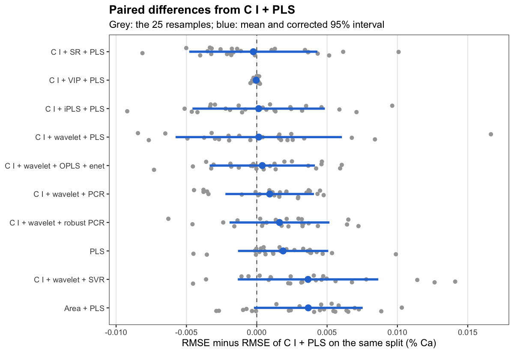

<!-- README.md is generated from README.Rmd. Please edit that file -->

# specProc 

<!-- badges: start -->

[](https://www.repostatus.org/#active)
[](https://lifecycle.r-lib.org/articles/stages.html#stable)
[](https://github.com/ChristianGoueguel/specProc/actions/workflows/R-CMD-check.yaml)
[](https://app.codecov.io/gh/ChristianGoueguel/specProc?branch=main)
[](https://opensource.org/licenses/MIT)

<!-- badges: end -->

**specProc** processes and analyzes emission spectra, streamlining the
pipeline from raw spectra to calibrated concentrations. While
specifically developed for laser-induced breakdown spectroscopy (LIBS),
it seamlessly supports other plasma techniques such as ICP-OES. Select
functions can also be used to process Raman and infrared
spectroscopy data. The package structures data with one spectrum per row
and wavelengths as column names, leveraging a C++ backend to power heavy
computations.

## Installation

``` r
# install.packages("remotes")
remotes::install_github("ChristianGoueguel/specProc", build_vignettes = TRUE)
```

A C++ compiler is needed to build the package from source (Rtools on
Windows, Xcode Command Line Tools on macOS).

## A LIBS workflow

The vignettes follow a typical LIBS analysis, on the `forageLIBS`
spectra of forage samples:

1.  **Fitting emission lines** (`vignette("peak-fitting")`): line
    identification, wavelength calibration, line profiles and
    overlapping lines.
2.  **Preprocessing with recipe steps** (`vignette("preprocessing")`):
    baseline correction, normalization and other `step_*()` functions,
    in a tidymodels workflow.
3.  **Calibration curves and figures of merit**
    (`vignette("calibration")`): univariate curves, limits of detection
    and quantification, and the net analyte signal of multivariate
    models.
4.  **Plasma diagnostics** (`vignette("plasma-diagnostics")`): electron
    density, temperature, LTE, self-absorption and calibration-free
    LIBS.

They are also available as [articles on the package
website](https://christiangoueguel.com/specProc/articles/).

## Function overview

| Task | Functions |
|----|----|
| Line identification | `libs_lines()`, `plot_lines()`, `line_finder()` (Shiny app), `wavelength_calibration()`, `apply_calibration()` |
| Line fitting | `peak_fit()`, `multipeak_fit()`, `plot_fit()`, `line_intensities()`, `voigt_profile()`, `pseudo_voigt_profile()`, `gaussian_profile()`, `lorentzian_profile()`, `voigt_fwhm()` |
| Preprocessing | `baseline_arpls()`, `baseline_als()`, `baseline_lsp()`, `snv()`, `msc()`, `emsc()`, `normalize()`, `savitzky_golay()`, `wavelet_features()`, `reject_shots()`, `average()` |
| Recipe steps | `step_baseline()`, `step_snv()`, `step_msc()`, `step_emsc()`, `step_spectral_norm()`, `step_line_ratio()`, `step_savgol()`, `step_wavelet()`, `step_line_intensities()`, `step_reject_shots()`, `step_opls()`, `step_o2pls()`, `step_epo()`, `step_glsw()`, and more |
| Orthogonalization | `osc()`, `direct_osc()`, `projected_osc()`, `opls()`, `o2pls()`, `epo()`, `glsw()`, `y_gradient_glsw()` |
| Calibration | `calibration_curve()`, `plot_calibration()`, `nas()`, `pds()` |
| Wavelength selection and robust calibration | `select_wavelengths()`, `plot_wavelength_selection()`, `step_select_wavelengths()`, `rsimpls()`, `step_rsimpls()`, `rpcr()`, `robust_rmsecv()`, the `"rsimpls"` engine of `parsnip::pls()` and `"lts"` engine of `parsnip::linear_reg()` |
| Robust classification | `rsimca()`, `plot_coomans()`, `robust_da()`, the `simca()` parsnip model, the `"mcd"` engines of `parsnip::discrim_linear()` and `parsnip::discrim_quad()` |
| Plasma diagnostics | `saturation_summary()`, `electron_density()`, `boltzmann()`, `saha_boltzmann()`, `plot_boltzmann()`, `mcwhirter_criterion()`, `self_absorption()`, `correct_self_absorption()`, `cf_libs()`, `nist_lines()`, `starkb_lines()` |
| Outliers and robust PCA | `robpca()`, `rospca()`, `macropca()`, `cellpca()`, `plot_outlier_map()`, `plot_cell_map()`, `q_residuals()`, `dmodx()`, `plot_influence()`, `hotelling_t2()` |
| Robust statistics | `summary_stats()`, `biweight_location()`, `biweight_scale()`, `rousseeuw_croux()`, `umad()`, `adjusted_boxplot()`, `robust_bcyj()` |
| Visualization | `plot_spectra()`, `plot_embedding()`, `plot_loadings()`, `plot_contributions()` |

See the [reference](https://christiangoueguel.com/specProc/reference/)
for the full list.

## Example: Comparing preprocessing pipelines

Which preprocessing and which model suit a LIBS calibration is an
empirical question. Since every specProc step is a recipe step,
candidate pipelines can be compared on an equal footing: each recipe is
re-estimated in every resample, together with the model. Here we predict
calcium from all 368 `forageLIBS` spectra. Calcium has strong lines in
these spectra (Ca II 393.37 and 396.85 nm, Ca I 422.67 nm), a laboratory
value for every sample, and a calibration error that reaches its minimum
within a few components, so the trade-offs are easy to see.

``` r
data("forageLIBS")
spectra_id <- c("Measurement", "Sample")
minerals <- names(forageLIBS)[3:14]
```

``` r
per_spectrum <- \(data, step, ...) {
  recipe(~ ., data = data) |>
    update_role(all_of(c(spectra_id, minerals)), new_role = "id") |>
    step(all_predictors(), ...) |>
    prep() |>
    bake(new_data = NULL)
}
```

``` r
corrected <- per_spectrum(forageLIBS, step_baseline, lambda = 1e5, options = list(max.iter = 20))
area <- per_spectrum(corrected, step_spectral_norm, method = "area")
carbon <- per_spectrum(corrected, step_line_ratio, reference = 247.856, window = 0.15)
compressed <- per_spectrum(carbon, step_wavelet, level = 3)
```

``` r
ca_recipe <- \(data) {
  recipe(Ca ~ ., data = data) |>
    update_role(all_of(spectra_id), all_of(setdiff(minerals, "Ca")), new_role = "id")
  }
```

The baseline is removed in every pipeline. The steps estimated from the
training data (principal components, orthogonal filter, selected
wavelengths) and the model parameters are tuned together. Wavelength
selection (`step_select_wavelengths()`) keeps the channels with the
largest variable importance in projection (VIP) or selectivity ratio
(SR) in a PLS model, or, with interval PLS (iPLS), the contiguous
intervals (out of 40) that lower the cross-validated error of a PLS
model; the number of channels or intervals is tuned with the components:

``` r
# mixOmics scales every predictor by default; scale = FALSE only centers
pls_model <- pls(num_comp = tune()) |> set_mode("regression") |> set_engine("mixOmics", scale = FALSE)
pcr_model <- linear_reg() |> set_engine("lm")
enet_model <- linear_reg(penalty = tune(), mixture = tune()) |> set_engine("glmnet")
svr_model <- svm_rbf(cost = tune(), rbf_sigma = tune()) |> set_mode("regression") |> set_engine("kernlab")
```

``` r
components <- tibble(num_comp = 1:20)

pipelines <- list(
  "PLS" = list(ca_recipe(corrected), pls_model, components),
  "Area + PLS" = list(ca_recipe(area), pls_model, components),
  "C I + PLS" = list(ca_recipe(carbon), pls_model, components),
  "C I + iPLS + PLS" = list(ca_recipe(carbon) |> step_select_wavelengths(all_predictors(), method = "ipls", num_intervals = tune(), num_comp = 10), pls_model, expand_grid(components, num_intervals = c(2L, 4L, 6L, 8L))),
  "C I + VIP + PLS" = list(ca_recipe(carbon) |> step_select_wavelengths(all_predictors(), method = "vip", num_terms = tune()), pls_model, expand_grid(components, num_terms = c(100L, 300L, 1000L, 3000L))),
  "C I + SR + PLS" = list(ca_recipe(carbon) |> step_select_wavelengths(all_predictors(), method = "sr", num_terms = tune()), pls_model, expand_grid(components, num_terms = c(100L, 300L, 1000L, 3000L))),
  "C I + wavelet + PLS" = list(ca_recipe(compressed), pls_model, components),
  "C I + wavelet + PCR" = list(ca_recipe(compressed) |> step_center(all_predictors()) |> step_pca(all_predictors(), num_comp = tune()), pcr_model, components),
  "C I + wavelet + robust PCR" = list(ca_recipe(compressed) |> step_robpca(all_predictors(), num_comp = tune(), options = list(kmax = 20)), pcr_model, components),
  "C I + wavelet + OPLS + enet" = list(ca_recipe(compressed) |> step_opls(all_predictors(), num_comp = tune()), enet_model, expand_grid(num_comp = 1:4, penalty = 10^seq(-4, -1, by = 0.5), mixture = c(0.1, 0.5, 1))),
  "C I + wavelet + SVR" = list(ca_recipe(compressed), svr_model,expand_grid(cost = 2^seq(0, 8, by = 2), rbf_sigma = 10^seq(-4.5, -2.5, by = 0.5)))
  )
```

Each pipeline is cross-validated in five repeats of a 5-fold split that
keeps the spectra of a sample in the same fold. The 25 resamples are
spread over parallel workers with the
[future](https://future.futureverse.org) package; tune gives each
resample the same random numbers in parallel as in sequence, so the
results do not depend on the number of workers:

``` r
cv_folds <- \(data) {
  set.seed(2026)
  group_vfold_cv(data, group = Sample, v = 5, repeats = 5)
  }
```

``` r
future::plan("multisession", workers = parallelly::availableCores(omit = 1))
results <- map(pipelines, \(p) {
  rec <- p[[1]]
  tune_grid(
    workflow(rec, p[[2]]), 
    resamples = cv_folds(rec$template), 
    grid = p[[3]],
    metrics = metric_set(rmse, rsq), 
    control = control_grid(save_pred = TRUE)
    )
  })
future::plan("sequential")
```

The cross-validated RMSE of the component-based pipelines as a function
of the number of components: on the left, the normalizations; in the
middle, the models of the wavelet coefficients, with the best elastic
net and SVR models (on the same coefficients) as references; on the
right, the wavelength selections, each with its best number of channels
or intervals, and PLS on all the channels (grey) as reference:


All pipelines are evaluated on the same 25 splits, so they can be
compared split by split, here with C I + PLS. Since the resamples
overlap, the standard error of the mean difference is inflated as in the
corrected repeated k-fold test ([Nadeau and Bengio,
2003](https://doi.org/10.1023/A:1024068626366); [Bouckaert and Frank,
2004](https://doi.org/10.1007/978-3-540-24775-3_3)):



Contrasts between preprocessing steps and models:

| Contrast | Mean difference (% Ca) | Splits where the first is better | p (corrected) |
|:---|---:|:---|---:|
| C I + PLS vs PLS | -0.0019 | 20 / 25 | 0.24 |
| Area + PLS vs PLS | 0.0018 | 8 / 25 | 0.40 |
| C I + iPLS + PLS vs C I + PLS | 0.0001 | 12 / 25 | 0.95 |
| C I + VIP + PLS vs C I + PLS | 0.0000 | 16 / 25 | 0.67 |
| C I + SR + PLS vs C I + PLS | -0.0002 | 16 / 25 | 0.91 |
| C I + wavelet + PLS vs C I + PLS | 0.0001 | 12 / 25 | 0.96 |
| C I + wavelet + SVR vs C I + wavelet + PLS | 0.0035 | 5 / 25 | 0.36 |

## Citation

If you use specProc in a publication, please cite it. In R,
`citation("specProc")` gives the reference of the installed version:

> Goueguel, C. L. (2026). *specProc: Preprocessing Tools for Laser-Induced
> Breakdown Spectroscopy*. R package version 0.8.3.
> <https://github.com/ChristianGoueguel/specProc>

A BibTeX entry for LaTeX users:

``` bibtex
@Manual{specProc,
  title  = {{specProc}: Preprocessing Tools for Laser-Induced Breakdown Spectroscopy},
  author = {Christian L. Goueguel},
  year   = {2026},
  note   = {R package version 0.8.3},
  url    = {https://github.com/ChristianGoueguel/specProc},
}
```

Replace the version and year with those of the version you used
(`packageVersion("specProc")`). Please also cite the original papers of the
methods you use, listed in the References section of their help pages (for
example, `?robpca` or `?rsimpls`).

## License

MIT © Christian L. Goueguel
