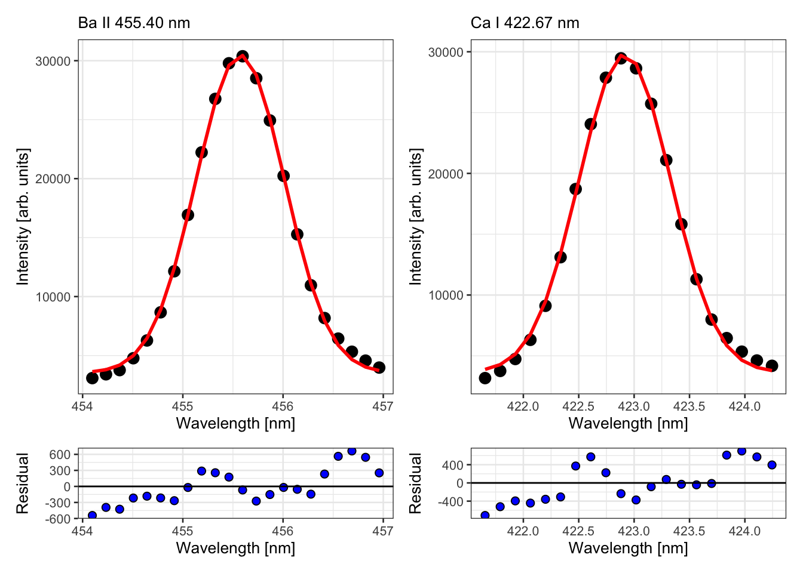

<!-- README.md is generated from README.Rmd. Please edit that file -->


# specProc

<!-- badges: start -->

[](https://lifecycle.r-lib.org/articles/stages.html#experimental)
[](https://CRAN.R-project.org/package=specProc)
<!-- badges: end -->

**Pre-release for feedback and experimenting.**

`specProc` package performs a number of pre-processing tasks commonly
used in laser-induced breakdown spectroscopy (LIBS). Collectively, these
are essential tools in LIBS calibration modeling. These include:

-   Baseline removal
-   Fitting single, multiple or overlapping peaks
-   Spectral-based normalization
-   Robust Box-Cox and Yeo-Johnson transformation
-   Pearson or Spearman peaks correlation
-   Descriptive statistics such as mean, standard deviation and higher
    central moments

## Installation

You can install the development version from
[GitHub](https://github.com/) with:

``` r
# install.packages("remotes")
remotes::install_github("ChristianGoueguel/specProc")
```

## Exemples

Loading `specProc` package.

``` r
library(specProc)
```

### LIBS spectrum in the 375–510 nm wavelength range

The plot below shows a typical LIBS spectrum. Prominent atomic and ionic
emission lines of Ca, Mn and Ba were identified using the [NIST spectral
lines database](https://www.nist.gov/pml/atomic-spectra-database). The
spectrum show emission lines of Ca II 393.37 nm, Ca II 396.85 nm and Ca
I 422.67 nm, unresolved Mn triplet at 403.08, 403.31 and 403.45 nm, and
Ba ionic lines at 455.40 and 493.41 nm.


### Baseline removal

When analyzing LIBS spectra, it is often more effective to subtract an
estimated baseline from the data. The estimate is constructed by fitting
a low-order polynomial function to the spectrum baseline. Then the
resulting curve fit is subtracted from the data. Here we use the
function `baselinerm` to perform such a task.

``` r
baseline_fit <- Ca_Mn_spec %>%
  select(`390.03027`:`500.03397`) %>%
  baselinerm(degree = 7)
```

As one can see, the `baselinerm` function provides a list containing two
data frames, one for the baseline-subtracted spectrum or spectra `spec`
and the other for the fitted baseline `bkg`.

``` r
str(baseline_fit, list.len = 5) 
#> List of 2
#>  $ spec: tibble [1 x 808] (S3: tbl_df/tbl/data.frame)
#>   ..$ 390.03027: num 131
#>   ..$ 390.1666 : num 10.5
#>   ..$ 390.30292: num 0
#>   ..$ 390.43921: num 129
#>   ..$ 390.57553: num 197
#>   .. [list output truncated]
#>  $ bkg : tibble [1 x 808] (S3: tbl_df/tbl/data.frame)
#>   ..$ 390.03027: num 13831
#>   ..$ 390.1666 : num 13864
#>   ..$ 390.30292: num 13897
#>   ..$ 390.43921: num 13927
#>   ..$ 390.57553: num 13957
#>   .. [list output truncated]
```

We can then extract each data frame from the list using the
`purrr::pluck` function.

``` r
background <- baseline_fit %>% pluck("bkg")
corrected_spec <- baseline_fit %>% pluck("spec")
```


### Peaks fitting

Fitting of laser-induced breakdown spectroscopy (LIBS) spectral lines is
very important for accurate quantitative analysis. As such, the
Gaussian, Lorentzian and Voigt profile functions are often used to fit
these spectral lines. The idea of curve fitting is to find a
mathematical model that fits the spectral lines. It is assumed that you
have theoretical or experimental reasons for picking a function of a
certain profile. The `peakfit` function finds the specific parameters
which make that function match your data as closely as possible.

`peakfit` is based on the `minpack.lm::nlsLM` function that uses the
Levenberg-Marquardt algorithm for searching the minimum value of the
square of the sum of the residuals. The search process involves starting
with an initial guess at the parameters values.

``` r
Ba455_fit %>% pluck("augmented")
#> [[1]]
#> # A tibble: 23 x 4
#>        x      y .fitted .resid
#>    <dbl>  <dbl>   <dbl>  <dbl>
#>  1  454.  9987.  10357. -370. 
#>  2  454. 10297.  10533. -236. 
#>  3  454. 10639.  10931. -292. 
#>  4  455. 11635.  11745. -111. 
#>  5  455. 13128.  13239. -111. 
#>  6  455. 15503.  15685. -182. 
#>  7  455. 18972.  19242. -270. 
#>  8  455. 23734.  23784.  -50.0
#>  9  455. 29026.  28779.  247. 
#> 10  455. 33550.  33326.  224. 
#> # ... with 13 more rows
```

``` r
Ba455_fit %>% pluck("tidied")
#> [[1]]
#> # A tibble: 4 x 5
#>   term   estimate std.error statistic  p.value
#>   <chr>     <dbl>     <dbl>     <dbl>    <dbl>
#> 1 y0    10251.    122.           83.8 7.14e-26
#> 2 xc      456.      0.00286  159126.  3.73e-88
#> 3 wG        0.886   0.00802     110.  3.80e-28
#> 4 A     29964.    332.           90.1 1.79e-26
```

``` r
plot3 <- Ba455_fit %>%
  pluck("augmented") %>%
  as.data.frame() %>%
  ggplot() +
  geom_point(aes(x = x, y = y), size = 3, colour = "black", shape = 21) +
  geom_line(aes(x = x, y = .fitted), size = 1, colour = "red", linetype = "solid") +
  labs(x = "Wavelength [nm]", y = "Intensity [arb. units]") +
  theme_bw(base_size = 10)

plot4 <- Ba455_fit %>%
  pluck("augmented") %>%
  as.data.frame() %>%
  ggplot(aes(x = x, y = .resid)) + 
  geom_point(shape = 21, size = 2, fill = "blue") +
  geom_hline(yintercept = 0) +
  labs(x = "Wavelength [nm]", y = "Residual") +
  theme_bw(base_size = 10)
```

``` r
(plot3 / plot4) + plot_layout(ncol = 1, heights = c(5, 1))
```


