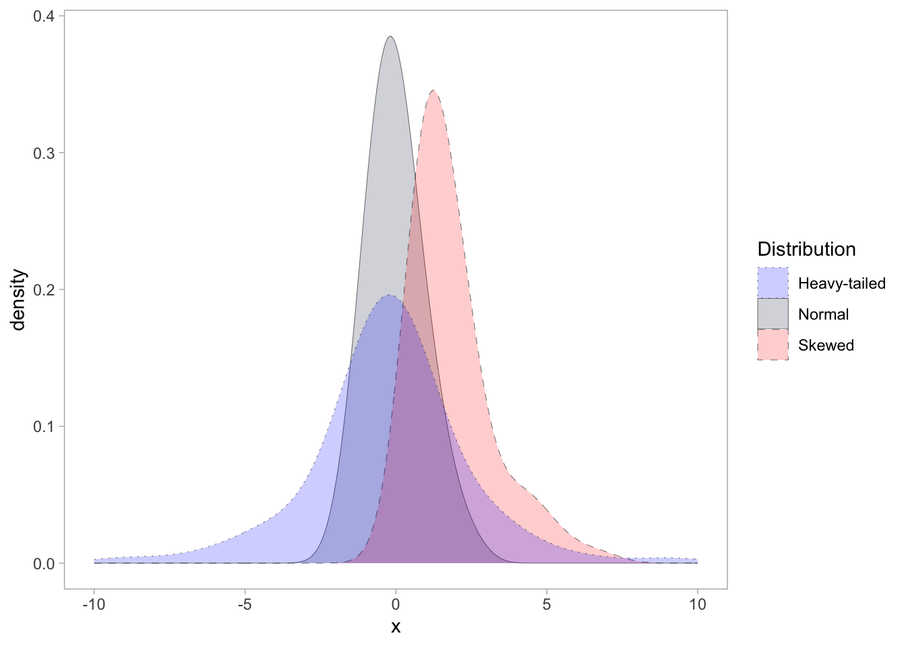

<!-- README.md is generated from README.Rmd. Please edit that file -->
<!-- badges: start -->

# specProc 

[](https://www.repostatus.org/#active)
[](https://lifecycle.r-lib.org/articles/stages.html#experimental)
[](https://opensource.org/licenses/MIT)
[](https://app.codecov.io/gh/ChristianGoueguel/specProc?branch=main)
[](https://github.com/ChristianGoueguel/specProc/actions/workflows/R-CMD-check.yaml)


<!-- badges: end -->

**Testing and experimenting.**

The `specProc` package performs a wide range of preprocessing tasks
essential for spectroscopic data analysis. Spectral preprocessing is
essential in ensuring accurate and reliable results by minimizing the
impact of various distortions and artifacts that can arise during data
acquisition or due to inherent characteristics of the sample or
instrument.

Some techniques are purely based on mathematical concepts, relying on
robust statistics and signal processing techniques. Other methods are
inspired by the physicochemical context of the dataset. These techniques
rely on domain knowledge and exploit the fundamental principles
governing the spectroscopic phenomenon used.

## Installation

You can install the development version from
[GitHub](https://github.com/) with:

``` r
install.packages("devtools")
devtools::install_github("ChristianGoueguel/specProc")
```

## Examples

``` r
set.seed(02301)
tbl <- data.frame(
  normal = stats::rnorm(100),
  skewed = stats::rgamma(100, shape = 2, scale = 1),
  heavy_tailed = stats::rcauchy(100, location = 0, scale = 1)
  )
```



### descriptive statistics

#### classical approach

``` r
specProc::summaryStats(tbl)
#> # A tibble: 3 × 14
#>   variable     mean  mode median   IQR    sd variance     cv     min   max range
#>   <chr>       <dbl> <dbl>  <dbl> <dbl> <dbl>    <dbl>  <dbl>   <dbl> <dbl> <dbl>
#> 1 heavy_tail…  0.44 -1.74  -0.22  2.36  6.54   42.7   1486.  -19.4   41.5  60.9 
#> 2 normal       0    -0.4   -0.14  1.04  0.91    0.823 -Inf    -1.80   2.54  4.34
#> 3 skewed       1.83  6.82   1.37  1.32  1.32    1.73    72.1   0.160  6.82  6.66
#> # ℹ 3 more variables: skewness <dbl>, kurtosis <dbl>, count <int>
```

#### robust approach

``` r
specProc::summaryStats(tbl, robust = TRUE)
#> # A tibble: 3 × 14
#>   variable    median   mad    Qn    Sn medcouple   LMC   RMC   rsd biloc biscale
#>   <chr>        <dbl> <dbl> <dbl> <dbl>     <dbl> <dbl> <dbl> <dbl> <dbl>   <dbl>
#> 1 heavy_tail…  -0.22  1.74  2.2   2.03      0.1   0.35  0.63  2.58 -0.22    2.4 
#> 2 normal       -0.14  0.82  0.92  0.93      0.19  0.29  0.55  1.22 -0.05    0.92
#> 3 skewed        1.37  0.95  0.91  0.85      0.46  0.2   0.43  1.41  1.58    1.18
#> # ℹ 3 more variables: bivar <dbl>, rcv <dbl>, count <int>
```

### adjusted boxplot

``` r
specProc::adjusted_boxplot(tbl, xlabels.angle = 0) +
  ggplot2::geom_hline(yintercept = 0, linetype = "dashed", linewidth = 0.1) +
  ggplot2::coord_flip()
```


### generalized boxplot

``` r
specProc::generalized_boxplot(tbl, xlabels.angle = 0) +
  ggplot2::geom_hline(yintercept = 0, linetype = "dashed", linewidth = 0.1) +
  ggplot2::coord_flip()
```


### correlation

``` r
data("glass", package = "chemometrics")
glass <- tibble::as_tibble(glass)
```

``` r
glass |> specProc::correlation(Na2O, method = "spearman", .plot = TRUE)
#> $correlation
#> # A tibble: 12 × 3
#>    variable .correlation method  
#>    <chr>           <dbl> <chr>   
#>  1 Cl              0.601 spearman
#>  2 SO3             0.406 spearman
#>  3 SiO2            0.244 spearman
#>  4 P2O5           -0.115 spearman
#>  5 BaO            -0.144 spearman
#>  6 MgO            -0.234 spearman
#>  7 MnO            -0.241 spearman
#>  8 Al2O3          -0.267 spearman
#>  9 Fe2O3          -0.281 spearman
#> 10 CaO            -0.316 spearman
#> 11 PbO            -0.356 spearman
#> 12 K2O            -0.571 spearman
#> 
#> $plot
```


