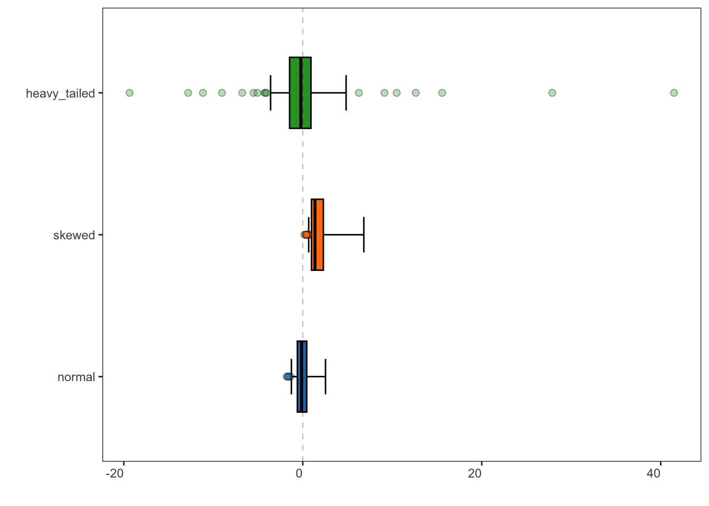

<!-- README.md is generated from README.Rmd. Please edit that file -->

# specProc

<!-- badges: start -->

[](https://lifecycle.r-lib.org/articles/stages.html#experimental)

<!-- badges: end -->

`specProc` package performs a number of pre-processing tasks commonly
used in laser-induced breakdown spectroscopy (LIBS). Collectively, these
are essential tools in LIBS calibration modeling. These include:

-   Baseline removal
-   Fitting single, multiple or overlapping peaks
-   Spectral-based normalization
-   Smoothing and filtering
-   Robust Box-Cox and Yeo-Johnson transformation
-   Pearson or Spearman peaks correlation
-   Descriptive statistics such as mean, standard deviation and higher
    central moments
-   Statistical tests

## Installation

You can install the development version from
[GitHub](https://github.com/) with:

``` r
# install.packages("devtools")
devtools::install_github("ChristianGoueguel/specProc")
```

## Exemples

Loading `specProc` package.

``` r
library(specProc)
```

``` r
ssh = suppressPackageStartupMessages
ssh(library(tidyverse))
library(patchwork)
```

### LIBS spectra in the 375–510 nm wavelength range

Prominent atomic and ionic emission lines of Mg, Ca, Ba and Mn were
identified using the NIST atomic lines database. The spectra show
emission lines from calcium, Ca II 393.366 nm, Ca II 396.847 nm and Ca I
422.673 nm, unresolved manganese triplet, Mn I403.076 nm, Mn I 403.307
nm and Mn I 403.449 nm, and barium ionic lines, Ba II 455.403 nm and Ba
II 493.408nm.

``` r
data(Ca_Mn_spec)
```

``` r
plot1 <- plotSpec(Ca_Mn_spec)
```

``` r
plot1 + ggtitle("LIBS spectrum")
```



Note: `plotSpec` is a `ggplot` based function available in this
`specProc` package to plot spectral data (see the documentation).

### Baseline removal

When analyzing LIBS spectra, it is often more effective to subtract an
estimated baseline from the data. The estimate is constructed by fitting
a low-order polynomial function to the spectrum baseline. Then the
resulting curve fit result is subtracted from the data.

``` r
baseline_fit <- baselinerm(data = Ca_Mn_spec, degree = 7)
```

``` r
str(baseline_fit, list.len = 5) 
#> List of 2
#>  $ spec: tibble [1 × 1,024] (S3: tbl_df/tbl/data.frame)
#>   ..$ 373.9455 : num 8529
#>   ..$ 374.08179: num 8102
#>   ..$ 374.21811: num 7681
#>   ..$ 374.35443: num 7266
#>   ..$ 374.49072: num 6856
#>   .. [list output truncated]
#>  $ bkg : tibble [1 × 1,024] (S3: tbl_df/tbl/data.frame)
#>   ..$ 373.9455 : num 0
#>   ..$ 374.08179: num 0
#>   ..$ 374.21811: num 0
#>   ..$ 374.35443: num 0
#>   ..$ 374.49072: num 0
#>   .. [list output truncated]
```

``` r
background <- baseline_fit %>%
  pluck("bkg") %>%
  pivot_longer(
    cols = everything(), 
    names_to = "wavelength", 
    values_to = "intensity"
    ) %>%
  modify_at("wavelength", as.numeric)
```

``` r
plot2 <- Ca_Mn_spec %>% 
  plotSpec() +
  geom_line(data = background, aes(x = wavelength, y = intensity), colour = "red")

plot3 <- baseline_fit %>%
  pluck("spec") %>% 
  plotSpec()
```

``` r
plot2 | plot3
```


### Peaks fitting

Fitting of laser-induced breakdown spectroscopy (LIBS) spectral line is
very important for accurate quantitative analysis. As such, the
Gaussian, the Lorentzian and the Voigt functions are often used to fit
LIBS spectral lines.

The idea of curve fitting is to find a mathematical model that fits your
data. We assume that you have theoretical reasons for picking a function
of a certain form. The curve fit finds the specific coefficients
(parameters) which make that function match your data as closely as
possible. For non-linear least-squares data fitting, Igor uses the
Levenberg-Marquardt algorithm to search for the minimum value of
chisquare. Chi-square defines a surface in a multidimensional error
space. The search process involves starting with an initial guess at the
coefficient values. Starting from the initial guesses, Igor searches for
the minimum value by travelling down hill from the starting point on the
chi-square surface.
