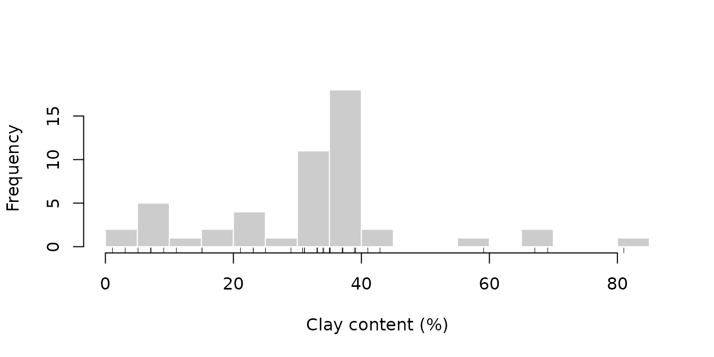

# Predicting soil clay content from LIBS spectra

Preprocessing is only useful if it improves the analysis it serves. This
vignette uses a concrete goal to evaluate preprocessing choices:
predicting the clay content of the 50 soil samples in `specLIBS` with
partial least squares (PLS) regression.

The main difficulty is statistical, not spectroscopic. With 50 samples
and 7152 variables, a model can fit the calibration data almost
perfectly, so everything depends on estimating prediction error
honestly. Several common shortcuts bias that estimate downward. The
vignette quantifies two of them.

``` r

library(specProc)
data(specLIBS)

meta <- specLIBS[1:8]
X <- as.matrix(specLIBS[-(1:8)])
```

## The target

``` r

clay <- tapply(meta$Clay, meta$Sample, unique)
summary(clay)
#>    Min. 1st Qu.  Median    Mean 3rd Qu.    Max. 
#>    1.10   23.57   34.55   31.83   38.45   81.00
hist(clay, breaks = 15, col = "grey80", border = "white", main = NULL,
     xlab = "Clay content (%)")
rug(clay)
```



The distribution is left-skewed. Most samples contain 20 to 45% clay,
while a handful of samples lie well above 55%. These few samples have
high leverage: the model’s behaviour at high clay content rests on very
little data, and any error summary is sensitive to how they fall in the
cross-validation folds.

## Preprocessing without leakage

Preprocessing steps fall into two groups:

- **Steps computed from each spectrum alone**
  ([`baseline_arpls()`](https://christiangoueguel.com/specProc/reference/baseline_arpls.md),
  [`snv()`](https://christiangoueguel.com/specProc/reference/snv.md),
  [`normalize()`](https://christiangoueguel.com/specProc/reference/normalize.md)):
  they use no information from other samples, so they can be applied
  once to the whole data set.
- **Steps estimated from a set of samples** (the MSC reference spectrum,
  EPO and GLSW filters, the OSC family, centering and scaling): they
  must be estimated on the calibration part of each cross-validation
  split only, and then applied to the held-out part.

We apply the per-spectrum steps now, and average the 8 shots of each
sample:

``` r

Xb <- as.matrix(baseline_arpls(X, lambda = 1e5, max.iter = 20)$correction)
Xsnv <- as.matrix(snv(Xb)$correction)

sample_mean <- function(M) {
  a <- average(cbind(Sample = meta$Sample, as.data.frame(M)), Sample)
  out <- as.matrix(a[-1])
  rownames(out) <- a$Sample
  out
}
raw_s <- sample_mean(X)
base_s <- sample_mean(Xb)
snv_s <- sample_mean(Xsnv)
y <- clay[rownames(snv_s)]
```

## Validation design

We use **repeated 5-fold cross-validation** with the sample as the unit.
Each sample is one row after averaging, so all 8 shots of a sample are
always on the same side of a split. Within each calibration set, the
number of PLS components is chosen by an inner cross-validation (up to
10 components). The outer folds therefore never influence this choice:
this is nested cross-validation. The whole procedure is repeated 5 times
with different fold assignments, to show how much the error estimate
itself varies.

``` r

fit_predict <- function(Xtr, ytr, Xte, ncomp = NULL, max_comp = 10) {
  if (is.null(ncomp)) {
    inner <- pls::plsr(ytr ~ Xtr, ncomp = max_comp, validation = "CV", segments = 5)
    ncomp <- which.min(inner$validation$PRESS[1, ])
  }
  model <- pls::plsr(ytr ~ Xtr, ncomp = ncomp)
  list(pred = drop(predict(model, newdata = Xte, ncomp = ncomp)), ncomp = ncomp)
}

# Repeated K-fold CV. `pipeline(train, test)` returns the preprocessed
# calibration and validation matrices and, optionally, a fixed ncomp.
cross_validate <- function(pipeline, repeats = 5, K = 5, seed = 2024) {
  set.seed(seed)
  n <- length(y)
  preds <- matrix(NA_real_, n, repeats)
  ncomps <- integer(0)
  for (r in seq_len(repeats)) {
    folds <- sample(rep(seq_len(K), length.out = n))
    for (k in seq_len(K)) {
      test <- which(folds == k)
      train <- which(folds != k)
      d <- pipeline(train, test)
      f <- fit_predict(d$train, y[train], d$test, ncomp = d$ncomp)
      preds[test, r] <- f$pred
      ncomps <- c(ncomps, f$ncomp)
    }
  }
  rmse <- apply(preds, 2, function(p) sqrt(mean((p - y)^2)))
  r2 <- apply(preds, 2, function(p) 1 - sum((p - y)^2) / sum((y - mean(y))^2))
  list(preds = preds, rmse = rmse, r2 = r2, ncomp = stats::median(ncomps))
}
```

## Comparing preprocessing pipelines

We compare six pipelines. The same seed gives every pipeline the same
fold assignments, so the comparisons are paired:

``` r

pipelines <- list(
  `raw counts` = function(tr, te) list(train = raw_s[tr, ], test = raw_s[te, ]),

  `baseline` = function(tr, te) list(train = base_s[tr, ], test = base_s[te, ]),

  `baseline + SNV` = function(tr, te) list(train = snv_s[tr, ], test = snv_s[te, ]),

  # MSC: the reference spectrum is estimated on the calibration samples only
  `baseline + MSC` = function(tr, te) {
    cal <- msc(base_s[tr, ])
    val <- msc(base_s[te, ], xref = cal$reference)
    list(train = as.matrix(cal$correction), test = as.matrix(val$correction))
  },

  # EPO: clutter = shot-to-shot deviations of the calibration samples only
  `SNV + EPO` = function(tr, te) {
    shots <- meta$Sample %in% rownames(snv_s)[tr]
    S <- Xsnv[shots, ]
    clutter <- S - apply(S, 2, function(v) ave(v, meta$Sample[shots]))
    filtered <- as.matrix(epo(snv_s, ncomp = 3, clutter = clutter)$correction)
    list(train = filtered[tr, ], test = filtered[te, ])
  },

  # OPLS filter (projected OSC) fitted on the calibration samples only,
  # followed by a one-component PLS model
  `SNV + OPLS filter` = function(tr, te) {
    f <- projected_osc(snv_s[tr, ], y[tr], ncomp = 4, newdata = snv_s[te, ])
    list(train = as.matrix(f$correction), test = as.matrix(f$newdata$correction), ncomp = 1)
  }
)

results <- lapply(pipelines, cross_validate)
```

``` r

null_rmse <- sqrt(mean((y - mean(y))^2))
summary_table <- data.frame(
  pipeline = names(results),
  RMSE = sapply(results, function(r) mean(r$rmse)),
  RMSE_sd = sapply(results, function(r) sd(r$rmse)),
  R2 = sapply(results, function(r) mean(r$r2)),
  ncomp = sapply(results, function(r) r$ncomp),  # median number of PLS components
  row.names = NULL
)
summary_table[2:4] <- round(summary_table[2:4], 2)
summary_table
#>            pipeline RMSE RMSE_sd   R2 ncomp
#> 1        raw counts 7.98    0.90 0.75     7
#> 2          baseline 8.22    0.63 0.73     7
#> 3    baseline + SNV 8.25    0.39 0.73     7
#> 4    baseline + MSC 8.08    0.17 0.74     7
#> 5         SNV + EPO 8.00    0.50 0.75     5
#> 6 SNV + OPLS filter 8.13    0.27 0.74     1
c(null_model_RMSE = round(null_rmse, 2))
#> null_model_RMSE 
#>           15.96
```

`RMSE` and `R2` are averages over the 5 repeats, and `RMSE_sd` is the
standard deviation of the RMSE across repeats. All pipelines predict
clay content far better than the null model, which predicts the mean for
every sample (RMSE 16%). With an RMSE of about 8% and a cross-validated
R² of about 0.7, the spectra explain most of the variation in clay
content.

Are the pipelines different from each other? The fold assignments are
shared, so we compare each pipeline with the baseline-only pipeline
repeat by repeat:

``` r

reference <- results$baseline$rmse
paired <- t(sapply(results, function(r) {
  d <- r$rmse - reference
  c(mean_difference = mean(d), min = min(d), max = max(d))
}))
round(paired, 2)
#>                   mean_difference   min  max
#> raw counts                  -0.24 -0.76 0.26
#> baseline                     0.00  0.00 0.00
#> baseline + SNV               0.03 -0.98 0.60
#> baseline + MSC              -0.14 -1.25 0.43
#> SNV + EPO                   -0.22 -0.78 0.43
#> SNV + OPLS filter           -0.09 -1.37 0.73
```

Every pipeline differs from the baseline-only pipeline by less than 0.25
points of RMSE on average, and for every pipeline the sign of the
difference changes from one repeat to another. With 50 samples, these
data cannot distinguish the pipelines reliably. This matches the finding
of the preprocessing vignette: SNV improves the repeatability of the
spectra, but removes between-sample variation too, and the two effects
roughly cancel for clay prediction.

The honest conclusion is that preprocessing choice matters little here.
A claim that one pipeline is better would need more samples, or an
independent validation set.

## How much optimism do common shortcuts add?

### Shortcut 1: splitting replicates across folds

If the 400 shots are cross-validated as if they were independent, shots
of the same sample end up in both the calibration and the validation
folds. The model is then partly validated on the samples it was trained
on:

``` r

set.seed(2024)
y_shot <- meta$Clay
shot_folds <- sample(rep(1:5, length.out = nrow(Xsnv)))
pred_shot <- numeric(nrow(Xsnv))
for (k in 1:5) {
  test <- shot_folds == k
  pred_shot[test] <- fit_predict(Xsnv[!test, ], y_shot[!test], Xsnv[test, ])$pred
}
shot_rmse <- sqrt(mean((pred_shot - y_shot)^2))
c(shot_level_CV = round(shot_rmse, 2),
  sample_level_CV = round(mean(results$`baseline + SNV`$rmse), 2))
#>   shot_level_CV sample_level_CV 
#>            7.67            8.25
```

Shot-level cross-validation reports an RMSE about 7% lower than the
sample-level estimate. The optimism is moderate here, because the shots
of a sample differ appreciably. It grows as replicates become more
alike, and it can be large for homogeneous materials.

### Shortcut 2: fitting a supervised filter before cross-validating

The OPLS filter uses the response `y` to decide what to remove. If it is
fitted once on all 50 samples and cross-validation is run afterwards,
the validation samples have already influenced the filter:

``` r

filtered_all <- as.matrix(projected_osc(snv_s, y, ncomp = 4)$correction)
leaky <- cross_validate(function(tr, te) {
  list(train = filtered_all[tr, ], test = filtered_all[te, ], ncomp = 1)
})
c(filter_before_CV = round(mean(leaky$rmse), 2),
  filter_inside_CV = round(mean(results$`SNV + OPLS filter`$rmse), 2))
#> filter_before_CV filter_inside_CV 
#>             5.01             8.13
```

Fitting the filter before cross-validation gives an RMSE 38% lower than
the honest estimate, a far larger effect than any difference between the
pipelines above. The same bias affects
[`osc()`](https://christiangoueguel.com/specProc/reference/osc.md),
[`direct_osc()`](https://christiangoueguel.com/specProc/reference/direct_osc.md),
[`direct_orthogonal()`](https://christiangoueguel.com/specProc/reference/direct_orthogonal.md),
[`nas()`](https://christiangoueguel.com/specProc/reference/nas.md) and
[`o2pls()`](https://christiangoueguel.com/specProc/reference/o2pls.md),
and any variable selection that uses the response. Refit these steps
inside every fold, including the inner loop that chooses the number of
components.

## Looking at the predictions

The out-of-fold predictions, averaged over the 5 repeats, show where the
model succeeds and where it fails:

``` r

pred <- rowMeans(results$`baseline + SNV`$preds)
plot(y, pred, pch = 21, bg = "grey70", xlim = c(0, 85), ylim = c(0, 85),
     xlab = "Measured clay (%)", ylab = "Cross-validated prediction (%)")
abline(0, 1, lty = 2)
```


Three of the four samples above 55% clay are underpredicted, by 12 to 21
points. With so few calibration samples in that range, the model pulls
extreme predictions toward the mean, and it should not be used to
predict clay contents above about 55% without more calibration data
there. At the other end, one sample receives a negative prediction: a
linear model does not respect the bounds of a percentage.

## Further considerations

- **Clay, sand and silt are compositional.** They sum to 100% for every
  sample, so separate models for each fraction will not, in general,
  predict fractions that sum to 100%. To predict all three, model
  log-ratios such as \log(\text{clay}/\text{silt}) and
  \log(\text{sand}/\text{silt}), and transform the predictions back.
  This also keeps predictions within 0–100%.
- **Cross-validation estimates error for similar samples.** It says
  nothing about soils from other regions, other instruments or other
  measurement sessions. An independent test set measured later is the
  stronger evidence, and
  [`pds()`](https://christiangoueguel.com/specProc/reference/pds.md) or
  [`glsw()`](https://christiangoueguel.com/specProc/reference/glsw.md)
  can help when a model must be transferred between instruments.
- **Report the variability of the error estimate.** A single RMSE from a
  single cross-validation split hides the spread shown in the table
  above.
