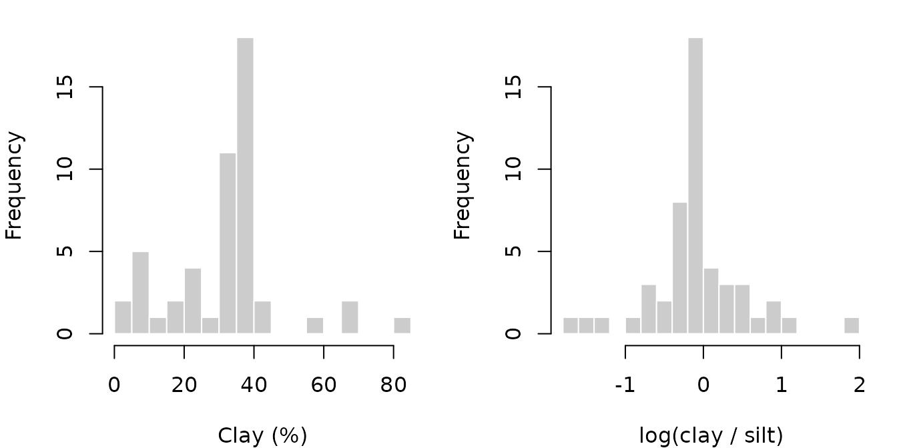
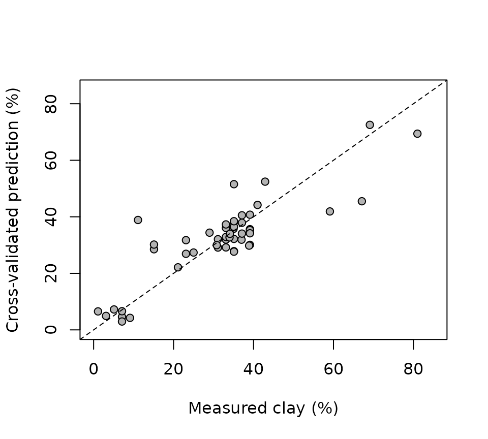

# Predicting soil clay content from LIBS spectra

Preprocessing is only useful if it improves the analysis it serves. This
vignette uses a concrete goal to evaluate preprocessing choices:
predicting the clay content of the 50 soil samples in `specLIBS` with
partial least squares (PLS) regression.

Two statistical issues shape the analysis:

- **Clay content is part of a composition.** Clay, sand and silt sum to
  100%, so they should be modeled on a log-ratio scale, not as three
  unrelated percentages.
- **There are 50 samples and 7152 variables.** A model can fit the
  calibration data almost perfectly, so everything depends on estimating
  the prediction error honestly. Common shortcuts bias it downward; the
  vignette quantifies two of them.

``` r

library(specProc)
data(specLIBS)

meta <- specLIBS[1:8]
X <- as.matrix(specLIBS[-(1:8)])
```

## The target: a composition

``` r

texture <- meta[!duplicated(meta$Sample), c("Sample", "Clay", "Sand", "Silt")]
summary(texture[c("Clay", "Sand", "Silt")])
#>       Clay            Sand            Silt      
#>  Min.   : 1.10   Min.   : 5.00   Min.   : 4.00  
#>  1st Qu.:23.57   1st Qu.:19.05   1st Qu.:30.45  
#>  Median :34.55   Median :25.00   Median :39.90  
#>  Mean   :31.83   Mean   :33.61   Mean   :34.56  
#>  3rd Qu.:38.45   3rd Qu.:30.70   3rd Qu.:43.33  
#>  Max.   :81.00   Max.   :92.90   Max.   :65.70
summary(rowSums(texture[c("Clay", "Sand", "Silt")]))
#>    Min. 1st Qu.  Median    Mean 3rd Qu.    Max. 
#>     100     100     100     100     100     100
```

The three fractions sum to 100% (up to rounding), so they carry only two
independent pieces of information. Modeling clay percentage directly
with a linear model ignores this constraint, which has two consequences:

- **Predictions can leave the range 0–100%.** A linear model can predict
  negative clay contents.
- **Errors are treated as equal on an absolute scale.** An error of 5
  points counts the same at 5% clay as at 50% clay, although it is a
  100% error in the first case and a 10% error in the second.

Compositional data analysis (Aitchison, 1986) removes the constraint by
working with log-ratios. We use the **additive log-ratio** (ALR)
transformation with silt as the reference fraction:

z_1 = \log\frac{\text{clay}}{\text{silt}}, \qquad z_2 =
\log\frac{\text{sand}}{\text{silt}}

The two log-ratios are unconstrained real numbers, so they suit linear
models such as PLS. We fit one PLS model for each. Their predictions
\hat z_1, \hat z_2 are transformed back to a composition:

\widehat{\text{clay}} = 100 \\ \frac{e^{\hat z_1}}{1 + e^{\hat z_1} +
e^{\hat z_2}}, \qquad \widehat{\text{sand}} = 100 \\ \frac{e^{\hat
z_2}}{1 + e^{\hat z_1} + e^{\hat z_2}}, \qquad \widehat{\text{silt}} =
100 - \widehat{\text{clay}} - \widehat{\text{sand}}

By construction, the predicted fractions are positive and sum to 100%.
None of the fractions is zero in this data set, so the log-ratios are
defined for every sample. Zeros would need a replacement strategy first.

``` r

composition <- as.matrix(texture[c("Clay", "Sand", "Silt")])
composition <- composition / rowSums(composition)   # close to exactly 1
z <- cbind(
  clay_silt = log(composition[, "Clay"] / composition[, "Silt"]),
  sand_silt = log(composition[, "Sand"] / composition[, "Silt"])
)
rownames(z) <- texture$Sample
clay <- 100 * composition[, "Clay"]
names(clay) <- texture$Sample

back_transform <- function(z1, z2) 100 * exp(z1) / (1 + exp(z1) + exp(z2))

op <- par(mfrow = c(1, 2), mar = c(4, 4, 1, 1))
hist(clay, breaks = 15, col = "grey80", border = "white", main = NULL, xlab = "Clay (%)")
hist(z[, "clay_silt"], breaks = 15, col = "grey80", border = "white", main = NULL,
     xlab = "log(clay / silt)")
```



``` r

par(op)
```

On the percentage scale, clay content is left-skewed, with a few samples
above 55% and several below 10%. On the log-ratio scale, the low-clay
samples are spread out rather than squeezed against zero.

## Preprocessing without leakage

Preprocessing steps fall into two groups:

- **Steps computed from each spectrum alone**
  ([`baseline_arpls()`](https://christiangoueguel.com/specProc/reference/baseline_arpls.md),
  [`snv()`](https://christiangoueguel.com/specProc/reference/snv.md),
  [`normalize()`](https://christiangoueguel.com/specProc/reference/normalize.md)):
  they use no information from other samples, so they can be applied
  once to the whole data set.
- **Steps estimated from a set of samples** (the MSC reference spectrum,
  EPO and GLSW filters, the OSC family, centering and scaling): they
  must be estimated on the calibration part of each cross-validation
  split only, and then applied to the held-out part.

We apply the per-spectrum steps now, and average the 8 shots of each
sample:

``` r

Xb <- as.matrix(baseline_arpls(X, lambda = 1e5, max.iter = 20)$correction)
Xsnv <- as.matrix(snv(Xb)$correction)

sample_mean <- function(M) {
  a <- average(cbind(Sample = meta$Sample, as.data.frame(M)), Sample)
  out <- as.matrix(a[-1])
  rownames(out) <- a$Sample
  out[texture$Sample, ]
}
raw_s <- sample_mean(X)
base_s <- sample_mean(Xb)
snv_s <- sample_mean(Xsnv)
```

## Validation design

We use **repeated 5-fold cross-validation** with the sample as the unit.
Each sample is one row after averaging, so all 8 shots of a sample are
always on the same side of a split. Within each calibration set, a PLS
model is fitted to each log-ratio, and the two predicted log-ratios are
back-transformed to clay percentages.

The number of PLS components (up to 10, the same for both log-ratios) is
chosen by an inner cross-validation within the calibration set, so the
outer folds never influence this choice: this is nested
cross-validation. The inner cross-validation minimizes the error of the
**back-transformed clay predictions**, the same criterion used to
evaluate the model. Choosing it instead on the log-ratio scale would
optimize relative errors, which favors fewer components and gives worse
clay percentages. With only 40 calibration samples per split, the chosen
number of components still varies considerably from split to split.

The whole procedure is repeated 5 times with different fold assignments,
to show how much the error estimate itself varies.

``` r

# PLS for a single response, ncomp chosen by inner CV on that response
fit_predict <- function(Xtr, ytr, Xte, ncomp = NULL, max_comp = 10) {
  if (is.null(ncomp)) {
    inner <- pls::plsr(ytr ~ Xtr, ncomp = max_comp, validation = "CV", segments = 5)
    ncomp <- which.min(inner$validation$PRESS[1, ])
  }
  model <- pls::plsr(ytr ~ Xtr, ncomp = ncomp)
  list(pred = drop(predict(model, newdata = Xte, ncomp = ncomp)), ncomp = ncomp)
}

# Predictions of the two log-ratio models for 1..max_comp components,
# back-transformed to clay (%): a matrix with one column per ncomp.
logratio_path <- function(Xtr1, Xtr2, ztr, Xte1, Xte2, max_comp = 10) {
  z1 <- predict(pls::plsr(ztr[, 1] ~ Xtr1, ncomp = max_comp), newdata = Xte1)[, 1, ]
  z2 <- predict(pls::plsr(ztr[, 2] ~ Xtr2, ncomp = max_comp), newdata = Xte2)[, 1, ]
  back_transform(matrix(z1, nrow(Xte1)), matrix(z2, nrow(Xte2)))
}

# Common ncomp for both log-ratios, minimizing the inner-CV error of the
# back-transformed clay predictions.
select_ncomp <- function(Xtr, ztr, claytr, segments = 5, max_comp = 10) {
  seg <- sample(rep(seq_len(segments), length.out = nrow(Xtr)))
  press <- numeric(max_comp)
  for (s in seq_len(segments)) {
    v <- seg == s
    pred <- logratio_path(Xtr[!v, ], Xtr[!v, ], ztr[!v, ], Xtr[v, , drop = FALSE],
                          Xtr[v, , drop = FALSE], max_comp)
    press <- press + colSums((pred - claytr[v])^2)
  }
  which.min(press)
}

# Repeated K-fold CV of the log-ratio model. `pipeline(train, test, response)`
# returns the preprocessed calibration and validation matrices, and
# optionally a fixed ncomp. `response` is the log-ratio being modeled, used
# only by supervised preprocessing.
cross_validate <- function(pipeline, repeats = 5, K = 5, seed = 2024) {
  set.seed(seed)
  n <- nrow(z)
  preds <- matrix(NA_real_, n, repeats)
  ncomps <- integer(0)
  for (r in seq_len(repeats)) {
    folds <- sample(rep(seq_len(K), length.out = n))
    for (k in seq_len(K)) {
      test <- which(folds == k)
      train <- which(folds != k)
      d1 <- pipeline(train, test, z[train, 1])
      d2 <- pipeline(train, test, z[train, 2])
      g <- if (is.null(d1$ncomp)) select_ncomp(d1$train, z[train, ], clay[train]) else d1$ncomp
      ncomps <- c(ncomps, g)
      path <- logratio_path(d1$train, d2$train, z[train, ], d1$test, d2$test, max_comp = g)
      preds[test, r] <- path[, g]
    }
  }
  rmse <- apply(preds, 2, function(p) sqrt(mean((p - clay)^2)))
  r2 <- apply(preds, 2, function(p) 1 - sum((p - clay)^2) / sum((clay - mean(clay))^2))
  list(preds = preds, rmse = rmse, r2 = r2, ncomp = stats::median(ncomps))
}
```

## Comparing preprocessing pipelines

We compare six pipelines. The same seed gives every pipeline the same
fold assignments, so the comparisons are paired:

``` r

pipelines <- list(
  `raw counts` = function(tr, te, resp) list(train = raw_s[tr, ], test = raw_s[te, ]),

  `baseline` = function(tr, te, resp) list(train = base_s[tr, ], test = base_s[te, ]),

  `baseline + SNV` = function(tr, te, resp) list(train = snv_s[tr, ], test = snv_s[te, ]),

  # MSC: the reference spectrum is estimated on the calibration samples only
  `baseline + MSC` = function(tr, te, resp) {
    cal <- msc(base_s[tr, ])
    val <- msc(base_s[te, ], xref = cal$reference)
    list(train = as.matrix(cal$correction), test = as.matrix(val$correction))
  },

  # EPO: clutter = shot-to-shot deviations of the calibration samples only
  `SNV + EPO` = function(tr, te, resp) {
    shots <- meta$Sample %in% rownames(snv_s)[tr]
    S <- Xsnv[shots, ]
    clutter <- S - apply(S, 2, function(v) ave(v, meta$Sample[shots]))
    filtered <- as.matrix(epo(snv_s, ncomp = 3, clutter = clutter)$correction)
    list(train = filtered[tr, ], test = filtered[te, ])
  },

  # OPLS filter (projected OSC) fitted to the calibration samples and to the
  # log-ratio being modeled, followed by a one-component PLS model
  `SNV + OPLS filter` = function(tr, te, resp) {
    f <- projected_osc(snv_s[tr, ], resp, ncomp = 4, newdata = snv_s[te, ])
    list(train = as.matrix(f$correction), test = as.matrix(f$newdata$correction), ncomp = 1)
  }
)

results <- lapply(pipelines, cross_validate)
```

``` r

null_rmse <- sqrt(mean((clay - mean(clay))^2))
summary_table <- data.frame(
  pipeline = names(results),
  RMSE = sapply(results, function(r) mean(r$rmse)),
  RMSE_sd = sapply(results, function(r) sd(r$rmse)),
  R2 = sapply(results, function(r) mean(r$r2)),
  ncomp = sapply(results, function(r) r$ncomp),  # median number of PLS components
  row.names = NULL
)
summary_table[2:4] <- round(summary_table[2:4], 2)
summary_table
#>            pipeline RMSE RMSE_sd   R2 ncomp
#> 1        raw counts 9.63    0.82 0.63     3
#> 2          baseline 9.88    0.85 0.61     3
#> 3    baseline + SNV 8.40    0.51 0.72     6
#> 4    baseline + MSC 8.26    0.65 0.73     6
#> 5         SNV + EPO 8.26    0.29 0.73     5
#> 6 SNV + OPLS filter 8.27    0.50 0.73     1
c(null_model_RMSE = round(null_rmse, 2))
#> null_model_RMSE 
#>           15.96
```

`RMSE` (in % clay) and `R2` are averages over the 5 repeats, and
`RMSE_sd` is the standard deviation of the RMSE across repeats. All
pipelines predict clay content far better than the null model, which
predicts the mean for every sample (RMSE 16%). The spectra explain most
of the variation in clay content.

Are the pipelines different from each other? The fold assignments are
shared, so we compare each pipeline with the baseline-only pipeline
repeat by repeat:

``` r

reference <- results$baseline$rmse
paired <- t(sapply(results, function(r) {
  d <- r$rmse - reference
  c(mean_difference = mean(d), min = min(d), max = max(d))
}))
round(paired, 2)
#>                   mean_difference   min   max
#> raw counts                  -0.25 -0.85  0.40
#> baseline                     0.00  0.00  0.00
#> baseline + SNV              -1.49 -1.98 -0.97
#> baseline + MSC              -1.62 -2.67 -0.75
#> SNV + EPO                   -1.62 -2.46 -0.89
#> SNV + OPLS filter           -1.61 -2.19 -0.89
```

The comparison separates two questions:

- **Normalizing helps.** All four pipelines that normalize the spectra
  (SNV, MSC, SNV + EPO and SNV + OPLS filter) have a lower RMSE than
  baseline correction alone in every repeat, by about 1.5 points of clay
  on average. This answers the question left open in the preprocessing
  vignette: the between-sample variation that normalization removes is
  mostly unrelated to clay content, so removing it helps.
- **The normalized pipelines cannot be ranked.** Their mean RMSEs lie
  within a few tenths of a point of each other, well within the
  variation between repeats. The additional filters (EPO, OPLS) do not
  measurably improve on SNV or MSC alone.

A claim that one normalized pipeline is better than another would need
more samples, or an independent validation set.

## What the log-ratio model gains

For comparison, we fit PLS directly to the clay percentage, with the
same preprocessing (baseline + SNV) and the same fold assignments:

``` r

direct <- local({
  set.seed(2024)
  preds <- matrix(NA_real_, nrow(z), 5)
  for (r in 1:5) {
    folds <- sample(rep(1:5, length.out = nrow(z)))
    for (k in 1:5) {
      test <- folds == k
      preds[test, r] <- fit_predict(snv_s[!test, ], clay[!test], snv_s[test, ])$pred
    }
  }
  preds
})

logratio <- results$`baseline + SNV`$preds
compare <- function(P) {
  p <- rowMeans(P)
  c(
    RMSE = mean(apply(P, 2, function(q) sqrt(mean((q - clay)^2)))),
    median_abs_error = stats::median(abs(p - clay)),
    min_prediction = min(P),
    RMSE_log_clay = sqrt(mean((log(pmax(p, 0.1)) - log(clay))^2))
  )
}
round(rbind(direct = compare(direct), log_ratio = compare(logratio)), 2)
#>           RMSE median_abs_error min_prediction RMSE_log_clay
#> direct    8.25             4.12          -6.53          0.73
#> log_ratio 8.40             3.45           2.00          0.41
```

The two models have a comparable RMSE; the difference is well within the
variation between repeats. The log-ratio model is better on the other
criteria:

- **Its predictions are always valid percentages.** The direct model
  predicts negative clay contents for some low-clay samples.
- **Its typical error is smaller,** as the median absolute error shows.
  The RMSE is dominated by the few large errors at high clay content.
- **Its relative errors are much smaller,** as the RMSE of log(clay)
  shows. The gain comes from the low-clay samples, where the direct
  model’s errors are large relative to the true values.

The model also predicts the complete composition: the sand and silt
predictions come with the same fit and are consistent with the clay
prediction by construction.

Two caveats apply to back-transformed predictions:

- **Back-transformed predictions are not unbiased means.** The model is
  fitted on the log-ratio scale, so the back-transformed prediction
  estimates a typical value on that scale (closer to a median than to a
  mean) of the clay fraction. When residuals are large, the mean clay
  content is slightly different.
- **The choice of reference fraction matters a little.** With separate
  PLS models for each log-ratio, choosing silt as the denominator gives
  slightly different predictions than choosing sand. Isometric
  log-ratios (ILR) avoid this arbitrary choice, but are less directly
  interpretable.

## How much optimism do common shortcuts add?

### Shortcut 1: splitting replicates across folds

If the 400 shots are cross-validated as if they were independent, shots
of the same sample end up in both the calibration and the validation
folds. The model is then partly validated on the samples it was trained
on:

``` r

set.seed(2024)
z_shot <- z[meta$Sample, ]
clay_shot <- clay[meta$Sample]
shot_folds <- sample(rep(1:5, length.out = nrow(Xsnv)))
pred_shot <- numeric(nrow(Xsnv))
for (k in 1:5) {
  test <- shot_folds == k
  z1 <- fit_predict(Xsnv[!test, ], z_shot[!test, 1], Xsnv[test, ])$pred
  z2 <- fit_predict(Xsnv[!test, ], z_shot[!test, 2], Xsnv[test, ])$pred
  pred_shot[test] <- back_transform(z1, z2)
}
shot_rmse <- sqrt(mean((pred_shot - clay_shot)^2))
c(shot_level_CV = round(shot_rmse, 2),
  sample_level_CV = round(mean(results$`baseline + SNV`$rmse), 2))
#>   shot_level_CV sample_level_CV 
#>            7.94            8.40
```

Shot-level cross-validation reports an RMSE about 5% lower than the
sample-level estimate. The optimism is moderate here, because the shots
of a sample differ appreciably. It grows as replicates become more
alike, and it can be large for homogeneous materials.

### Shortcut 2: fitting a supervised filter before cross-validating

The OPLS filter uses the response to decide what to remove. If it is
fitted once on all 50 samples and cross-validation is run afterwards,
the validation samples have already influenced the filter:

``` r

filtered_all <- lapply(1:2, function(j) {
  as.matrix(projected_osc(snv_s, z[, j], ncomp = 4)$correction)
})
leaky <- cross_validate(function(tr, te, resp) {
  # identify which log-ratio is being modeled, and use its pre-filtered data
  j <- if (identical(resp, z[tr, 1])) 1 else 2
  list(train = filtered_all[[j]][tr, ], test = filtered_all[[j]][te, ], ncomp = 1)
})
c(filter_before_CV = round(mean(leaky$rmse), 2),
  filter_inside_CV = round(mean(results$`SNV + OPLS filter`$rmse), 2))
#> filter_before_CV filter_inside_CV 
#>             4.95             8.27
```

Fitting the filter before cross-validation gives an RMSE 40% lower than
the honest estimate, a far larger effect than any difference between the
pipelines above. The same bias affects
[`osc()`](https://christiangoueguel.com/specProc/reference/osc.md),
[`direct_osc()`](https://christiangoueguel.com/specProc/reference/direct_osc.md),
[`direct_orthogonal()`](https://christiangoueguel.com/specProc/reference/direct_orthogonal.md),
[`nas()`](https://christiangoueguel.com/specProc/reference/nas.md) and
[`o2pls()`](https://christiangoueguel.com/specProc/reference/o2pls.md),
and any variable selection that uses the response. Refit these steps
inside every fold, including the inner loop that chooses the number of
components.

## Looking at the predictions

The out-of-fold predictions of the log-ratio model, averaged over the 5
repeats, show where the model succeeds and where it fails:

``` r

pred <- rowMeans(logratio)
plot(clay, pred, pch = 21, bg = "grey70", xlim = c(0, 85), ylim = c(0, 85),
     xlab = "Measured clay (%)", ylab = "Cross-validated prediction (%)")
abline(0, 1, lty = 2)
```



``` r

high <- clay > 55
round(cbind(measured = clay[high], log_ratio = pred[high], direct = rowMeans(direct)[high]), 1)
#>              measured log_ratio direct
#> LSG-S18-0003     81.0      69.4   63.5
#> LSG-S18-0004     69.1      72.5   67.7
#> LSG-S18-0018     67.1      45.5   46.0
#> MRI011           59.1      41.9   46.7
```

The samples above 55% clay remain the weak point. Two of the four are
underpredicted by more than 15 points with the log-ratio model, and
three with the direct model. With so few calibration samples in that
range, predictions are pulled toward the bulk of the data. The model
should not be used to predict clay contents above about 55% without more
calibration data there.

## Further considerations

- **Cross-validation estimates error for similar samples.** It says
  nothing about soils from other regions, other instruments or other
  measurement sessions. An independent test set measured later is the
  stronger evidence, and
  [`pds()`](https://christiangoueguel.com/specProc/reference/pds.md) or
  [`glsw()`](https://christiangoueguel.com/specProc/reference/glsw.md)
  can help when a model must be transferred between instruments.
- **Report the variability of the error estimate.** A single RMSE from a
  single cross-validation split hides the spread shown in the table
  above.
- **A joint model of both log-ratios** (PLS2, or a multivariate method)
  can exploit the correlation between them. With two separate PLS1
  models, as here, each log-ratio has its own number of components.

## Reference

Aitchison, J. (1986). *The Statistical Analysis of Compositional Data*.
Chapman and Hall, London.
