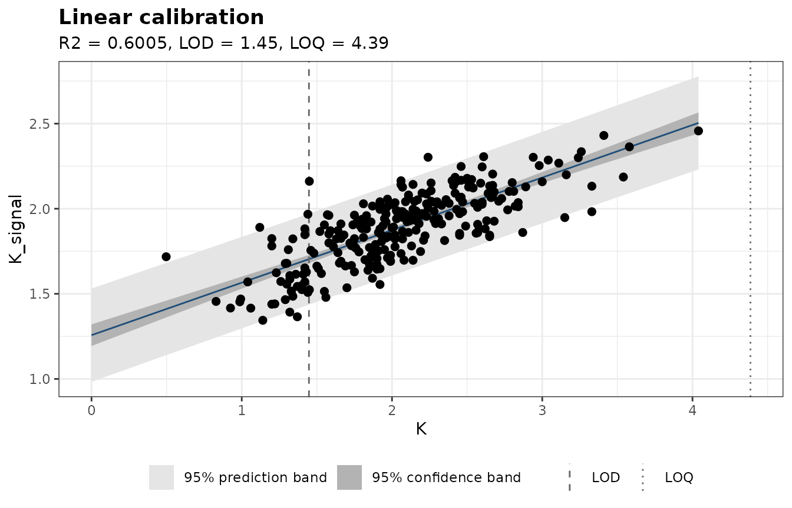
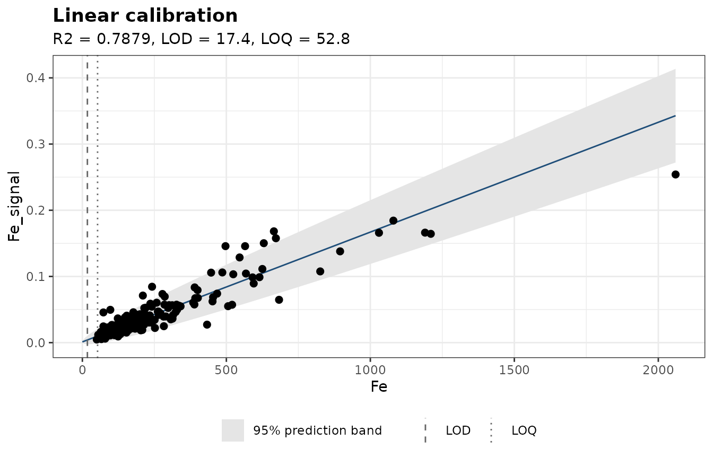
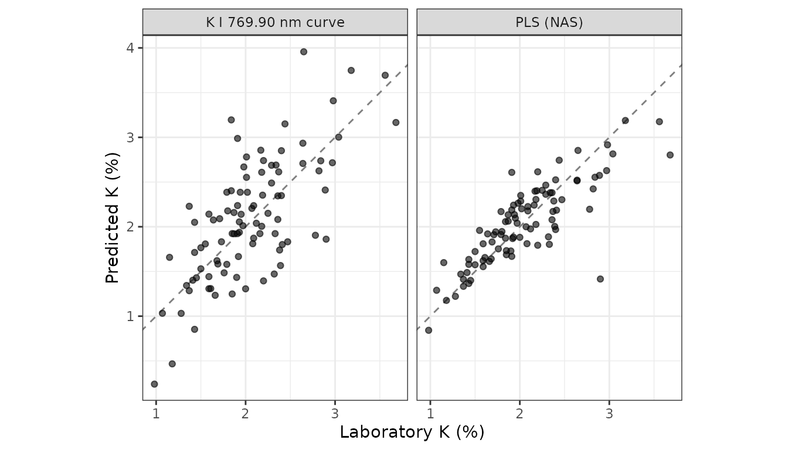

# 3. Calibration curves and figures of merit

A calibration relates a signal to the concentration of an element, from
samples of known composition, and predicts the concentration of new
samples. This vignette builds univariate calibration curves from line
intensities, with their limits of detection and quantification, and
compares them with a multivariate model of the whole spectrum, whose
figures of merit come from the net analyte signal.

``` r

library(specProc)
library(dplyr)
library(tidyr)
library(ggplot2)

data("forageLIBS")
spectra_id <- forageLIBS |> select(1:2) |> names()
minerals <- forageLIBS |> select(3:14) |> names()
spectra <- forageLIBS |> select(-all_of(c(spectra_id, minerals)))
```

## Line intensities

We remove the baseline and measure, in every spectrum, the intensities
of a potassium line, an iron line and the carbon line C I 247.86 nm.
Carbon is the main element of the forage matrix, and dividing by its
line compensates for the changes of ablated mass and plasma from
spectrum to spectrum (the internal standard of
[`vignette("preprocessing")`](https://christiangoueguel.com/specProc/articles/preprocessing.md)):

``` r

corrected <- baseline_arpls(spectra, lambda = 1e5, max.iter = 20)$correction

lines <- c(C = 247.856, K = 769.896, Fe = 259.940)
intensities <- line_intensities(corrected, lines) |>
  select(spectrum, line, intensity) |>
  pivot_wider(names_from = line, values_from = intensity)

data <- forageLIBS |>
  select(all_of(spectra_id), K, Fe) |>
  mutate(K_signal = intensities$K / intensities$C,
         Fe_signal = intensities$Fe / intensities$C)
```

We set aside a quarter of the samples to test the calibrations:

``` r

set.seed(1)
test_samples <- sample(unique(data$Sample), round(0.25 * n_distinct(data$Sample)))
calibration <- filter(data, !Sample %in% test_samples)
test <- filter(data, Sample %in% test_samples)
c(calibration = nrow(calibration), test = nrow(test))
#> calibration        test 
#>         275          93
```

## A calibration curve for potassium

[`calibration_curve()`](https://christiangoueguel.com/specProc/reference/calibration_curve.md)
fits the signal as a function of the concentration, and returns the
coefficients, the figures of merit and tests of linearity:

``` r

k_curve <- calibration_curve(calibration, K_signal, K)
k_curve
#> Linear calibration curve (275 standards)
#> 
#>       term estimate std_error  lower  upper
#>  intercept   1.2570   0.03232 1.1934 1.3206
#>      slope   0.3087   0.01524 0.2787 0.3387
#> 
#> R-squared:    0.60055
#> Sensitivity:  0.3087
#> LOD:          1.45  (residual)
#> LOQ:          4.39
#> Mandel:        F = 4.52, p = 0.0345
#> Lack of fit:   F = 1.12, p = 0.258
```

- **The sensitivity** is the slope: the change of the signal for 1% of
  K.
- **The limits of detection and quantification**, 3.3\\\sigma/S and
  10\\\sigma/S, use here the residual standard deviation \sigma of the
  fit. It includes every source of scatter around the curve, not only
  the noise of a blank, so the limits, 1.4% and 4.4% K, describe this
  calibration rather than the instrument.
- **Mandel’s test** compares the straight line with a quadratic curve.
  Its p-value, 0.034, points to a slight curvature, as expected for a
  resonance line, which the plasma partly reabsorbs at high
  concentration.

[`plot_calibration()`](https://christiangoueguel.com/specProc/reference/plot_calibration.md)
draws the curve with its confidence band (where the mean signal lies)
and its prediction band (where a single new measurement is expected):

``` r

plot_calibration(k_curve)
```



[`predict()`](https://rdrr.io/r/stats/predict.html) inverts the curve:
it gives the concentration of new samples from their signals, with a
prediction interval, and flags the values below the limits of detection
and quantification:

``` r

k_predicted <- predict(k_curve, test$K_signal)
head(k_predicted)
#> # A tibble: 6 × 7
#>   signal concentration    se lower upper below_lod below_loq
#>    <dbl>         <dbl> <dbl> <dbl> <dbl> <lgl>     <lgl>    
#> 1   2.23          3.17 0.443 2.29   4.04 FALSE     TRUE     
#> 2   1.89          2.05 0.439 1.18   2.91 FALSE     TRUE     
#> 3   2.06          2.61 0.440 1.74   3.48 FALSE     TRUE     
#> 4   2.16          2.93 0.442 2.06   3.80 FALSE     TRUE     
#> 5   1.83          1.86 0.439 0.996  2.73 FALSE     TRUE     
#> 6   1.85          1.92 0.439 1.06   2.79 FALSE     TRUE
sqrt(mean((k_predicted$concentration - test$K)^2))   # RMSEP, % K
#> [1] 0.4828623
```

The limit of quantification of this curve, 4.4% K, is above the
potassium content of almost every sample, so 100% of the predictions are
flagged `below_loq`: a single line ranks the samples, but does not
quantify them individually with the usual 10\\\sigma margin.

## Trace elements: weights and limits of detection

Iron ranges from 50 to 2060 ppm, and its signal is noisier at high
concentration. An unweighted fit is then dominated by the few rich
samples, and so is its residual standard deviation, which inflates the
limit of detection. Weights `"1/x"` give each sample a weight inversely
proportional to its concentration. With weights, the residual standard
deviation depends on their scale, so the blank standard deviation is
taken from the standard error of the intercept
(`lod_method = "intercept"`):

``` r

fe_calibration <- filter(calibration, !is.na(Fe))
fe_unweighted <- calibration_curve(fe_calibration, Fe_signal, Fe)
fe_weighted <- calibration_curve(fe_calibration, Fe_signal, Fe, weights = "1/x",
                                 lod_method = "intercept")

bind_rows(unweighted = fe_unweighted$figures_of_merit,
          weighted = fe_weighted$figures_of_merit, .id = "fit") |>
  select(fit, n, r_squared, lod, loq)
#> # A tibble: 2 × 5
#>   fit            n r_squared   lod   loq
#>   <chr>      <int>     <dbl> <dbl> <dbl>
#> 1 unweighted   272     0.852 295.  895. 
#> 2 weighted     272     0.788  17.4  52.8
```

``` r

plot_calibration(fe_weighted, interval = "prediction")
```



The weighted fit gives a limit of detection of 17 ppm, instead of 295
ppm. Its R² is lower, because it no longer favors the rich samples,
which dominate R².

``` r

fe_test <- filter(test, !is.na(Fe))
fe_predicted <- predict(fe_weighted, fe_test$Fe_signal)
count(fe_predicted, below_loq)
#> # A tibble: 2 × 2
#>   below_loq     n
#>   <lgl>     <int>
#> 1 FALSE        84
#> 2 TRUE          9
median(abs(fe_predicted$concentration - fe_test$Fe) / fe_test$Fe)   # relative error
#> [1] 0.2138503
```

## A multivariate model and its figures of merit

A single line uses a small part of the spectrum. Partial least squares
(PLS) regression uses all of it: we divide the baseline-corrected
spectra by the carbon line, and choose the number of components by
cross-validation on the calibration samples, with the pls package:

``` r

x <- as.matrix(corrected) / intensities$C
is_calibration <- !data$Sample %in% test_samples
x_calibration <- x[is_calibration, ]

cv <- pls::plsr(K ~ x, data = data.frame(K = data$K[is_calibration], x = I(x_calibration)),
                ncomp = 15, validation = "CV", segments = 10)
ncomp <- pls::selectNcomp(cv, method = "onesigma")
ncomp
#> [1] 7
```

[`nas()`](https://christiangoueguel.com/specProc/reference/nas.md) fits
the same model and computes its net analyte signal (NAS): the part of
each spectrum that is unique to potassium, orthogonal to the
contributions of the other constituents. The figures of merit follow
from it:

- **Sensitivity**: the NAS produced by 1% of K.
- **Selectivity**: the fraction of each spectrum used for prediction.
- **Limits of detection and quantification**, 3.3\\\sigma_x/\mathrm{SEN}
  and 10\\\sigma_x/\mathrm{SEN}, where \sigma_x is the noise of the
  spectra (`noise`).

We estimate the noise from the three samples measured twice, as the
standard deviation of their difference spectra divided by \sqrt{2}:

``` r

repeated <- data$Sample[duplicated(data$Sample)]
differences <- sapply(repeated, \(s) {
  rows <- which(data$Sample == s)
  x[rows[1], ] - x[rows[2], ]
})
noise <- sd(differences) / sqrt(2)

k_nas <- nas(x_calibration, data$K[is_calibration], ncomp = ncomp, noise = noise)
k_nas$figures_of_merit
#>            sensitivity            selectivity analytical_sensitivity 
#>              4.0183608              0.1183193             29.9163896 
#>                    lod                    loq 
#>              0.1103074              0.3342649
```

``` r

nas_predicted <- predict(k_nas, x[!is_calibration, ])
sqrt(mean((nas_predicted$predicted - test$K)^2))   # RMSEP, % K
#> [1] 0.2964224
summary(nas_predicted$selectivity)
#>      Min.   1st Qu.    Median      Mean   3rd Qu.      Max. 
#> 0.0009985 0.0479909 0.0875087 0.1082689 0.1542453 0.3520663
```

``` r

bind_rows(
  `K I 769.90 nm curve` = tibble(laboratory = test$K, predicted = k_predicted$concentration),
  `PLS (NAS)` = tibble(laboratory = test$K, predicted = nas_predicted$predicted),
  .id = "model"
) |>
  ggplot(aes(laboratory, predicted)) +
  geom_abline(colour = "grey50", linetype = "dashed") +
  geom_point(alpha = 0.6) +
  facet_wrap(~ model) +
  coord_equal() +
  labs(x = "Laboratory K (%)", y = "Predicted K (%)") +
  theme_bw()
```



The PLS model predicts the test samples with an error of 0.30% K,
against 0.48% for the calibration curve. Its limit of detection, 0.11%
K, accounts for the noise of the spectra only, so it is a lower bound,
far below the limit of the calibration curve, which includes all the
scatter of the samples. Its mean selectivity, 0.12, means that only
about a tenth of each spectrum is specific to potassium: the rest is
shared with the other constituents and the plasma.

## Summary

- **Normalize line intensities** to an internal standard, such as the
  carbon line of an organic matrix.
- **Check the linearity** with Mandel’s test and the lack-of-fit test of
  [`calibration_curve()`](https://christiangoueguel.com/specProc/reference/calibration_curve.md);
  resonance lines often curve at high concentration.
- **Weight the fit** when the signal is noisier at high concentration,
  and take the limit of detection from the intercept or from blanks.
- **Report how the limits were estimated**: from the residuals of a
  curve, they include the scatter of the samples; from the noise of the
  spectra
  ([`nas()`](https://christiangoueguel.com/specProc/reference/nas.md)),
  they are lower bounds.
- **Validate on samples left out** of the calibration: the prediction
  error on test samples is the most honest figure of merit.

The last vignette,
[`vignette("plasma-diagnostics")`](https://christiangoueguel.com/specProc/articles/plasma-diagnostics.md),
measures the plasma itself: electron density, temperature and
self-absorption.
