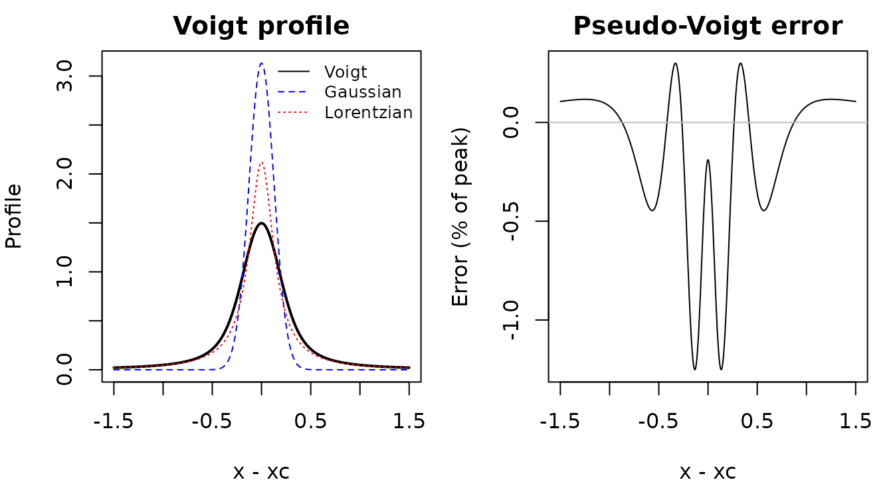
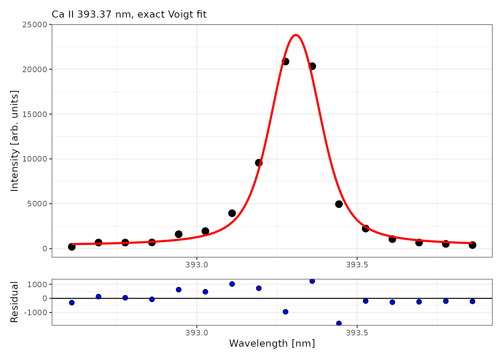
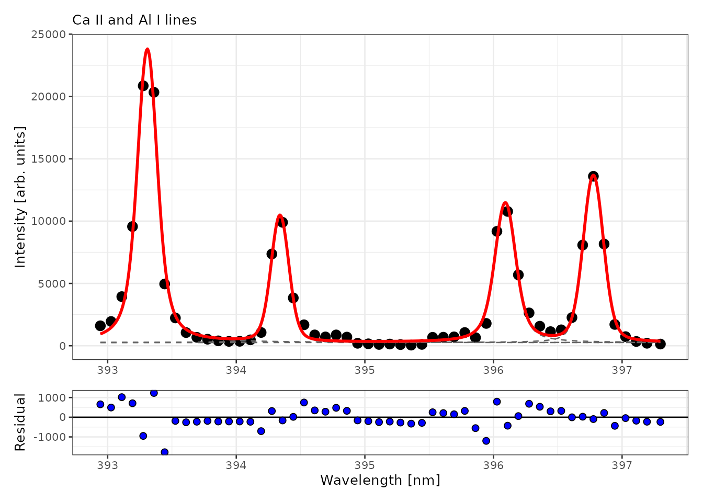

# Fitting emission lines

Integrating the counts in a fixed window around a line is simple, but it
mixes the line with its neighbours and the local background. Fitting a
line profile separates overlapping lines and gives the line area, center
and widths as parameters, with standard errors. This vignette shows how
to fit single and overlapping lines with specProc, how to choose a
profile, and how far the fitted standard errors can be trusted.

``` r

library(specProc)
data(specLIBS)

meta <- specLIBS[1:8]
X <- as.matrix(specLIBS[-(1:8)])
wl <- as.numeric(colnames(X))

# Baseline-corrected counts (see vignette("preprocessing"))
Xb <- as.matrix(baseline_arpls(X, lambda = 1e5, max.iter = 20)$correction)
```

## Line profiles

An emission line in a laser-induced plasma is broadened by several
mechanisms. Doppler and instrumental broadening give a Gaussian profile,
while Stark (pressure) and natural broadening give a Lorentzian profile.
When both are present, the line has a **Voigt** profile, the convolution
of the two. specProc provides four unit-area profiles, parametrized by
their full widths at half maximum (FWHM):

| Function | Profile | Parameters |
|----|----|----|
| [`gaussian_profile()`](https://christiangoueguel.com/specProc/reference/gaussian_profile.md) | Gaussian | `wG` |
| [`lorentzian_profile()`](https://christiangoueguel.com/specProc/reference/lorentzian_profile.md) | Lorentzian | `wL` |
| [`voigt_profile()`](https://christiangoueguel.com/specProc/reference/voigt_profile.md) | exact Voigt (C++, Faddeeva function) | `wG`, `wL` |
| [`pseudo_voigt_profile()`](https://christiangoueguel.com/specProc/reference/pseudo_voigt_profile.md) | Thompson–Cox–Hastings pseudo-Voigt | `wG`, `wL` |

The pseudo-Voigt is a weighted sum of a Gaussian and a Lorentzian that
approximates the Voigt profile. It is faster to compute, but it is an
approximation:

``` r

x <- seq(-1.5, 1.5, length.out = 500)
v <- voigt_profile(x, y0 = 0, xc = 0, wG = 0.3, wL = 0.3, A = 1)
pv <- pseudo_voigt_profile(x, y0 = 0, xc = 0, wG = 0.3, wL = 0.3, A = 1)$y

op <- par(mfrow = c(1, 2), mar = c(4, 4, 2, 1))
plot(x, v, type = "l", lwd = 2, ylim = c(0, max(gaussian_profile(x, 0, 0, 0.3, 1))),
     xlab = "x - xc", ylab = "Profile", main = "Voigt profile")
lines(x, gaussian_profile(x, 0, 0, 0.3, 1), lty = 2, col = "blue")
lines(x, lorentzian_profile(x, 0, 0, 0.3, 1), lty = 3, col = "red")
legend("topright", c("Voigt", "Gaussian", "Lorentzian"), lty = 1:3,
       col = c("black", "blue", "red"), bty = "n", cex = 0.8)
plot(x, (pv - v) / max(v) * 100, type = "l", xlab = "x - xc",
     ylab = "Error (% of peak)", main = "Pseudo-Voigt error")
abline(h = 0, col = "grey")
```



``` r

par(op)
```

For equal Gaussian and Lorentzian widths, the pseudo-Voigt deviates from
the exact profile by about 1% of the peak height. That is small, but it
is systematic, and it biases the fitted widths when the data are
precise.

## Fitting a single line

[`peak_fit()`](https://christiangoueguel.com/specProc/reference/peak_fit.md)
takes spectra in rows, with the wavelengths as column names. It fits the
model y = y_0 + A \cdot f(x; x_c, w) to each spectrum by
Levenberg–Marquardt least squares. Starting values are estimated from
the data unless you supply them.

We fit the Ca II 393.37 nm line in the mean spectrum of the first
sample, using each of the four profiles:

``` r

first <- meta$Sample == meta$Sample[1]
window <- wl > 392.6 & wl < 393.9
line_data <- as.data.frame(t(colMeans(Xb[first, window])))
names(line_data) <- wl[window]

profiles <- c("gaussian", "lorentzian", "pseudo_voigt", "voigt")
fits <- lapply(profiles, function(p) peak_fit(line_data, profile = p))
names(fits) <- profiles

comparison <- data.frame(
  profile = profiles,
  parameters = sapply(fits, function(f) length(stats::coef(f$fit[[1]]))),
  AIC = sapply(fits, function(f) round(stats::AIC(f$fit[[1]]), 1)),
  area = sapply(fits, function(f) round(stats::coef(f$fit[[1]])[["A"]])),
  area_SE = sapply(fits, function(f) round(summary(f$fit[[1]])$coefficients["A", 2])),
  row.names = NULL
)
comparison
#>        profile parameters   AIC area area_SE
#> 1     gaussian          4 270.7 4572     225
#> 2   lorentzian          4 269.6 6567     446
#> 3 pseudo_voigt          5 268.6 5802     701
#> 4        voigt          5 267.4 5677     666
```

The exact Voigt profile has the lowest AIC, but by only 1 to 3 units, so
the evidence for it over the other profiles is modest. The reason is
resolution: the channels are about 0.084 nm apart and the line FWHM is
about 0.2 nm, so each line is sampled by only 2 to 3 channels across its
half width. With 16 points, the shapes of the profiles are hard to tell
apart.

The fitted **area** differs markedly between profiles, by more than 40%
between the Gaussian and the Lorentzian fits. The Lorentzian’s heavy
wings extend beyond the fitted window, and the area estimate
extrapolates them. The profile choice is a source of systematic
uncertainty in the line area, much larger than its standard error. The
Voigt fit:

``` r

fits$voigt$tidied[[1]]
#> # A tibble: 5 × 5
#>   term   estimate std.error  statistic  p.value
#>   <chr>     <dbl>     <dbl>      <dbl>    <dbl>
#> 1 y0     328.     442.           0.742 4.73e- 1
#> 2 xc     393.       0.00333 118279.    1.98e-51
#> 3 wG       0.130    0.0422       3.08  1.05e- 2
#> 4 wL       0.0921   0.0477       1.93  7.95e- 2
#> 5 A     5677.     666.           8.53  3.53e- 6
```

``` r

plot_fit(fits$voigt, title = "Ca II 393.37 nm, exact Voigt fit")
```



## How precise are the fitted parameters?

The standard errors in the table are asymptotic least-squares standard
errors. They assume a correct model and residuals that are independent,
identically distributed and Gaussian. In LIBS data, the noise follows
photon-counting (Poisson-like) statistics, the plasma itself varies from
shot to shot, and the profile model is only approximate.

Each sample was measured at 8 locations, so we can compare the model
standard errors with the actual spread of the fitted areas across
replicates. We fit the four lines of the 393–397.3 nm region in each of
the 8 shots of the first sample (the joint fit is explained in the next
section):

``` r

window2 <- wl > 392.9 & wl < 397.3
shots <- as.data.frame(Xb[first, window2])
names(shots) <- wl[window2]
shots$shot <- seq_len(nrow(shots))
centers <- c(393.37, 394.40, 396.15, 396.85)
per_shot <- multipeak_fit(shots, peaks = centers, profiles = "voigt", id = "shot")

get <- function(term, what) sapply(per_shot$tidied, function(t) t[[what]][t$term == term])
precision <- data.frame(
  line = c("Ca II 393.37", "Al I 394.40", "Al I 396.15", "Ca II 396.85"),
  mean_area = sapply(paste0("A_", 1:4), function(a) mean(get(a, "estimate"))),
  model_SE = sapply(paste0("A_", 1:4), function(a) median(get(a, "std.error"))),
  replicate_SD = sapply(paste0("A_", 1:4), function(a) sd(get(a, "estimate"))),
  row.names = NULL
)
precision[-1] <- round(precision[-1])
precision
#>           line mean_area model_SE replicate_SD
#> 1 Ca II 393.37      5723      335          204
#> 2  Al I 394.40      1947      292           67
#> 3  Al I 396.15      2788      333          154
#> 4 Ca II 396.85      2920      295           76
```

Here the model standard errors are *larger* than the replicate standard
deviations. Part of the residual variance comes from model misfit rather
than noise. This misfit is essentially the same in every shot, so it
inflates the standard errors without making the areas less reproducible.

Combining this with the profile comparison above gives three sources of
uncertainty for a line area, in increasing order of size:

1.  **Replicate variability** (a few percent): the reproducibility of
    the measurement.
2.  **The model standard error** (about 5 to 15% here): a model-based
    quantity that mixes noise and misfit.
3.  **The choice of profile** (tens of percent): systematic, and
    invisible to both of the above.

The practical consequences:

- **Use the same profile and fitting window for every spectrum** in a
  study. A systematic profile bias then affects all samples alike, and
  it largely cancels in a calibration against reference samples.
- **Report the reproducibility from replicates,** for example the
  standard error \mathrm{SD}/\sqrt{8} of the mean area.
- **Treat absolute line areas as dependent on the profile,** for example
  when comparing them with theoretical intensities.

## Overlapping lines

Between 393 and 397.3 nm, the Ca II 393.37 and 396.85 nm lines and the
Al I 394.40 and 396.15 nm lines are close enough that their wings
overlap.
[`multipeak_fit()`](https://christiangoueguel.com/specProc/reference/multipeak_fit.md)
fits all of them simultaneously on a common baseline offset. The
parameters of line i carry the suffix `_i`:

``` r

region <- as.data.frame(t(colMeans(Xb[first, window2])))
names(region) <- wl[window2]

multi <- multipeak_fit(region, peaks = centers, profiles = "voigt")
multi$tidied[[1]]
#> # A tibble: 17 × 5
#>    term   estimate std.error  statistic   p.value
#>    <chr>     <dbl>     <dbl>      <dbl>     <dbl>
#>  1 y0     259.     199.           1.30  2.00e-  1
#>  2 xc_1   393.       0.00246 159704.    6.53e-161
#>  3 wG_1     0.129    0.0257       5.01  1.46e-  5
#>  4 wL_1     0.0941   0.0265       3.56  1.07e-  3
#>  5 A_1   5722.     337.          17.0   9.25e- 19
#>  6 xc_2   394.       0.00529  74531.    5.37e-149
#>  7 wG_2     0.144    0.0423       3.39  1.68e-  3
#>  8 wL_2     0.0373   0.0569       0.655 5.16e-  1
#>  9 A_2   1945.     292.           6.65  9.43e-  8
#> 10 xc_3   396.       0.00534  74157.    6.44e-149
#> 11 wG_3     0.141    0.0466       3.03  4.52e-  3
#> 12 wL_3     0.0893   0.0536       1.66  1.05e-  1
#> 13 A_3   2788.     336.           8.29  7.21e- 10
#> 14 xc_4   397.       0.00426  93171.    1.74e-152
#> 15 wG_4     0.162    0.0314       5.15  9.47e-  6
#> 16 wL_4     0.0443   0.0427       1.04  3.07e-  1
#> 17 A_4   2917.     297.           9.84  9.61e- 12
```

``` r

plot_fit(multi, title = "Ca II and Al I lines")
```



Look at the Lorentzian widths `wL_2`, `wL_3` and `wL_4`: their standard
errors are comparable to or larger than the estimates themselves. The
data cannot separate the Lorentzian from the Gaussian broadening for
these lines, so the two widths are not *identifiable* from these
spectra, only their combination is. The line areas, which are usually
what matters for quantitative analysis, remain well determined. When
individual widths matter, for example to estimate the electron density
from Stark broadening, use lines with a higher signal-to-noise ratio.
Alternatively, fix the instrumental Gaussian width from a calibration
measurement.

## Summary

- **Choose the profile from the data.** Compare the AIC on
  representative spectra, and look at the residuals. Expect modest
  differences when lines are sampled by only a few channels.
- **Keep the profile and window fixed across a study.** The profile
  choice is the largest source of uncertainty in absolute line areas.
- **Take reproducibility from replicates.** Model standard errors mix
  noise with misfit, and can be larger or smaller than the replicate
  spread.
- **Check identifiability before interpreting a parameter.** A parameter
  whose standard error is as large as its estimate is not determined by
  the data.
