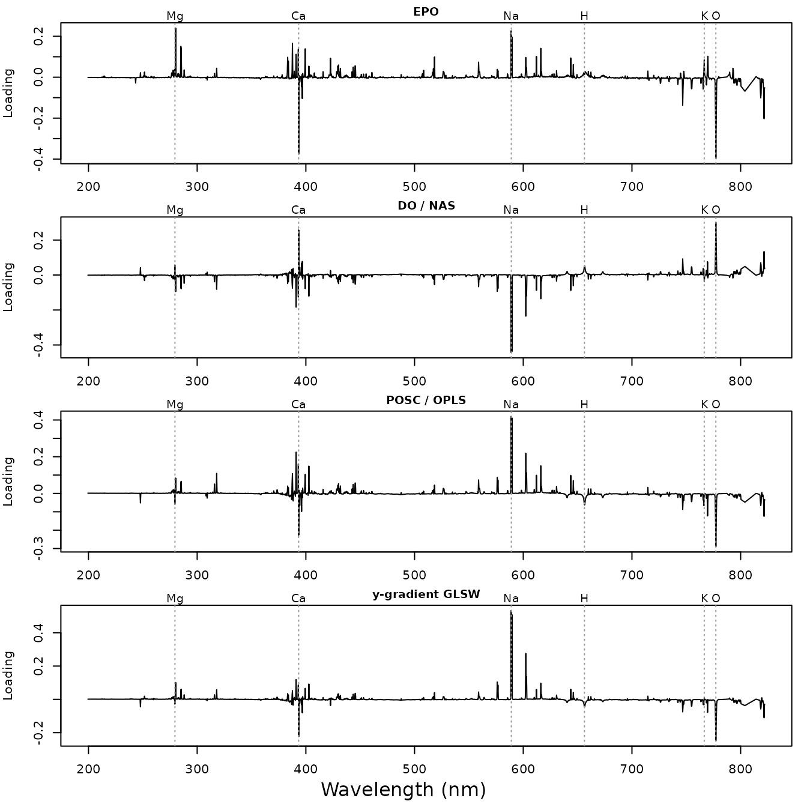

# Removing unwanted variation: a comparison of orthogonalization methods

Most of the variation in a set of LIBS spectra has nothing to do with
the property we want to predict. Plasma conditions change the total
emitted intensity from shot to shot and sample to sample, and every
element in the sample adds its own lines. Orthogonalization methods try
to identify this unwanted variation and remove it before calibration.

specProc implements two families of such methods, which differ in how
they define “unwanted”. Each is available as a function and as a
[recipes](https://recipes.tidymodels.org) step:

| Family | Unwanted variation is… | Recipe steps |
|:---|:---|:---|
| External | the variation between spectra that should be identical (clutter) | [`step_epo()`](https://christiangoueguel.com/specProc/reference/step_epo.md), [`step_glsw()`](https://christiangoueguel.com/specProc/reference/step_glsw.md) |
| Response-orthogonal | the variation in \mathbf{X} uncorrelated with the response \mathbf{y} | [`step_osc()`](https://christiangoueguel.com/specProc/reference/step_osc.md), [`step_direct_orthogonal()`](https://christiangoueguel.com/specProc/reference/step_direct_orthogonal.md), [`step_direct_osc()`](https://christiangoueguel.com/specProc/reference/step_direct_osc.md), [`step_projected_osc()`](https://christiangoueguel.com/specProc/reference/step_projected_osc.md), [`step_y_gradient_glsw()`](https://christiangoueguel.com/specProc/reference/step_y_gradient_glsw.md) |

This vignette applies all of them to the same problem, predicting the
potassium content of forage samples, and asks three questions:

1.  **What does each method remove?**
2.  **Does removing it improve predictions** on samples not used to fit
    the filter?
3.  **Which methods are actually the same method?**

Each method is a step in a recipe, combined with a PLS model in a
tidymodels workflow. The workflow re-estimates the filter on the
analysis set of every resample, so supervised filters never see the
samples they are validated on, and the filter is tuned together with the
model.

``` r

# parsnip attaches the mixOmics engine, which attaches MASS. Attaching it
# first keeps dplyr::select() (attached with recipes) ahead of MASS::select()
suppressPackageStartupMessages(library(mixOmics))
library(specProc)
library(recipes)
library(parsnip)
library(workflows)
library(tune)
library(rsample)
library(yardstick)
library(plsmod)
library(dplyr)
library(tidyr)
library(purrr)
library(ggplot2)

data(fourrage)
elements <- c("Ca", "Cl", "Cu", "Fe", "Mg", "Mn", "Mo", "P", "K", "Na", "S", "Zn")
raw_channels <- setdiff(names(fourrage), c("Measurement", "Sample", elements))
wl <- as.numeric(raw_channels)
dim(fourrage)
#> [1]  368 7166
```

`fourrage` contains 368 measurements of 365 forage samples (three
samples were measured twice). Each measurement is the mean of 8 laser
shots. The target is potassium, which is available for every measurement
and spans 0.5 to 4%.

## Preparing the spectra

Two practical steps come first:

- **Channel overlap.** Two spectrometers overlap near 766 nm, so a few
  channels repeat wavelengths already covered. We drop them.
- **Binning.** The GLSW filters are p \times p matrices, and
  [`glsw()`](https://christiangoueguel.com/specProc/reference/glsw.md)
  returns them as such: with 7152 channels, each would take about 400
  MB. The recipe steps store them in factored form, but summing 4
  adjacent channels still speeds up every method, at the cost of some
  spectral resolution. Most emission lines in these spectra span several
  channels, so little information is lost.

Finally,
[`step_snv()`](https://christiangoueguel.com/specProc/reference/step_snv.md)
normalizes each spectrum. It works on each spectrum alone, so it can be
applied once to all the data.

``` r

keep <- wl > cummax(c(-Inf, wl[-length(wl)]))
sum(!keep)  # overlapping channels dropped
#> [1] 6
bin <- ceiling(seq_len(sum(keep)) / 4)
wlb <- as.vector(tapply(wl[keep], bin, mean))
channels <- sprintf("%.3f", wlb)

binned <- as.matrix(fourrage[raw_channels[keep]]) |>
  t() |> rowsum(bin) |> t() |>
  as_tibble(.name_repair = \(nm) channels)

unprocessed <- fourrage |>
  select(Sample, all_of(elements)) |>
  mutate(total = rowSums(fourrage[raw_channels])) |>
  bind_cols(binned)

spectra <- recipe(K ~ ., data = unprocessed) |>
  update_role(Sample, total, all_of(setdiff(elements, "K")), new_role = "id") |>
  step_snv(all_predictors()) |>
  prep() |>
  bake(new_data = NULL)
dim(spectra)
#> [1]  368 1801
```

## Identifying the unwanted variation

A principal component analysis shows where the variance lies. We
correlate the scores of the first five components with the total emitted
intensity and with the reference contents of several elements:

``` r

covariates <- spectra |> select(total, K, Ca, Mg, Na, P, S)

pca_summary <- function(x, label) {
  pc <- prcomp(x)
  list(
    variance = tibble(data = label, component = paste0("PC", 1:5),
                      percent = round(100 * pc$sdev[1:5]^2 / sum(pc$sdev^2), 1)),
    correlations = cor(pc$x[, 1:5], covariates, use = "pairwise.complete.obs") |>
      round(2) |>
      as_tibble(rownames = "component") |>
      mutate(data = label, .before = 1)
  )
}
raw_pca <- pca_summary(as.matrix(binned), "raw")
snv_pca <- pca_summary(as.matrix(spectra[channels]), "SNV")

bind_rows(raw_pca$variance, snv_pca$variance) |>
  pivot_wider(names_from = component, values_from = percent)   # % variance
#> # A tibble: 2 × 6
#>   data    PC1   PC2   PC3   PC4   PC5
#>   <chr> <dbl> <dbl> <dbl> <dbl> <dbl>
#> 1 raw    63.2  18.5   6.1   3.2   2.5
#> 2 SNV    39.5  29.2  10.9   5.2   3.8
raw_pca$correlations
#> # A tibble: 5 × 9
#>   data  component total     K    Ca    Mg    Na     P     S
#>   <chr> <chr>     <dbl> <dbl> <dbl> <dbl> <dbl> <dbl> <dbl>
#> 1 raw   PC1       -0.98 -0.28 -0.21 -0.32 -0.2  -0.3  -0.42
#> 2 raw   PC2       -0.1  -0.22  0.26  0.41  0.77  0.19  0.16
#> 3 raw   PC3       -0.02  0.48 -0.52 -0.11  0.1   0.14  0.06
#> 4 raw   PC4        0.15 -0.25 -0.19 -0.26 -0.25 -0.26 -0.22
#> 5 raw   PC5        0.01  0.08  0.33 -0.06 -0.06 -0.11  0.05
snv_pca$correlations
#> # A tibble: 5 × 9
#>   data  component total     K    Ca    Mg    Na     P     S
#>   <chr> <chr>     <dbl> <dbl> <dbl> <dbl> <dbl> <dbl> <dbl>
#> 1 SNV   PC1       -0.71 -0.15 -0.33 -0.55 -0.62 -0.39 -0.47
#> 2 SNV   PC2       -0.6  -0.36  0.05  0.13  0.51 -0.04 -0.13
#> 3 SNV   PC3        0.01  0.47 -0.57 -0.15  0.03  0.12  0.05
#> 4 SNV   PC4        0.21 -0.2   0.02 -0.17 -0.25 -0.26 -0.12
#> 5 SNV   PC5        0.05 -0.29 -0.4   0.11 -0.06 -0.01 -0.05
```

The raw spectra are dominated by one structure. The first component
explains 63.2% of the variance, and its scores are almost perfectly
correlated with the total intensity. This is the multiplicative effect
of the plasma: a hotter or denser plasma raises all lines together. SNV
removes most of it, but the SNV spectra still carry several structures
that have little to do with potassium:

- **PC1 and PC2** still follow the total intensity, and also sodium and
  magnesium. After SNV, intensity changes appear as changes in line
  ratios, which a per-spectrum scaling cannot remove.
- **PC3** contrasts potassium with calcium, the main cation that varies
  in the opposite direction.

How much of the SNV variance is related to potassium at all? Regressing
each channel on \mathbf{y} gives the share of variance that a linear
function of potassium content explains:

``` r

x_centered <- scale(as.matrix(spectra[channels]), scale = FALSE)
k_centered <- spectra$K - mean(spectra$K)
y_part <- k_centered %*% crossprod(k_centered, x_centered) / sum(k_centered^2)
y_share <- 100 * sum(y_part^2) / sum(x_centered^2)
round(y_share, 1)  # % of the variance
#> [1] 8
```

Only about 8% of the variance is directly related to potassium. The
remaining variance is the target of the orthogonalization methods.

## Calibration and test sets

We set aside one third of the samples as a test set. Filters and PLS
models are always fitted on the calibration set only, and every tuning
decision uses cross-validation within the calibration set, with folds
formed by sample so that the two measurements of a sample stay together.

The external methods need clutter: spectra that should be identical but
are not. The three samples measured twice provide this. Their difference
spectra describe how the measurement of a given material varies from one
session to the next. We keep these three samples in the calibration set,
so the test split is made by hand with
[`rsample::make_splits()`](https://rsample.tidymodels.org/reference/make_splits.html):

``` r

set.seed(1)
twice <- spectra |> count(Sample) |> filter(n > 1) |> pull(Sample)
test_samples <- sample(setdiff(unique(spectra$Sample), twice),
                       round(n_distinct(spectra$Sample) / 3))
is_test <- spectra$Sample %in% test_samples
split <- make_splits(list(analysis = which(!is_test), assessment = which(is_test)),
                     data = spectra)
calibration <- analysis(split)
test <- assessment(split)
c(calibration = nrow(calibration), test = nrow(test))
#> calibration        test 
#>         246         122

set.seed(2)
folds <- group_vfold_cv(calibration, group = Sample, v = 5)

# clutter: difference spectra of the samples measured twice
clutter <- spectra |>
  filter(Sample %in% twice) |>
  group_by(Sample) |>
  summarise(across(all_of(channels), \(v) last(v) - first(v))) |>
  select(-Sample)
```

Three difference spectra are a small clutter matrix. In practice,
repeated measurements of a few reference materials over several sessions
would describe this variation better.

## The recipes

Every method is a recipe step added to the same base recipe. The filter
settings are tuned: the number of components removed, or, for GLSW, the
strength \alpha of the down-weighting, relative to the largest
eigenvalue of the clutter. Because the PLS model also has a `num_comp`
parameter, the filter’s is named `filter`.

``` r

base_recipe <- recipe(K ~ ., data = calibration) |>
  update_role(Sample, total, all_of(setdiff(elements, "K")), new_role = "id")

filter_steps <- list(
  `none` = identity,
  # External: the clutter directions are projected out ...
  `EPO` = \(rec, k) step_epo(rec, all_predictors(), clutter = clutter, num_comp = k),
  # ... or down-weighted
  `GLSW` = \(rec, k) step_glsw(rec, all_predictors(), clutter = clutter, alpha = k),
  # Response-orthogonal
  `OSC (Wold)` = \(rec, k) step_osc(rec, all_predictors(), method = "wold", num_comp = k),
  `OSC (Sjoblom)` = \(rec, k) step_osc(rec, all_predictors(), method = "sjoblom", num_comp = k),
  `OSC (Fearn)` = \(rec, k) step_osc(rec, all_predictors(), method = "fearn", num_comp = k),
  `DO` = \(rec, k) step_direct_orthogonal(rec, all_predictors(), num_comp = k),
  `DOSC` = \(rec, k) step_direct_osc(rec, all_predictors(), num_comp = k),
  `POSC / OPLS` = \(rec, k) step_projected_osc(rec, all_predictors(), num_comp = k),
  `y-gradient GLSW` = \(rec, k) step_y_gradient_glsw(rec, all_predictors(), alpha = k)
)
filter_grid <- list(
  `none` = NA, EPO = 1:3, GLSW = 10^-(0:4), `OSC (Wold)` = 1:4, `OSC (Sjoblom)` = 1:4,
  `OSC (Fearn)` = 1:4, DO = 1:4, DOSC = 1:4, `POSC / OPLS` = 1:4, `y-gradient GLSW` = 10^-(0:4)
)

method_recipe <- function(method, k = tune("filter")) {
  if (method == "none") base_recipe else filter_steps[[method]](base_recipe, k)
}
```

[`opls()`](https://christiangoueguel.com/specProc/reference/opls.md) has
no step: it wraps the Bioconductor package ropls and returns a fitted
model rather than a filter.
[`step_projected_osc()`](https://christiangoueguel.com/specProc/reference/step_projected_osc.md)
gives the same filtered data, as shown below.

## What does each method remove?

We prep each recipe on the calibration set with a comparable setting (2
components, or \alpha = 0.01 for GLSW). For the removed part of the
spectra, \mathbf{X} - f(\mathbf{X}), we compute:

- **`removed`:** its share of the calibration variance, in percent.
- **The correlations of its first principal component** with the total
  intensity and with the element contents (absolute values).

``` r

x_cal <- as.matrix(calibration[channels])
settings <- c(EPO = 2, GLSW = 0.01, `OSC (Wold)` = 2, `OSC (Sjoblom)` = 2, `OSC (Fearn)` = 2,
              DO = 2, DOSC = 2, `POSC / OPLS` = 2, `y-gradient GLSW` = 0.01)

removed_parts <- imap(settings, \(k, method) {
  corrected <- method_recipe(method, k) |> prep() |> bake(new_data = NULL)
  scale(x_cal - as.matrix(corrected[channels]), scale = FALSE)
})

removed <- imap(removed_parts, \(r, method) {
  s <- svd(r, nu = 1, nv = 1)
  cor(s$u, select(calibration, total, K, Ca, Mg, Na, P, S), use = "pairwise.complete.obs") |>
    abs() |>
    as_tibble() |>
    mutate(method = method,
           removed = 100 * sum(r^2) / sum(scale(x_cal, scale = FALSE)^2),
           .before = 1)
}) |>
  bind_rows() |>
  mutate(across(where(is.numeric), \(v) round(v, 2)))
removed
#> # A tibble: 9 × 9
#>   method          removed total     K    Ca    Mg    Na     P     S
#>   <chr>             <dbl> <dbl> <dbl> <dbl> <dbl> <dbl> <dbl> <dbl>
#> 1 EPO                44.2  0.9   0.2   0.28  0.42  0.33  0.32  0.46
#> 2 GLSW               25.3  0.84  0.1   0.37  0.47  0.44  0.31  0.46
#> 3 OSC (Wold)         63.2  0.65  0     0.36  0.54  0.67  0.32  0.45
#> 4 OSC (Sjoblom)      68.4  0.74  0.12  0.38  0.51  0.6   0.35  0.49
#> 5 OSC (Fearn)        62.6  0.61  0     0.41  0.54  0.69  0.32  0.45
#> 6 DO                 67.9  0.73  0.11  0.38  0.52  0.61  0.34  0.49
#> 7 DOSC               65.1  0.67  0     0.36  0.51  0.66  0.3   0.45
#> 8 POSC / OPLS        59.7  0.63  0     0.61  0.56  0.55  0.31  0.47
#> 9 y-gradient GLSW    68.4  0.72  0.11  0.37  0.52  0.62  0.35  0.48
```

The table shows what each family targets:

- **The response-orthogonal methods remove the most variance**, about
  60–68% with only two components. The removed part is uncorrelated with
  potassium, exactly so for Wold’s and Fearn’s OSC, DOSC and POSC. DO
  and Sjöblom’s OSC keep a small correlation, because they remove the
  principal directions of the \mathbf{y}-orthogonal space, and the
  scores of \mathbf{X} on these directions need not be orthogonal to
  \mathbf{y}. What these methods remove is strongly related to the total
  intensity and to sodium, the structures found by the PCA above.
- **EPO and GLSW remove less**, and what they remove is mostly the total
  intensity (correlations of 0.84 and 0.9). When a sample is measured
  again, what changes most is the plasma, not the composition. It also
  shows that SNV does not remove all intensity effects.
- **y-gradient GLSW** removes about 68% of the variance at \alpha =
  0.01, again related to sodium and intensity. It down-weights
  directions rather than removing them, so \alpha sets its strength
  continuously, from almost nothing to a projection like EPO.

The first direction of the removed part (the loading) shows which
emission lines are involved:

``` r

lines_nm <- c(Mg = 279.55, Ca = 393.37, Na = 588.99, H = 656.28, K = 766.49, O = 777.19)

removed_parts[c("EPO", "DO", "POSC / OPLS", "y-gradient GLSW")] |>
  imap(\(r, method) tibble(method = method, wavelength = wlb,
                           loading = svd(r, nu = 0, nv = 1)$v[, 1])) |>
  bind_rows() |>
  mutate(method = factor(method, levels = c("EPO", "DO", "POSC / OPLS", "y-gradient GLSW"))) |>
  ggplot(aes(wavelength, loading)) +
  geom_vline(xintercept = lines_nm, colour = "grey60", linetype = "dotted") +
  geom_line(linewidth = 0.3) +
  geom_text(data = tibble(wavelength = lines_nm, label = names(lines_nm)),
            aes(wavelength, Inf, label = label), vjust = 1.2, size = 2.5, inherit.aes = FALSE) +
  facet_wrap(~ method, ncol = 1, scales = "free_y") +
  labs(x = "Wavelength (nm)", y = "Loading") +
  theme_bw()
```



The sign of each loading is arbitrary. The four directions share a
common pattern: the emission lines of the sample’s metals (Mg, Ca and
above all the Na doublet at 589 nm) vary against the O I line at 777 nm
and the continuum above 800 nm. For a measurement in air, the O I line
comes from both the atmosphere and the organic matrix, so this contrast
likely reflects how much material is ablated and how the plasma develops
rather than the composition of the sample. The sodium doublet is the
largest feature for the response-orthogonal methods and y-gradient GLSW:
its variation between samples is large and independent of potassium. The
potassium lines barely appear in these directions.

## Does removing it improve predictions?

We now combine each recipe with a PLS model and tune both the filter
parameter and the number of PLS components (up to 15) with
[`tune_grid()`](https://tune.tidymodels.org/reference/tune_grid.html) on
the grouped folds of the calibration set:

``` r

# mixOmics scales every channel by default; scale = FALSE only centers
pls_model <- pls(num_comp = tune()) |>
  set_mode("regression") |>
  set_engine("mixOmics", scale = FALSE)

tune_method <- function(method) {
  grid <- tibble(num_comp = 1:15)
  if (method != "none") grid <- expand_grid(filter = filter_grid[[method]], grid)
  suppressMessages(tune_grid(workflow(method_recipe(method), pls_model),
                             resamples = folds, grid = grid, metrics = metric_set(rmse)))
}
tuned <- map(set_names(names(filter_steps)), tune_method)
```

The best setting of each method is then refitted to the whole
calibration set and evaluated on the test set with
[`last_fit()`](https://tune.tidymodels.org/reference/last_fit.html):

``` r

final_fits <- imap(tuned, \(res, method) {
  workflow(method_recipe(method), pls_model) |>
    finalize_workflow(select_best(res, metric = "rmse")) |>
    last_fit(split, metrics = metric_set(rmse))
})

settings_chosen <- imap(tuned, \(res, method) {
  best <- show_best(res, metric = "rmse", n = 1)
  tibble(method = method,
         filter = if (method == "none") NA_real_ else best$filter,
         pls_ncomp = best$num_comp,
         RMSECV = best$mean)
}) |>
  bind_rows()

test_predictions <- final_fits |>
  map(\(f) collect_predictions(f) |> select(.row, K, .pred)) |>
  bind_rows(.id = "method") |>
  pivot_wider(names_from = method, values_from = .pred)
```

With 122 test spectra, the test error itself is uncertain. Because all
methods predict the same test samples, we compare each one with plain
PLS (`none`) using a paired bootstrap of the test samples. `diff_low`
and `diff_high` bound a 95% interval for the difference in RMSEP;
negative values favor the filter.

``` r

methods <- names(filter_steps)
rmse_of <- \(d) summarise(d, across(all_of(methods), \(p) sqrt(mean((p - K)^2))))

set.seed(3)
boot_diff <- bootstraps(test_predictions, times = 2000) |>
  mutate(rmse = map(splits, \(s) rmse_of(analysis(s)))) |>
  select(rmse) |>
  unnest(rmse) |>
  mutate(across(all_of(methods), \(v) v - none))

comparison <- settings_chosen |>
  left_join(rmse_of(test_predictions) |> pivot_longer(everything(), names_to = "method",
                                                      values_to = "RMSEP"), by = "method") |>
  left_join(boot_diff |>
              pivot_longer(everything(), names_to = "method") |>
              group_by(method) |>
              summarise(diff_low = quantile(value, 0.025), diff_high = quantile(value, 0.975)),
            by = "method") |>
  mutate(across(c(RMSECV, RMSEP, diff_low, diff_high), \(v) round(v, 3)))
comparison
#> # A tibble: 10 × 7
#>    method          filter pls_ncomp RMSECV RMSEP diff_low diff_high
#>    <chr>            <dbl>     <int>  <dbl> <dbl>    <dbl>     <dbl>
#>  1 none             NA           10  0.294 0.282    0         0    
#>  2 EPO               2            9  0.295 0.276   -0.017     0.003
#>  3 GLSW              0.01         9  0.291 0.284   -0.009     0.012
#>  4 OSC (Wold)        3            7  0.293 0.286   -0.004     0.011
#>  5 OSC (Sjoblom)     1            9  0.296 0.297    0.007     0.023
#>  6 OSC (Fearn)       4            7  0.294 0.283   -0.006     0.01 
#>  7 DO                1            9  0.294 0.284    0.001     0.004
#>  8 DOSC              1            5  0.307 0.281   -0.022     0.023
#>  9 POSC / OPLS       4            6  0.294 0.282    0         0    
#> 10 y-gradient GLSW   0.01         2  0.29  0.275   -0.019     0.006
c(null_RMSEP = round(sqrt(mean((mean(calibration$K) - test$K)^2)), 3))
#> null_RMSEP 
#>      0.534
```

All models predict potassium far better than the null model, which
predicts the calibration mean for every sample. The comparison with
plain PLS:

- **No filter improves predictions measurably** . The intervals for the
  difference with plain PLS include zero or favor plain PLS, and the
  differences in RMSEP are a few hundredths of a percent of potassium,
  against a typical error of about 0.28%.
- **Filtering mostly moves components from PLS to the filter.** The
  component-based filters remove components and need fewer PLS
  components in return (compare `pls_ncomp` with the 10 components of
  plain PLS); the total model complexity hardly changes.
- **Some filtered models are plain PLS in disguise.** The POSC / OPLS
  models give exactly the same test predictions as plain PLS (both
  bootstrap bounds are 0), as the next section explains.
- **The most parsimonious model** is the y-gradient GLSW model, with 2
  PLS components, but its RMSEP is not distinguishable from that of
  plain PLS.

The external filters could not help much: their clutter comes from three
samples, and the main thing it describes, the intensity effect, is
variation PLS already learns to ignore from 246 calibration spectra.

## Which methods are the same method?

Several functions compute the same filter, or a filter that cannot
change PLS predictions:

``` r

# POSC and O2PLS with a single response: both give OPLS-filtered data
all.equal(as.matrix(projected_osc(x_cal, calibration$K, ncomp = 3)$correction),
          as.matrix(o2pls(x_cal, calibration$K, ncomp = 1, nx = 2)$correction),
          check.attributes = FALSE)
#> [1] TRUE

# OPLS filter with 2 orthogonal components + 1-component PLS
# gives the same predictions as a 3-component PLS model
predict_with <- function(rec, ncomp) {
  workflow(rec, set_args(pls_model, num_comp = ncomp)) |>
    fit(data = calibration) |>
    predict(new_data = test) |>
    pull(.pred)
}
all.equal(predict_with(method_recipe("POSC / OPLS", 2), 1),
          predict_with(base_recipe, 3))
#> [1] TRUE
```

The first result means that
[`projected_osc()`](https://christiangoueguel.com/specProc/reference/projected_osc.md)
and
[`o2pls()`](https://christiangoueguel.com/specProc/reference/o2pls.md)
(with one response) are interchangeable. The second explains why
OPLS-filtered models can reproduce plain PLS predictions exactly. OPLS
splits the systematic variation of a PLS model into a predictive and an
orthogonal part, but the model is the same (Trygg and Wold, 2002;
Kemsley and Tapp, 2009). These filters are still useful for
interpretation: the orthogonal components show what varies in the
spectra independently of potassium, as in the figure above.

## The main pitfall: fitting the filter before validating

The response-orthogonal filters use \mathbf{y}. If a filter is fitted
once on all calibration samples and cross-validation is run afterwards,
the validation samples have already shaped the filter. We prep a DOSC
recipe on the whole calibration set, bake the data, and only then
cross-validate a PLS model on the filtered spectra:

``` r

leak <- map(c(1, 2, 4, 8), \(k) {
  filtered_recipe <- method_recipe("DOSC", k) |> prep()
  filtered_cal <- bake(filtered_recipe, new_data = NULL)
  filtered_folds <- manual_rset(
    map(folds$splits, \(s) make_splits(list(analysis = s$in_id, assessment = complement(s)),
                                       data = filtered_cal)),
    folds$id)
  cv <- tune_grid(workflow(base_recipe, pls_model), resamples = filtered_folds,
                  grid = tibble(num_comp = 1:15), metrics = metric_set(rmse))
  best <- select_best(cv, metric = "rmse")
  test_pred <- finalize_workflow(workflow(base_recipe, pls_model), best) |>
    fit(data = filtered_cal) |>
    predict(new_data = bake(filtered_recipe, new_data = test)) |>
    pull(.pred)
  tibble(filter = k, pls_ncomp = best$num_comp,
         leaky_RMSECV = show_best(cv, metric = "rmse", n = 1)$mean,
         RMSEP = sqrt(mean((test_pred - test$K)^2)))
}) |>
  bind_rows() |>
  mutate(across(c(leaky_RMSECV, RMSEP), \(v) round(v, 3)))
leak
#> # A tibble: 4 × 4
#>   filter pls_ncomp leaky_RMSECV RMSEP
#>    <dbl>     <int>        <dbl> <dbl>
#> 1      1        15        0.024 0.323
#> 2      2        15        0.002 0.322
#> 3      4        15        0.001 0.322
#> 4      8        15        0     0.322
```

With the filter fitted before cross-validation, the cross-validated
error is close to zero, while the error on the test set is higher than
for plain PLS. DOSC first projects \mathbf{y} onto the space of
\mathbf{X}. With far more channels than samples, this projection
reproduces the calibration values almost exactly, and so does the
filtered \mathbf{X}. The calibration vignette
([`vignette("calibration", package = "specProc")`](https://christiangoueguel.com/specProc/articles/calibration.md))
shows a milder version of the same bias for the OPLS filter. In the
comparison above, the filter is a step of the workflow’s recipe, so
[`tune_grid()`](https://tune.tidymodels.org/reference/tune_grid.html)
refits it inside every fold and this bias cannot occur.

## How much of the signal serves the prediction?

The filters above remove variation; the net analyte signal (NAS) asks
the complementary question. The NAS of a spectrum is the part that is
unique to the analyte, orthogonal to the contributions of all other
constituents. For an inverse model such as PLS, it follows from the
regression vector \mathbf{b} (Lorber *et al.*, 1997; Faber, 1998): the
NAS of a sample is (\hat{y}\_i - \bar{y}) / \\\mathbf{b}\\.
[`nas()`](https://christiangoueguel.com/specProc/reference/nas.md)
computes it together with the figures of merit of the model (Olivieri
*et al.*, 2006):

- **Sensitivity**, 1 / \\\mathbf{b}\\: the NAS produced by 1% of
  potassium, in SNV units.
- **Selectivity**: the fraction of each (centered) spectrum that is used
  for prediction.
- **Limit of detection and of quantification**, 3.3\\\sigma /
  \mathrm{SEN} and 10\\\sigma / \mathrm{SEN}, where \sigma is the noise
  level of the spectra.

We estimate \sigma from the three samples measured twice: the standard
deviation of their difference spectra, divided by \sqrt{2}. This is a
repeatability between measurements, which includes the plasma effects
seen above, not the noise of the detector alone.

``` r

noise <- sqrt(mean(as.matrix(clutter)^2) / 2)
merit <- map(c(`5 components` = 5, `10 components` = 10), \(a) {
  nas(x_cal, calibration$K, ncomp = a, noise = noise)$figures_of_merit
}) |>
  as_tibble() |>
  mutate(figure = names(nas(x_cal, calibration$K, ncomp = 5, noise = noise)$figures_of_merit),
         .before = 1) |>
  mutate(across(-figure, \(v) round(v, 3)))
merit
#> # A tibble: 5 × 3
#>   figure                 `5 components` `10 components`
#>   <chr>                           <dbl>           <dbl>
#> 1 sensitivity                     2.82            1.3  
#> 2 selectivity                     0.171           0.086
#> 3 analytical_sensitivity         23.6            10.9  
#> 4 lod                             0.14            0.304
#> 5 loq                             0.424           0.921

# selectivity of the test samples, 10-component model
fit_nas <- nas(x_cal, calibration$K, ncomp = 10, noise = noise)
summary(predict(fit_nas, test[channels])$selectivity)
#>    Min. 1st Qu.  Median    Mean 3rd Qu.    Max. 
#> 0.00043 0.03500 0.07078 0.08477 0.12457 0.27872
```

Two results stand out:

- **Only a small part of each spectrum carries potassium information.**
  With 10 components, the mean selectivity is 0.086: less than a tenth
  of the centered signal is used for prediction, the rest is shared with
  other constituents or is plasma variation. This is the same conclusion
  as the variance share computed at the start, seen from the model’s
  side.
- **More components trade sensitivity for selectivity.** Going from 5 to
  10 components more than halves the sensitivity, because the regression
  vector must avoid more interferent directions, and more than doubles
  the limit of detection, to 0.3% K. The 10-component model still
  predicts better: its lower sensitivity is the price of being less
  affected by the interferents.

These limits account for the repeatability of the spectra only, not for
the errors of the reference analyses or of the model itself, so they are
lower bounds. Before specProc 0.4.0,
[`nas()`](https://christiangoueguel.com/specProc/reference/nas.md)
returned spectra filtered by direct orthogonalization;
[`direct_orthogonal()`](https://christiangoueguel.com/specProc/reference/direct_orthogonal.md)
computes that filter.

## Summary

- **Identify first.** A PCA with correlations to known factors (total
  intensity, other elements) shows what the unwanted variation is. Here,
  it is mainly the plasma intensity effect and the variation of sodium
  and calcium.
- **External methods remove what you tell them to.** EPO and GLSW are
  only as good as the clutter. Differences between repeated measurements
  of the same material captured the intensity effect, which SNV leaves
  in part.
- **Response-orthogonal methods remove a lot of variance, but add no
  information.** They make models smaller and easier to interpret, not
  more accurate: the removed variation is variation that PLS already
  ignores. Some (OPLS/POSC, O2PLS, Fearn’s OSC) can give exactly the PLS
  predictions.
- **Validate honestly.** Put supervised filters in the recipe of a
  workflow, so they are refitted inside each fold. Otherwise the
  cross-validated error can be meaningless.

## References

- Andersson, C.A. (1999). Direct orthogonalization. *Chemometrics and
  Intelligent Laboratory Systems*, 47(1):51–63.
- Fearn, T. (2000). On orthogonal signal correction. *Chemometrics and
  Intelligent Laboratory Systems*, 50(1):47–52.
- Faber, N.M. (1998). Efficient computation of net analyte signal vector
  in inverse multivariate calibration models. *Analytical Chemistry*,
  70(23):5108–5110.
- Kemsley, E.K., Tapp, H.S. (2009). OPLS filtered data can be obtained
  directly from non-orthogonalized PLS1. *Journal of Chemometrics*,
  23(5):263–264.
- Lorber, A., Faber, K., Kowalski, B.R. (1997). Net analyte signal
  calculation in multivariate calibration. *Analytical Chemistry*,
  69(8):1620–1626.
- Martens, H., Høy, M., Wise, B.M., Bro, R., Brockhoff, P.B. (2003).
  Pre-whitening of data by covariance-weighted preprocessing. *Journal
  of Chemometrics*, 17(3):153–165.
- Olivieri, A.C., Faber, N.M., Ferré, J., Boqué, R., Kalivas, J.H.,
  Mark, H. (2006). Uncertainty estimation and figures of merit for
  multivariate calibration (IUPAC Technical Report). *Pure and Applied
  Chemistry*, 78(3):633–661.
- Roger, J.-M., Chauchard, F., Bellon-Maurel, V. (2003). EPO-PLS
  external parameter orthogonalisation of PLS application to
  temperature-independent measurement of sugar content of intact fruits.
  *Chemometrics and Intelligent Laboratory Systems*, 66(2):191–204.
- Trygg, J., Wold, S. (2002). Orthogonal projections to latent
  structures (O-PLS). *Journal of Chemometrics*, 16(3):119–128.
- Westerhuis, J.A., de Jong, S., Smilde, A.K. (2001). Direct orthogonal
  signal correction. *Chemometrics and Intelligent Laboratory Systems*,
  56(1):13–25.
- Wold, S., Antti, H., Lindgren, F., Öhman, J. (1998). Orthogonal signal
  correction of near-infrared spectra. *Chemometrics and Intelligent
  Laboratory Systems*, 44(1):175–185.
