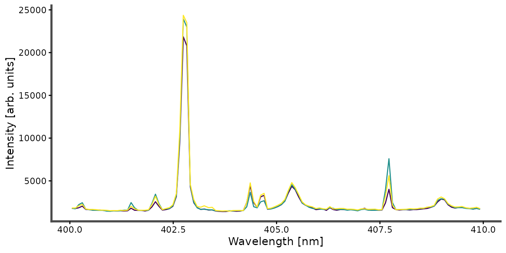
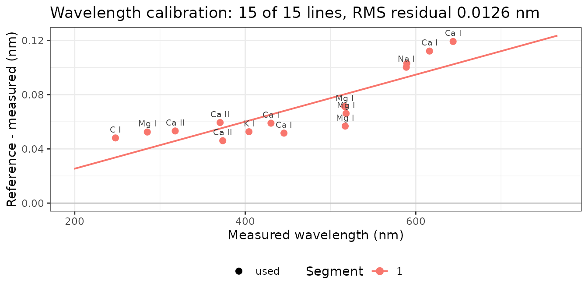
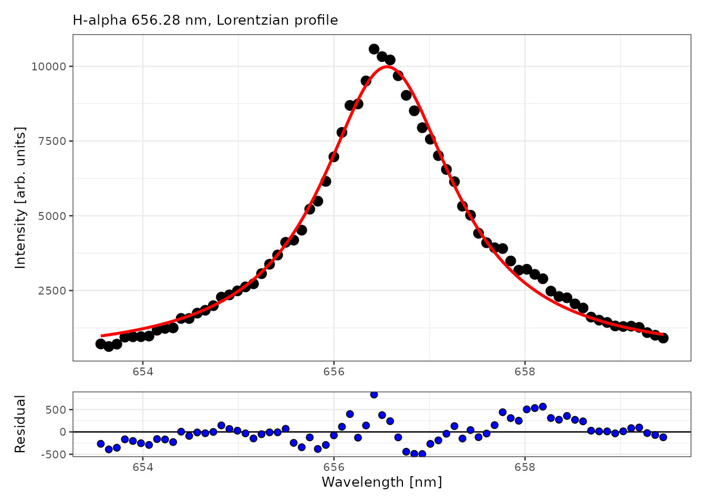
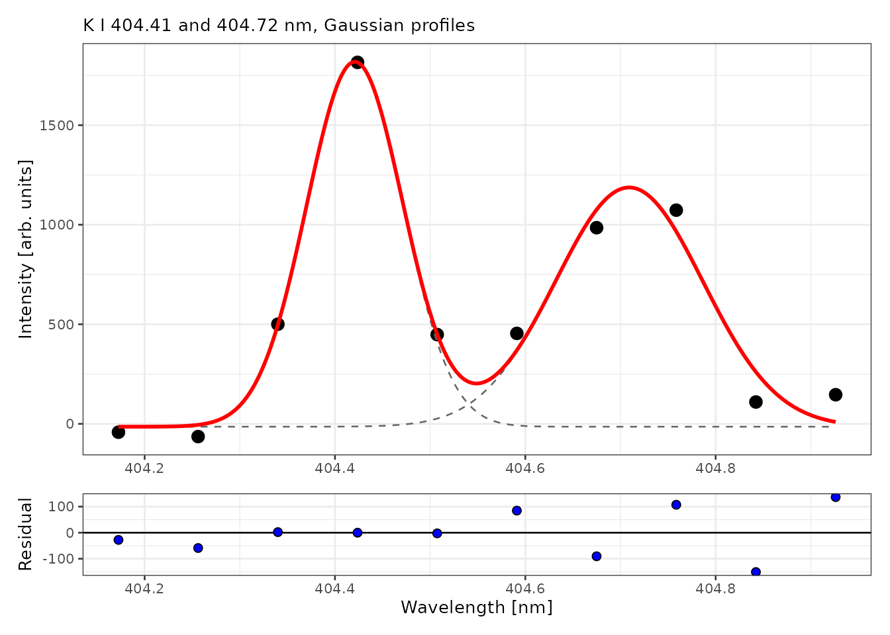
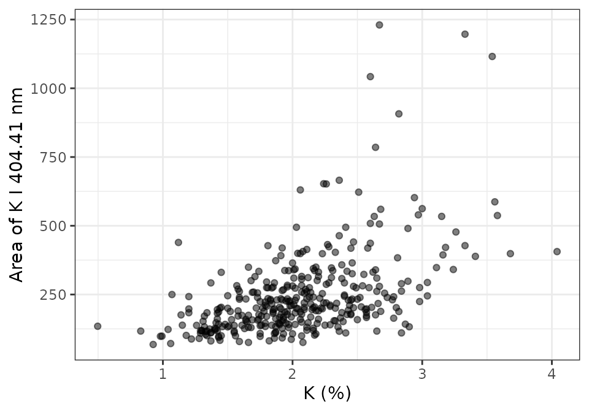

# 1. Fitting emission lines

A typical LIBS analysis goes through four stages, each covered by a
vignette:

1.  **Fitting emission lines** (this vignette): identify the lines,
    correct the wavelength axis and measure line areas.
2.  **Preprocessing** with recipe steps:
    [`vignette("preprocessing")`](https://christiangoueguel.com/specProc/articles/preprocessing.md).
3.  **Calibration** and figures of merit:
    [`vignette("calibration")`](https://christiangoueguel.com/specProc/articles/calibration.md).
4.  **Plasma diagnostics**:
    [`vignette("plasma-diagnostics")`](https://christiangoueguel.com/specProc/articles/plasma-diagnostics.md).

All four use `forageLIBS`: 368 spectra of dried forage samples, with
laboratory concentrations of 12 elements.

``` r

library(specProc)
library(dplyr)
library(purrr)
library(ggplot2)

data("forageLIBS")
spectra_id <- forageLIBS |> select(1:2) |> names()
minerals <- forageLIBS |> select(3:14) |> names()
spectra <- forageLIBS |> select(-all_of(c(spectra_id, minerals)))
wl <- as.numeric(names(spectra))
```

Each row of `spectra` is one spectrum, the mean of 8 laser shots, and
the column names are the wavelengths (nm):

``` r

forageLIBS |>
  slice(1:3) |>
  select(Measurement, all_of(names(spectra)[wl > 400 & wl < 410])) |>
  plot_spectra(id = Measurement)
```



## Identifying the lines

[`libs_lines()`](https://christiangoueguel.com/specProc/reference/libs_lines.md)
lists the strongest lines of given species in a wavelength range, from
the NIST Atomic Spectra Database, and
[`plot_lines()`](https://christiangoueguel.com/specProc/reference/plot_lines.md)
marks them on a spectrum.
[`line_finder()`](https://christiangoueguel.com/specProc/reference/line_finder.md)
opens an interactive app that does both. These functions need an
internet connection:

``` r

candidates <- libs_lines(c("K I", "Ca I", "Fe I", "Mn I"), wavelength = c(400, 410))
plot_lines(colMeans(spectra), candidates)
line_finder(spectra)
```

## Correcting the wavelength axis

The measured lines are shifted from their tabulated wavelengths.
[`wavelength_calibration()`](https://christiangoueguel.com/specProc/reference/wavelength_calibration.md)
locates known lines in the mean spectrum and fits a correction of the
axis. The instrument joins several detectors (the wavelengths step back
at 766 nm), and each detector has its own calibration: we correct the
first one, from 199 to 766 nm, which holds the lines used below.

``` r

first_detector <- spectra[seq_len(which(diff(wl) < 0)[1])]

reference <- c(`C I` = 247.856, `Mg I` = 285.213, `Ca II` = 317.933, `Ca II` = 370.603,
               `Ca II` = 373.690, `K I` = 404.414, `Ca I` = 430.253, `Ca I` = 445.478,
               `Mg I` = 516.732, `Mg I` = 517.268, `Mg I` = 518.360, `Na I` = 588.995,
               `Na I` = 589.592, `Ca I` = 616.217, `Ca I` = 643.907)
wavecal <- wavelength_calibration(first_detector, reference)
wavecal$segments
#> # A tibble: 1 × 6
#>   segment  from    to degree n_lines   rmse
#>     <int> <dbl> <dbl>  <int>   <int>  <dbl>
#> 1       1  199.  766.      1      15 0.0136
```

``` r

plot_wavelength_calibration(wavecal)
```



The offset grows from 0.05 nm in the UV to 0.12 nm in the red, about one
channel, and the residuals of the linear correction are close to 0.01
nm.
[`apply_calibration()`](https://christiangoueguel.com/specProc/reference/apply_calibration.md)
relabels the columns with the corrected wavelengths. We also remove the
continuum with
[`baseline_arpls()`](https://christiangoueguel.com/specProc/reference/baseline_arpls.md),
and average the spectra for a clean example:

``` r

calibrated <- apply_calibration(first_detector, wavecal)
corrected <- baseline_arpls(calibrated, lambda = 1e5, max.iter = 20)$correction
wl_corrected <- as.numeric(names(corrected))
mean_spectrum <- colMeans(corrected)

# The channels between two wavelengths, as a one-row table
window <- function(from, to, x = mean_spectrum) {
  keep <- wl_corrected > from & wl_corrected < to
  if (is.null(dim(x))) as_tibble(as.list(x[keep])) else x[keep]
}
```

## Line profiles

An emission line of a laser-induced plasma is broadened by several
mechanisms: the instrument and the Doppler effect give a Gaussian
profile, the Stark effect a Lorentzian one, and both together a Voigt
profile. specProc provides the four profiles, parametrized by their full
widths at half maximum:

| Function | Profile | Widths |
|----|----|----|
| [`gaussian_profile()`](https://christiangoueguel.com/specProc/reference/gaussian_profile.md) | Gaussian | `wG` |
| [`lorentzian_profile()`](https://christiangoueguel.com/specProc/reference/lorentzian_profile.md) | Lorentzian | `wL` |
| [`voigt_profile()`](https://christiangoueguel.com/specProc/reference/voigt_profile.md) | exact Voigt (Faddeeva function, C++) | `wG`, `wL` |
| [`pseudo_voigt_profile()`](https://christiangoueguel.com/specProc/reference/pseudo_voigt_profile.md) | Thompson–Cox–Hastings pseudo-Voigt | `wG`, `wL` |

## Fitting a single line

[`peak_fit()`](https://christiangoueguel.com/specProc/reference/peak_fit.md)
fits y = y_0 + A \cdot f(x; x_c, w) to each spectrum (one per row,
wavelengths as column names) by nonlinear least squares, with starting
values estimated from the data. The hydrogen H\alpha line at 656.28 nm
comes from the water of the samples. Its width is dominated by the Stark
effect, and the choice of profile matters:

``` r

halpha <- window(653.5, 659.5)
fits <- c("gaussian", "lorentzian", "pseudo_voigt", "voigt") |>
  set_names() |>
  map(\(p) peak_fit(halpha, profile = p))

tibble(
  profile = names(fits),
  AIC = map_dbl(fits, \(f) AIC(f$fit[[1]])),
  area = map_dbl(fits, \(f) coef(f$fit[[1]])[["A"]])
) |>
  mutate(across(c(AIC, area), round))
#> # A tibble: 4 × 3
#>   profile        AIC  area
#>   <chr>        <dbl> <dbl>
#> 1 gaussian      1081 14650
#> 2 lorentzian    1002 25884
#> 3 pseudo_voigt  1004 25886
#> 4 voigt         1004 25884
```

The Gaussian misses the wings of the line: its AIC is 80 units higher,
and its area 40% smaller. The Lorentzian, pseudo-Voigt and Voigt
profiles fit equally well. `tidied` holds the parameters, with their
standard errors:

``` r

fits$voigt$tidied[[1]]
#> # A tibble: 5 × 5
#>   term      estimate  std.error statistic    p.value
#>   <chr>        <dbl>      <dbl>     <dbl>      <dbl>
#> 1 y0      260.        144.        1.81e+0 7.50 e-  2
#> 2 xc      657.          0.00842   7.79e+4 1.52 e-264
#> 3 wG        0.000841  119.        7.08e-6 1.000e+  0
#> 4 wL        1.69        0.140     1.21e+1 2.26 e- 18
#> 5 A     25884.       1388.        1.86e+1 5.23 e- 28
```

The Gaussian width of the Voigt fit is close to zero, with a standard
error far larger than its value: the line is purely Lorentzian, and the
Voigt profile has one parameter too many.
[`plot_fit()`](https://christiangoueguel.com/specProc/reference/plot_fit.md)
shows the Lorentzian fit and its residuals:

``` r

plot_fit(fits$lorentzian, title = "H-alpha 656.28 nm, Lorentzian profile")
```



The width of H\alpha gives the electron density of the plasma (see
[`vignette("plasma-diagnostics")`](https://christiangoueguel.com/specProc/articles/plasma-diagnostics.md));
for a Voigt fit,
[`voigt_fwhm()`](https://christiangoueguel.com/specProc/reference/voigt_fwhm.md)
combines the two widths into the total width.

## Overlapping lines

The potassium doublet at 404.41 and 404.72 nm is weak and its lines
overlap.
[`multipeak_fit()`](https://christiangoueguel.com/specProc/reference/multipeak_fit.md)
fits them together, on a common baseline; the parameters of line i carry
the suffix `_i`:

``` r

doublet <- window(404.1, 405.0)
k_voigt <- multipeak_fit(doublet, peaks = c(404.414, 404.721), profiles = "voigt")
k_voigt$tidied[[1]]
#> # A tibble: 9 × 5
#>   term     estimate std.error statistic   p.value
#>   <chr>       <dbl>     <dbl>     <dbl>     <dbl>
#> 1 y0    -137.        429.      -3.19e-1 0.804    
#> 2 xc_1   404.          0.0230   1.76e+4 0.0000362
#> 3 wG_1     0.0712      0.224    3.17e-1 0.804    
#> 4 wL_1     0.0657      0.223    2.94e-1 0.818    
#> 5 A_1    285.        194.       1.47e+0 0.380    
#> 6 xc_2   405.          0.0156   2.60e+4 0.0000245
#> 7 wG_2     0.000837  107.       7.80e-6 1.000    
#> 8 wL_2     0.145       0.505    2.88e-1 0.822    
#> 9 A_2    343.        684.       5.02e-1 0.704
```

With about ten channels for 9 parameters, the Gaussian and Lorentzian
widths of each line cannot be separated: their standard errors are
larger than the estimates, and the areas are poorly determined. A
Gaussian profile, with one width per line, is enough for lines only a
few channels wide:

``` r

k_gauss <- multipeak_fit(doublet, peaks = c(404.414, 404.721), profiles = "gaussian")
k_gauss$tidied[[1]]
#> # A tibble: 7 × 5
#>   term  estimate std.error statistic  p.value
#>   <chr>    <dbl>     <dbl>     <dbl>    <dbl>
#> 1 y0     -14.4    97.4        -0.148 8.92e- 1
#> 2 xc_1   404.      0.00743 54465.    1.36e-14
#> 3 wG_1     0.119   0.0126      9.43  2.53e- 3
#> 4 A_1    232.     33.5         6.94  6.12e- 3
#> 5 xc_2   405.      0.0112  36253.    4.63e-14
#> 6 wG_2     0.183   0.0330      5.54  1.16e- 2
#> 7 A_2    234.     48.0         4.86  1.66e- 2
c(voigt = AIC(k_voigt$fit[[1]]), gaussian = AIC(k_gauss$fit[[1]]))
#>    voigt gaussian 
#> 135.1920 133.2817
```

``` r

plot_fit(k_gauss, title = "K I 404.41 and 404.72 nm, Gaussian profiles")
```



The areas are now determined, and the AIC is lower: prefer the simplest
profile that describes the data.

## Fitting every spectrum

With an `id` column,
[`peak_fit()`](https://christiangoueguel.com/specProc/reference/peak_fit.md)
and
[`multipeak_fit()`](https://christiangoueguel.com/specProc/reference/multipeak_fit.md)
fit each row, so the same line is measured in every spectrum. A fit that
fails (here on a few spectra where the doublet is lost in the noise)
gives `NULL` with a warning, and the others continue:

``` r

doublets <- bind_cols(
  select(forageLIBS, Measurement),
  window(404.1, 405.0, x = corrected)
)
k_fits <- multipeak_fit(doublets, peaks = c(404.414, 404.721), profiles = "gaussian",
                        id = "Measurement")

k_areas <- k_fits |>
  mutate(area = map_dbl(tidied, \(t) if (is.null(t)) NA else t$estimate[t$term == "A_1"])) |>
  select(Measurement, area) |>
  left_join(select(forageLIBS, Measurement, K), by = "Measurement")
sum(is.na(k_areas$area))
#> [1] 8
```

``` r

ggplot(k_areas, aes(K, area)) +
  geom_point(alpha = 0.5) +
  labs(x = "K (%)", y = "Area of K I 404.41 nm") +
  theme_bw()
```



The area follows the potassium content, with much scatter: the intensity
of a line also depends on the ablated mass and the plasma, which the
next vignettes correct by normalization and calibration.

## Integrating instead of fitting

[`line_intensities()`](https://christiangoueguel.com/specProc/reference/line_intensities.md)
measures many lines at once: it finds the peak of each line near its
tabulated wavelength (`search`) and integrates it over a window
(`half_width`), or fits a Voigt profile with `method = "voigt"`. It
needs no starting values and is fast, but it does not separate
overlapping lines:

``` r

lines <- c(`K I 404.41` = 404.414, `Mg I 518.36` = 518.360, `Fe II 259.94` = 259.940)
line_intensities(corrected[1:2, ], lines, half_width = 0.1)
#> # A tibble: 6 × 10
#>   spectrum line       wavelength peak_wavelength    shift height intensity   snr
#>      <int> <chr>           <dbl>           <dbl>    <dbl>  <dbl>     <dbl> <dbl>
#> 1        1 K I 404.41       404.            404.  0.00970  2908.     321.   66.9
#> 2        1 Mg I 518.…       518.            518.  0.0247   8692.    1006.  200. 
#> 3        1 Fe II 259…       260.            260. -0.00470   614.      65.3  14.1
#> 4        2 K I 404.41       404.            404.  0.00970  2092.     209.   47.0
#> 5        2 Mg I 518.…       518.            518.  0.0247   5547.     639.  125. 
#> 6        2 Fe II 259…       260.            260. -0.00470   596.      64.4  13.4
#> # ℹ 2 more variables: detected <lgl>, saturated <lgl>
```

The recipe step
[`step_line_intensities()`](https://christiangoueguel.com/specProc/reference/step_line_intensities.md)
does the same within a preprocessing pipeline
([`vignette("preprocessing")`](https://christiangoueguel.com/specProc/articles/preprocessing.md)).

## Summary

- **Correct the wavelength axis first** with
  [`wavelength_calibration()`](https://christiangoueguel.com/specProc/reference/wavelength_calibration.md),
  so that lines can be found and identified at their tabulated
  wavelengths.
- **Choose the profile from the data**: compare the AIC and the
  residuals. Strongly Stark-broadened lines such as H\alpha need a
  Lorentzian or Voigt profile; lines a few channels wide are often
  better fitted by a Gaussian.
- **Fit overlapping lines together** with
  [`multipeak_fit()`](https://christiangoueguel.com/specProc/reference/multipeak_fit.md),
  and check that each parameter is determined (its standard error well
  below its value).
- **Keep the same profile and window for every spectrum** of a study,
  and fit them all with `id`.
