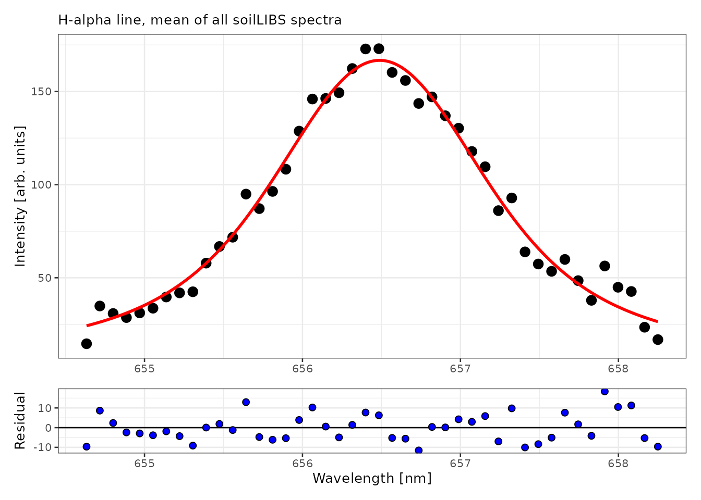
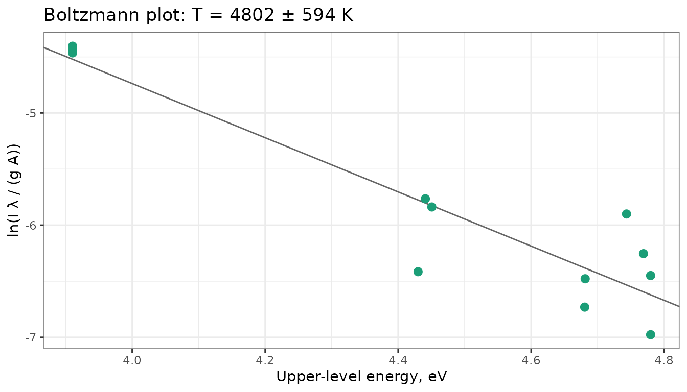
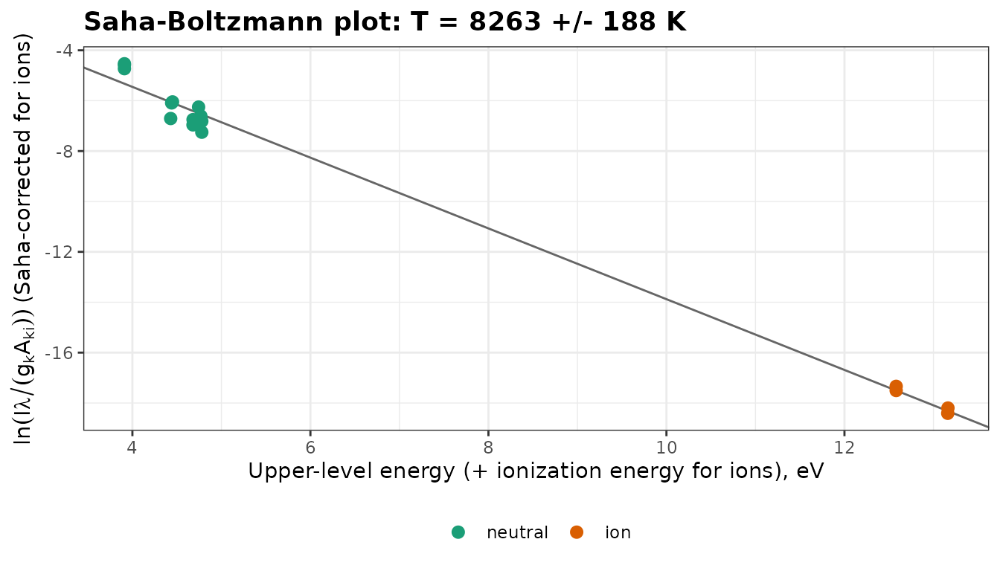
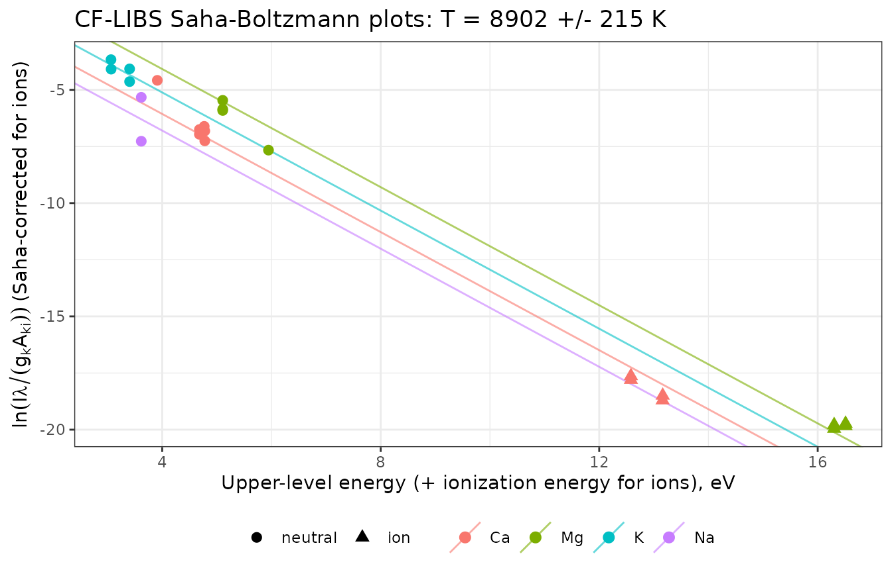
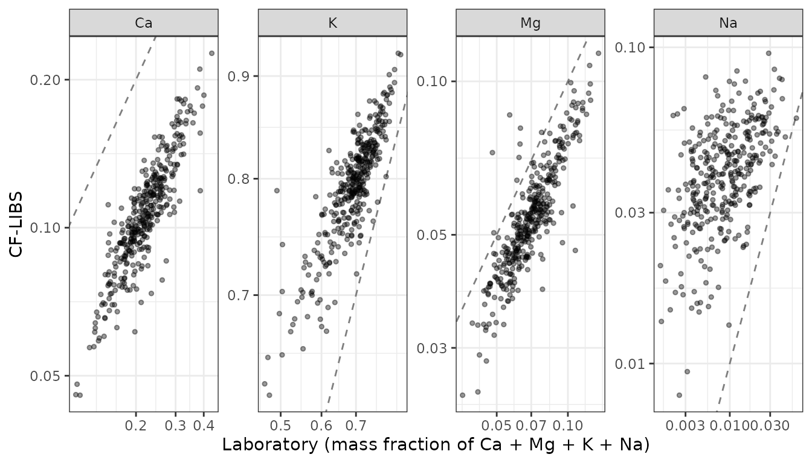

# Plasma diagnostics: electron density, temperature and self-absorption

Quantitative LIBS relies on the plasma being in local thermodynamic
equilibrium (LTE), optically thin, and recorded within the linear range
of the detector. This vignette shows how to check these conditions and
how to measure the two quantities that describe the plasma: the electron
density N_e, from the Stark broadening of a line, and the excitation
temperature T, from Boltzmann and Saha-Boltzmann plots. It ends with a
calibration-free estimate of the composition of the forage samples,
compared with their laboratory values. It uses the spectra of `soilLIBS`
and `forageLIBS`, atomic data from the NIST Atomic Spectra Database, and
Stark broadening parameters from the STARK-B database.

Two limitations of these data affect every number below:

- **The intensities are not corrected for the spectral response** of the
  instrument, which weights lines at different wavelengths differently.
  The temperatures are therefore indicative.
- **The acquisition delay and gate are not known.** N_e and T change
  quickly as the plasma cools, and the values are averages over the
  gate.

``` r

library(specProc)
library(dplyr)
library(tidyr)
library(tibble)
library(ggplot2)

data(soilLIBS)
meta_cols <- c("Sample", "Location", "Clay", "Sand", "Silt", "Texture", "Structure", "Type")
channels <- setdiff(names(soilLIBS), meta_cols)
wl <- as.numeric(channels)
```

## Detector saturation

A saturated line is clipped at the detector’s maximum count: its area
and width are wrong, and it no longer grows with concentration. It must
be excluded from any diagnostic.
[`saturation_summary()`](https://christiangoueguel.com/specProc/reference/saturation_summary.md)
lists the saturated channels. The `forageLIBS` spectra are means of 8
shots, so we count as saturated the channels whose mean is within 1% of
the 16-bit limit (65535), that is, saturated in nearly every shot:

``` r

data(forageLIBS)
saturated <- saturation_summary(forageLIBS[-(1:14)], limit = 65535, tolerance = 655)

# adjacent saturated channels belong to the same line
saturated$channels |>
  mutate(line = cumsum(c(1, diff(index) > 2))) |>
  group_by(line) |>
  summarise(wavelength = round(mean(wavelength), 2), channels = n(),
            measurements = max(n_spectra)) |>
  select(-line) |>
  arrange(desc(measurements))
#> # A tibble: 11 × 3
#>    wavelength channels measurements
#>         <dbl>    <int>        <dbl>
#>  1       397.        2          362
#>  2       393.        3          272
#>  3       399.        2          184
#>  4       280.        1           98
#>  5       388.        1           65
#>  6       280.        2           50
#>  7       423.        2           42
#>  8       589.        1           18
#>  9       770.        3            7
#> 10       590.        1            4
#> 11       391         1            1
```

The strongest lines of the forage spectra are saturated in a large share
of the measurements: Ca II 393.37 and 396.85 nm, Mg II 279.55 and 280.27
nm, the Ca I resonance line at 422.67 nm, and some Na and K lines. None
of them can be used for plasma diagnostics in these data. The `soilLIBS`
spectra peak at 28446 counts, well below the limit:

``` r

nrow(saturation_summary(soilLIBS[channels], limit = 65535)$channels)
#> [1] 0
```

We use `soilLIBS` below, averaged over all 400 spectra after baseline
correction, which gives a single high signal-to-noise spectrum:

``` r

spectrum <- baseline_arpls(soilLIBS[channels], lambda = 1e5, max.iter = 20)$correction |>
  colMeans()
```

## Electron density from the H\alpha line

Water and organic matter in the soil give a hydrogen line at 656.28 nm.
H\alpha is the standard density diagnostic in LIBS: its Stark width is
large, it is rarely self-absorbed, and computer simulations relate its
width to N_e with little dependence on temperature (Gigosos et al.,
2003). The relation between width and density applies to the full width
at half maximum (FWHM) of H\alpha’s Stark profile, which is not
Lorentzian. We therefore fit a Voigt profile only to describe the line
shape, and use its total FWHM:

``` r

halpha_window <- channels[wl > 654.6 & wl < 658.3]
halpha_fit <- as_tibble(as.list(spectrum[halpha_window])) |>
  peak_fit(profile = "voigt")
halpha_fit$tidied[[1]]
#> # A tibble: 5 × 5
#>   term  estimate std.error statistic   p.value
#>   <chr>    <dbl>     <dbl>     <dbl>     <dbl>
#> 1 y0       3.58    17.1        0.209 8.35e-  1
#> 2 xc     656.       0.0131 50187.    6.40e-154
#> 3 wG       0.845    0.536      1.58  1.23e-  1
#> 4 wL       1.18     0.731      1.61  1.16e-  1
#> 5 A      379.     130.         2.92  5.78e-  3
```

``` r

plot_fit(halpha_fit, title = "H-alpha line, mean of all soilLIBS spectra")
```



``` r

widths <- halpha_fit$tidied[[1]] |> select(term, estimate) |> deframe()
fwhm_halpha <- voigt_fwhm(widths[["wG"]], widths[["wL"]])
ne <- electron_density(fwhm_halpha, method = "halpha")
c(fwhm_nm = fwhm_halpha, electron_density = ne)
#>          fwhm_nm electron_density 
#>     1.636163e+00     1.800555e+17
```

The Gaussian and Lorentzian widths of the fit have large standard
errors: with a noisy line, the fit can trade one for the other. Their
combination, the total width, is much better determined. The
instrumental width, about 0.1 to 0.2 nm judging from the narrow lines of
these spectra, is small compared with the FWHM of 1.64 nm and changes it
by less than 1% when subtracted in quadrature, so we neglect it. The
width gives N_e \approx 1.8e+17 cm^{-3}, a typical value for LIBS
plasmas in air a few hundred nanoseconds to a few microseconds after the
laser pulse.

## Temperature from Boltzmann plots

### Atomic data

A Boltzmann plot needs, for each line, the transition probability
A\_{ki}, the statistical weight g_k and the energy E_k of the upper
level.
[`nist_lines()`](https://christiangoueguel.com/specProc/reference/nist_lines.md)
retrieves them from the NIST Atomic Spectra Database, and
[`nist_ionization_energy()`](https://christiangoueguel.com/specProc/reference/nist_ionization_energy.md)
the ionization energies:

``` r

ca_neutral <- nist_lines("Ca I", wavelength = c(420, 660))
ca_ion <- nist_lines("Ca II", wavelength = c(310, 400))
ionization_energy <- nist_ionization_energy("Ca I")
```

So that this vignette runs without an internet connection, the values
retrieved for the calcium lines used below are included here (NIST ASD,
Kramida et al.):

``` r

atomic <- tribble(
  ~species, ~stage, ~wavelength, ~Aki,    ~accuracy, ~Ek,       ~gk,
  "Ca I",   1,      428.301,     4.34e7,  "C+",      4.779784,  5,
  "Ca I",   1,      430.253,     1.36e8,  "C+",      4.779784,  5,
  "Ca I",   1,      431.865,     7.40e7,  "C+",      4.7690284, 3,
  "Ca I",   1,      443.496,     6.70e7,  "C",       4.680635,  5,
  "Ca I",   1,      445.478,     8.70e7,  "C",       4.681327,  7,
  "Ca I",   1,      558.876,     4.90e7,  "D",       4.7435268, 7,
  "Ca I",   1,      610.272,     9.60e6,  "C",       3.910399,  3,
  "Ca I",   1,      612.222,     2.87e7,  "C",       3.910399,  3,
  "Ca I",   1,      616.217,     4.77e7,  "C",       3.910399,  3,
  "Ca I",   1,      643.907,     5.30e7,  "D",       4.450647,  9,
  "Ca I",   1,      646.257,     4.70e7,  "D",       4.4409544, 7,
  "Ca I",   1,      649.378,     4.40e7,  "D",       4.4300117, 5,
  "Ca II",  2,      315.887,     3.10e8,  "C",       7.047169,  4,
  "Ca II",  2,      317.933,     3.60e8,  "C",       7.049551,  6,
  "Ca II",  2,      370.603,     8.80e7,  "C",       6.467875,  2,
  "Ca II",  2,      373.690,     1.70e8,  "C",       6.467875,  2
)
ionization_energy <- 6.1131549   # Ca I, eV (NIST ASD)
```

The accuracy grades of these transition probabilities (C: ≤ 25%, D: ≤
50%) limit the precision of any temperature derived from them. The Ca II
resonance lines at 393.37 and 396.85 nm are left out: they are strongly
self-absorbed, as shown at the end of this vignette.

### Line intensities

The spectrometer’s wavelength scale is offset from the NIST wavelengths
by about one channel in places.
[`line_intensities()`](https://christiangoueguel.com/specProc/reference/line_intensities.md)
therefore searches the peak of each line within 0.2 nm of its tabulated
wavelength (`search`), and integrates it over ±0.15 nm around the peak
(`half_width`). It keeps the columns of the table of lines and adds the
measured `intensity`, so the result goes directly into the Boltzmann
plots:

``` r

lines <- line_intensities(spectrum, atomic)
lines |> select(species, wavelength, peak_wavelength, intensity, snr)
#> # A tibble: 16 × 5
#>    species wavelength peak_wavelength intensity   snr
#>    <chr>        <dbl>           <dbl>     <dbl> <dbl>
#>  1 Ca I          428.            428.      56.2  50.1
#>  2 Ca I          430.            430.     104.   91.5
#>  3 Ca I          432.            432.      65.3  51.3
#>  4 Ca I          443.            443.      58.6  46.7
#>  5 Ca I          445.            445.     132.   95.1
#>  6 Ca I          559.            559.     103.   70.6
#>  7 Ca I          610.            610.      35.6  24.9
#>  8 Ca I          612.            612.      99.2  68.4
#>  9 Ca I          616.            616.     170.  119. 
#> 10 Ca I          644.            644.     135.   97.8
#> 11 Ca I          646.            646.      98.6  70.1
#> 12 Ca I          649.            649.      36.5  29.2
#> 13 Ca II         316.            316.      93.3  56.8
#> 14 Ca II         318.            318.     182.  119. 
#> 15 Ca II         371.            371.      55.5  38.4
#> 16 Ca II         374.            374.     188.  132.
```

### Boltzmann plot of the neutral atom

``` r

neutral <- boltzmann_plot(filter(lines, stage == 1))
neutral
#> Boltzmann plot (12 lines)
#> 
#> Temperature:  4991 +/- 611 K
#> R-squared:    0.8697
```

``` r

plot_boltzmann(neutral)
```



### Saha-Boltzmann plot

Adding lines of the ion extends the energy range. The Saha equation
places them on the same plot, using the electron density measured on
H\alpha:

``` r

saha <- saha_boltzmann_plot(lines, ionization_energy = ionization_energy, electron_density = ne)
saha
#> Saha-Boltzmann plot (16 lines)
#> 
#> Temperature:  8747 +/- 234 K
#> R-squared:    0.99
#> Ne:           1.8e+17 cm-3
```

``` r

plot_boltzmann(saha)
```



The Ca I lines come from upper levels between 3.9 and 4.8 eV. Over such
a narrow range, the slope of the Boltzmann plot is sensitive to errors
in a few intensities or transition probabilities (graded C and D, that
is, uncertain by 25 to 50%): its temperature, 4990 ± 610 K, is far below
the Saha-Boltzmann estimate. This is the usual problem of Boltzmann
plots with lines of a single species.

The ionic points extend the abscissa by the ionization energy, to about
13 eV, and the Saha-Boltzmann fit gives T \approx 8700 K with a standard
error of 230 K. The standard error reflects the scatter of the points,
not the systematic errors of the transition probabilities, the spectral
response, or the density.

### Is the plasma in LTE?

The McWhirter criterion gives the minimum density for collisions to
dominate the population of the levels. The largest energy gap here is
the first excited level of Ca II, 3.15 eV above the ground state:

``` r

lte <- mcwhirter_criterion(temperature = saha$temperature, delta_e = 3.15, electron_density = ne)
lte
#> # A tibble: 1 × 5
#>   temperature delta_e minimum_density electron_density satisfied
#>         <dbl>   <dbl>           <dbl>            <dbl> <lgl>    
#> 1       8747.    3.15         4.68e15          1.80e17 TRUE
```

The measured density is 38 times the minimum. The criterion is necessary
but not sufficient: in a transient, inhomogeneous plasma, LTE also
requires equilibration to be faster than the changes of the plasma
(Cristoforetti et al., 2010).

## Stark broadening parameters from STARK-B

For lines other than H\alpha, the electron density follows from the
Stark width in the impact approximation, N_e = N\_{ref}\\w /
w\_{ref}(T), with w\_{ref} from STARK-B.
[`starkb_lines()`](https://christiangoueguel.com/specProc/reference/starkb_lines.md)
downloads the widths and shifts of a species:

``` r

stark <- tryCatch(
  starkb_lines("Ca II", wavelength = c(390, 400), perturber = "electron"),
  error = function(e) NULL
)
if (is.null(stark)) {
  message("STARK-B could not be reached; the sections that need it are skipped.")
} else {
  stark |> filter(density == 1e17) |> select(wavelength, upper, lower, temperature, width, shift)
}
#> # A tibble: 6 × 6
#>   wavelength upper      lower     temperature  width    shift
#>        <dbl> <chr>      <chr>           <dbl>  <dbl>    <dbl>
#> 1       395. 3p6.4p 2Po 3p6.4s 2S        5000 0.0296 -0.00507
#> 2       395. 3p6.4p 2Po 3p6.4s 2S       10000 0.0228 -0.00418
#> 3       395. 3p6.4p 2Po 3p6.4s 2S       20000 0.0188 -0.00324
#> 4       395. 3p6.4p 2Po 3p6.4s 2S       30000 0.0177 -0.00275
#> 5       395. 3p6.4p 2Po 3p6.4s 2S       50000 0.0171 -0.00257
#> 6       395. 3p6.4p 2Po 3p6.4s 2S      100000 0.0166 -0.00214
```

STARK-B tabulates the Ca II 4s–4p multiplet at its mean wavelength.
[`stark_width()`](https://christiangoueguel.com/specProc/reference/stark_width.md)
interpolates the width at the plasma temperature, scales it linearly to
the electron density, and converts the multiplet width to that of the
line with the \lambda^2 rule:

``` r

thin <- stark_width(stark, wavelength = 393.366, temperature = saha$temperature,
                    density = ne, tolerance = 2)
thin
#> # A tibble: 1 × 9
#>   wavelength tabulated_wavelength upper      lower perturber temperature density
#>        <dbl>                <dbl> <chr>      <chr> <chr>           <dbl>   <dbl>
#> 1       393.                 395. 3p6.4p 2Po 3p6.… electron        8747. 1.80e17
#> # ℹ 2 more variables: width <dbl>, shift <dbl>
```

If the service is not available, a table saved earlier can be read with
[`read_starkb()`](https://christiangoueguel.com/specProc/reference/read_starkb.md),
and widths from other sources can be entered with
[`stark_table()`](https://christiangoueguel.com/specProc/reference/stark_table.md),
which takes tabulated values or STARK-B’s fitted temperature laws:

``` r

# made-up widths of a hypothetical line, in Angstrom at 1e17 cm-3
stark_table(wavelength = 5000, temperature = c(5000, 10000, 20000),
            width = c(0.20, 0.16, 0.13), units = "A", species = "X II")
#> # A tibble: 3 × 10
#>   species wavelength upper lower perturber temperature density width shift
#>   <chr>        <dbl> <chr> <chr> <chr>           <dbl>   <dbl> <dbl> <dbl>
#> 1 X II           500 ""    ""    electron         5000    1e17 0.02      0
#> 2 X II           500 ""    ""    electron        10000    1e17 0.016     0
#> 3 X II           500 ""    ""    electron        20000    1e17 0.013     0
#> # ℹ 1 more variable: source <chr>
```

Take the values of your line from the database or the literature, and
state their units, since widths are published in both Å and nm.

## Self-absorption of a resonance line

Resonance lines end on the ground state, which is heavily populated, so
the plasma reabsorbs their light. Self-absorption flattens and broadens
the line: its measured Stark width exceeds the width expected at the
plasma’s electron density. The ratio gives the self-absorption
coefficient SA (El Sherbini et al., 2005), the fraction of the peak
intensity that escapes. Ca II 393.37 nm is an isolated line, so its
Stark profile is Lorentzian: we fit it jointly with its neighbors and
take its Lorentzian width:

``` r

ca_window <- channels[wl > 392.9 & wl < 397.3]
ca_fit <- as_tibble(as.list(spectrum[ca_window])) |>
  multipeak_fit(peaks = c(393.37, 394.40, 396.15, 396.85), profiles = "voigt")
measured <- ca_fit$tidied[[1]] |> filter(term == "wL_1")
measured
#> # A tibble: 1 × 5
#>   term  estimate std.error statistic  p.value
#>   <chr>    <dbl>     <dbl>     <dbl>    <dbl>
#> 1 wL_1     0.102    0.0260      3.90 0.000399
self_absorption(width = measured$estimate, thin_width = thin$width)
#> # A tibble: 1 × 4
#>   width thin_width    SA intensity_correction
#>   <dbl>      <dbl> <dbl>                <dbl>
#> 1 0.102     0.0429 0.203                 4.94
```

The measured Lorentzian width, 0.102 nm, is 2.4 times the optically thin
width of 0.043 nm, which gives SA of about 0.2: only a fraction of the
peak intensity escapes the plasma. The Lorentzian width of a line only a
few channels wide is uncertain (see its standard error), so this
coefficient is an order of magnitude rather than a correction factor. It
confirms what the saturation of the same line in the forage spectra
already suggested: the Ca II resonance lines are unsuitable for
quantification in these plasmas.

## Calibration-free composition

Calibration-free LIBS (CF-LIBS; Ciucci et al., 1999) derives the
composition of a sample from its line intensities alone, without
calibration standards. In LTE, the Boltzmann plots of all species share
the same slope, -1/k_B T, and the intercept of each plot gives the
density of its species.
[`cf_libs()`](https://christiangoueguel.com/specProc/reference/cf_libs.md)
fits the plots together, adds the ionization stages that are not
observed with the Saha equation, and normalizes the densities of the
elements to fractions that sum to one.

The forage samples have laboratory reference values for Ca, Mg, K and
Na, so we can check the method against them. We baseline-correct the
measurements and measure the electron density on H\alpha of their mean,
as above:

``` r

forage_channels <- names(forageLIBS)[-(1:14)]
forage_wl <- as.numeric(forage_channels)
forage <- as.matrix(baseline_arpls(forageLIBS[forage_channels], lambda = 1e5, max.iter = 20)$correction)
colnames(forage) <- forage_channels
forage_mean <- colMeans(forage)

forage_halpha <- forage_mean[forage_channels[forage_wl > 654.6 & forage_wl < 658.3]]
forage_fit <- as_tibble(as.list(forage_halpha)) |>
  peak_fit(profile = "voigt")
forage_widths <- forage_fit$tidied[[1]] |> select(term, estimate) |> deframe()
ne_forage <- electron_density(voigt_fwhm(forage_widths[["wG"]], forage_widths[["wL"]]),
                              method = "halpha")
ne_forage
#> [1] 1.575407e+17
```

### Lines and atomic data

The lines must be unsaturated, free of interference, and optically thin.
In these spectra, that rules out the resonance lines of all four
elements (Ca II 393/397 nm, Mg I 285 nm, Mg II 280 nm, K I 766/770 nm,
Na I 589 nm), which are saturated or strongly self-absorbed. The
remaining lines are fainter, and those of Na are weak.
[`nist_lines()`](https://christiangoueguel.com/specProc/reference/nist_lines.md)
gives their atomic data.
[`cf_libs()`](https://christiangoueguel.com/specProc/reference/cf_libs.md)
also needs the partition functions of the species, which it computes
from the energy levels of
[`nist_levels()`](https://christiangoueguel.com/specProc/reference/nist_levels.md),
and the ionization energies:

``` r

species <- c("Ca I", "Ca II", "Mg I", "Mg II", "K I", "K II", "Na I", "Na II")
levels <- nist_levels(species)
ionization <- nist_ionization_energy(c("Ca I", "Mg I", "K I", "Na I"))
```

To run without an internet connection, this vignette includes the values
retrieved from the NIST ASD. The partition functions come from
[`partition_function()`](https://christiangoueguel.com/specProc/reference/nist_levels.md)
with the levels truncated at the ionization energy lowered for N_e = 1.6
\times 10^{17} cm^{-3} (see
[`?partition_function`](https://christiangoueguel.com/specProc/reference/nist_levels.md)),
and are tabulated from 6000 to 12000 K:

``` r

cf_atomic <- tribble(
  ~species, ~wavelength, ~Aki,      ~accuracy, ~Ek,      ~gk,
  "Ca I",   428.301,     4.340e+07, "C+",      4.779784, 5,
  "Ca I",   430.253,     1.360e+08, "C+",      4.779784, 5,
  "Ca I",   431.865,     7.400e+07, "C+",      4.769028, 3,
  "Ca I",   443.496,     6.700e+07, "C",       4.680635, 5,
  "Ca I",   445.478,     8.700e+07, "C",       4.681327, 7,
  "Ca I",   616.217,     4.770e+07, "C",       3.910399, 3,
  "Ca II",  315.887,     3.100e+08, "C",       7.047169, 4,
  "Ca II",  317.933,     3.600e+08, "C",       7.049551, 6,
  "Ca II",  370.603,     8.800e+07, "C",       6.467875, 2,
  "Ca II",  373.690,     1.700e+08, "C",       6.467875, 2,
  "Mg I",   383.829,     1.610e+08, "B+",      5.945916, 7,
  "Mg I",   516.732,     1.130e+07, "B+",      5.107827, 3,
  "Mg I",   517.268,     3.370e+07, "B+",      5.107827, 3,
  "Mg I",   518.360,     5.610e+07, "A",       5.107827, 3,
  "Mg II",  279.078,     4.010e+08, "A",       8.863762, 4,
  "Mg II",  279.800,     4.790e+08, "A",       8.863654, 6,
  "Mg II",  292.863,     1.150e+08, "A",       8.654711, 2,
  "Mg II",  293.651,     2.300e+08, "A",       8.654711, 2,
  "K I",    404.414,     1.150e+06, "A",       3.064907, 4,
  "K I",    404.721,     1.070e+06, "B+",      3.062581, 2,
  "K I",    691.108,     2.500e+06, "AA",      3.403454, 2,
  "K I",    693.877,     4.956e+06, "AA",      3.403454, 2,
  "Na I",   818.326,     4.290e+07, "A+",      3.616977, 4,
  "Na I",   819.482,     5.140e+07, "A+",      3.616971, 6
)
cf_ionization <- c(Ca = 6.113155, Mg = 7.646236, K = 4.340664, Na = 5.139077)

partition_table <- tribble(
  ~species, ~`6000`, ~`7000`, ~`8000`, ~`9000`, ~`10000`, ~`11000`, ~`12000`,
  "Ca I",   1.407,   1.798,   2.401,   3.281,   4.499,    6.184,    8.356,
  "Ca II",  2.389,   2.633,   2.917,   3.229,   3.560,    3.905,    4.262,
  "Mg I",   1.049,   1.109,   1.207,   1.362,   1.597,    1.959,    2.463,
  "Mg II",  2.001,   2.004,   2.010,   2.020,   2.036,    2.058,    2.087,
  "K I",    2.488,   3.000,   3.858,   5.078,   6.743,    8.938,    11.503,
  "K II",   1,       1,       1,       1,       1,        1,        1,
  "Na I",   2.166,   2.401,   2.868,   3.635,   4.779,    6.548,    8.724,
  "Na II",  1,       1,       1,       1,       1,        1,        1
)
# log-linear interpolation of the table, in the form cf_libs() accepts
partition <- function(species, temperature) {
  grid <- as.numeric(names(partition_table)[-1])
  vapply(species, function(s) {
    u <- unlist(partition_table[partition_table$species == s, -1])
    exp(stats::approx(grid, log(u), xout = temperature)$y)
  }, numeric(1))
}
```

With `partition = NULL` (the default),
[`cf_libs()`](https://christiangoueguel.com/specProc/reference/cf_libs.md)
downloads the levels and computes the partition functions itself.

### Composition of the mean spectrum

The line intensities are measured as in the Boltzmann plots above, on
the mean forage spectrum. With the electron density given,
[`cf_libs()`](https://christiangoueguel.com/specProc/reference/cf_libs.md)
fits one Saha-Boltzmann plot per element, which spans a much wider
energy range than the Boltzmann plot of a single species:

``` r

cf_mean <- line_intensities(forage_mean, cf_atomic) |>
  cf_libs(electron_density = ne_forage, partition = partition, ionization_energy = cf_ionization)
cf_mean
#> Calibration-free LIBS (24 lines, 6 species; Saha-Boltzmann plots)
#> 
#> Temperature:  8902 +/- 215 K
#> Ne:           1.58e+17 cm-3
#> Normalization: closure
#> 
#>  element atomic_fraction mass_fraction stages      
#>  Ca      0.0987          0.1067        I, II       
#>  Mg      0.0857          0.0562        I, II       
#>  K       0.7628          0.8044        I, II (Saha)
#>  Na      0.0528          0.0327        I, II (Saha)
```

``` r

plot_boltzmann(cf_mean)
```



The four plots are parallel within the scatter of their points, at T
\approx 8900 K. The closure applies to the four measured elements only:
the forage is mostly C, H, O and N, whose lines are not used here, so
the fractions describe the relative composition of these four elements,
which we compare with the laboratory values on the same basis:

``` r

lab <- forageLIBS |>
  summarise(across(c(Ca, Mg, K, Na), \(v) mean(v, na.rm = TRUE)))
cf_mean$composition |>
  select(element, cf_libs = mass_fraction) |>
  mutate(laboratory = unlist(lab[element]) / sum(unlist(lab)),
         ratio = cf_libs / laboratory)
#> # A tibble: 4 × 4
#>   element cf_libs laboratory ratio
#>   <chr>     <dbl>      <dbl> <dbl>
#> 1 Ca       0.107      0.222  0.481
#> 2 Mg       0.0562     0.0702 0.800
#> 3 K        0.804      0.698  1.15 
#> 4 Na       0.0327     0.0101 3.23
```

### Self-absorption of the resonance lines

The K I resonance doublet at 766.49 and 769.90 nm is the strongest K
feature of these spectra, and it is not saturated. Why not use it?
[`correct_self_absorption()`](https://christiangoueguel.com/specProc/reference/correct_self_absorption.md)
answers by comparing each line with a reference line of the same species
that is little absorbed (Sun and Yu, 2009). By default, the reference is
the line of smallest optical depth, which needs the lower-level energies
`Ei` of
[`nist_lines()`](https://christiangoueguel.com/specProc/reference/nist_lines.md):

``` r

k_lines <- tribble(
  ~species, ~wavelength, ~Aki,      ~Ei,      ~Ek,      ~gk,
  "K I",    404.414,     1.150e+06, 0,        3.064907, 4,
  "K I",    404.721,     1.070e+06, 0,        3.062581, 2,
  "K I",    691.108,     2.500e+06, 1.609958, 3.403454, 2,
  "K I",    693.877,     4.956e+06, 1.617113, 3.403454, 2,
  "K I",    766.490,     3.779e+07, 0,        1.617113, 4,
  "K I",    769.896,     3.734e+07, 0,        1.609958, 2
)
line_intensities(forage_mean, k_lines) |>
  correct_self_absorption(temperature = cf_mean$temperature) |>
  select(wavelength, measured_intensity, SA, reference)
#> # A tibble: 6 × 4
#>   wavelength measured_intensity    SA reference
#>        <dbl>              <dbl> <dbl> <lgl>    
#> 1       404.               191. 0.660 FALSE    
#> 2       405.               135. 1     TRUE     
#> 3       691.               123. 1.04  FALSE    
#> 4       694.               138. 0.592 FALSE    
#> 5       766.              5172. 0.156 FALSE    
#> 6       770.              6899. 0.419 FALSE
```

The resonance lines keep only a fraction of the intensity they would
have in an optically thin plasma. The clearest sign needs no model: the
766.49 nm line has twice the g_k A\_{ki} of the 769.90 nm line, so it
should be twice as intense, yet it is weaker. The coefficients of the
weaker lines, between about 0.6 and 1, show the precision of the method
on these data: it inherits the noise of the reference line, blends, and
the errors of the transition probabilities. The correction is therefore
large and uncertain for the resonance lines, which is why the CF-LIBS
analysis above leaves them out.

### Every measurement

Applied to each of the 368 measurements, the method follows the
variation of the composition between samples:

``` r

cf_each <- line_intensities(forage, cf_atomic) |>
  group_by(measurement = spectrum) |>
  group_modify(\(lines, key) {
    fit <- cf_libs(lines, electron_density = ne_forage, partition = partition,
                   ionization_energy = cf_ionization)
    fit$composition |>
      select(element, cf_libs = mass_fraction) |>
      mutate(temperature = fit$temperature)
  }) |>
  ungroup()

lab_fractions <- forageLIBS |>
  mutate(measurement = row_number(), total = Ca + Mg + K + Na) |>
  pivot_longer(c(Ca, Mg, K, Na), names_to = "element", values_to = "content") |>
  transmute(measurement, element, laboratory = content / total)

cf_scores <- cf_each |>
  inner_join(lab_fractions, by = c("measurement", "element")) |>
  filter(laboratory > 0)

summary(distinct(cf_each, measurement, temperature)$temperature)
#>    Min. 1st Qu.  Median    Mean 3rd Qu.    Max. 
#>    8694    8868    8909    8912    8952    9171
cf_scores |>
  group_by(element) |>
  summarise(correlation = cor(log(cf_libs), log(laboratory)),
            median_ratio = median(cf_libs / laboratory))
#> # A tibble: 4 × 3
#>   element correlation median_ratio
#>   <chr>         <dbl>        <dbl>
#> 1 Ca            0.884        0.509
#> 2 K             0.868        1.13 
#> 3 Mg            0.862        0.812
#> 4 Na            0.541        4.05
```

``` r

ggplot(cf_scores, aes(laboratory, cf_libs)) +
  geom_abline(colour = "grey50", linetype = "dashed") +
  geom_point(alpha = 0.4, size = 1) +
  facet_wrap(~ element, nrow = 1, scales = "free") +
  scale_x_log10() +
  scale_y_log10() +
  labs(x = "Laboratory (mass fraction of Ca + Mg + K + Na)", y = "CF-LIBS") +
  theme_bw()
```



The results show both the promise and the limits of calibration-free
analysis on these data:

- **The variation between samples is well captured.** For Ca, Mg and K,
  the CF-LIBS fractions correlate with the laboratory values (r \approx
  0.87 on log scales), without any calibration.
- **The values are biased.** Ca is underestimated by about half, Mg by
  about a fifth, and K is slightly overestimated. The main suspects are
  the spectral response of the instrument, which is not corrected here
  (the lines of each element lie in different parts of the spectrum),
  and the transition probabilities of the Ca lines, graded C (uncertain
  by up to 25%).
- **Na fails.** Its two lines are weak, their residuals on the Boltzmann
  plot are large, and its content is often near the detection limit, so
  its fraction is overestimated several times over.

A correction of the spectral response would reduce the bias. With one
standard of known composition, the remaining bias can also be measured
and removed for each element. In a matrix whose major elements are not
all measured, `reference` scales the result to the known concentration
of one element (an internal reference) instead of closure.

## Summary

- **Screen for saturation first.** Saturated lines are useless for
  diagnostics and nonlinear for calibration.
- **Measure N_e on a line that is broad and optically thin,** such as
  H\alpha, from the FWHM of its Stark profile; for isolated lines, use
  the Lorentzian width of a Voigt fit with Stark data from STARK-B.
- **Prefer Saha-Boltzmann to Boltzmann plots.** Lines of two ionization
  stages span a much wider energy range; check the accuracy grades of
  the transition probabilities, and correct the intensities for the
  spectral response when a calibration is available.
- **Check LTE and self-absorption** before trusting intensities: the
  McWhirter criterion is a minimum requirement, and resonance lines are
  often strongly self-absorbed.
- **Calibration-free LIBS is semi-quantitative without a response
  correction.** It follows the composition of the samples closely, but
  its absolute values carry the biases of the spectral response and of
  the atomic data.

## References

- Ciucci, A., Corsi, M., Palleschi, V., Rastelli, S., Salvetti, A.,
  Tognoni, E. (1999). New procedure for quantitative elemental analysis
  by laser-induced plasma spectroscopy. *Applied Spectroscopy*,
  53(8):960–964.
- Cristoforetti, G., De Giacomo, A., Dell’Aglio, M., Legnaioli, S.,
  Tognoni, E., Palleschi, V., Omenetto, N. (2010). Local thermodynamic
  equilibrium in laser-induced breakdown spectroscopy: beyond the
  McWhirter criterion. *Spectrochimica Acta Part B*, 65(1):86–95.
- El Sherbini, A.M., et al. (2005). Evaluation of self-absorption
  coefficients of aluminum emission lines in laser-induced breakdown
  spectroscopy measurements. *Spectrochimica Acta Part B*,
  60(12):1573–1579.
- Gigosos, M.A., González, M.Á., Cardeñoso, V. (2003). Computer
  simulated Balmer-alpha, -beta and -gamma Stark line profiles for
  non-equilibrium plasmas diagnostics. *Spectrochimica Acta Part B*,
  58(8):1489–1504.
- Kramida, A., Ralchenko, Yu., Reader, J., and NIST ASD Team. NIST
  Atomic Spectra Database, <https://physics.nist.gov/asd>.
- Olivero, J.J., Longbothum, R.L. (1977). Empirical fits to the Voigt
  line width: a brief review. *Journal of Quantitative Spectroscopy and
  Radiative Transfer*, 17(2):233–236.
- Sahal-Bréchot, S., Dimitrijević, M.S., Moreau, N. STARK-B database,
  <https://stark-b.obspm.fr>. Observatoire de Paris and Astronomical
  Observatory of Belgrade.
- Sun, L., Yu, H. (2009). Correction of self-absorption effect in
  calibration-free laser-induced breakdown spectroscopy by an internal
  reference method. *Talanta*, 79(2):388–395.
- Tognoni, E., Cristoforetti, G., Legnaioli, S., Palleschi, V. (2010).
  Calibration-free laser-induced breakdown spectroscopy: state of the
  art. *Spectrochimica Acta Part B*, 65(1):1–14.
