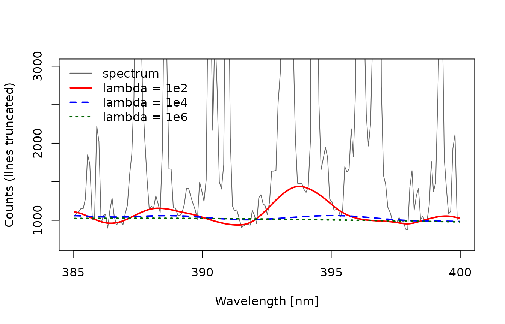
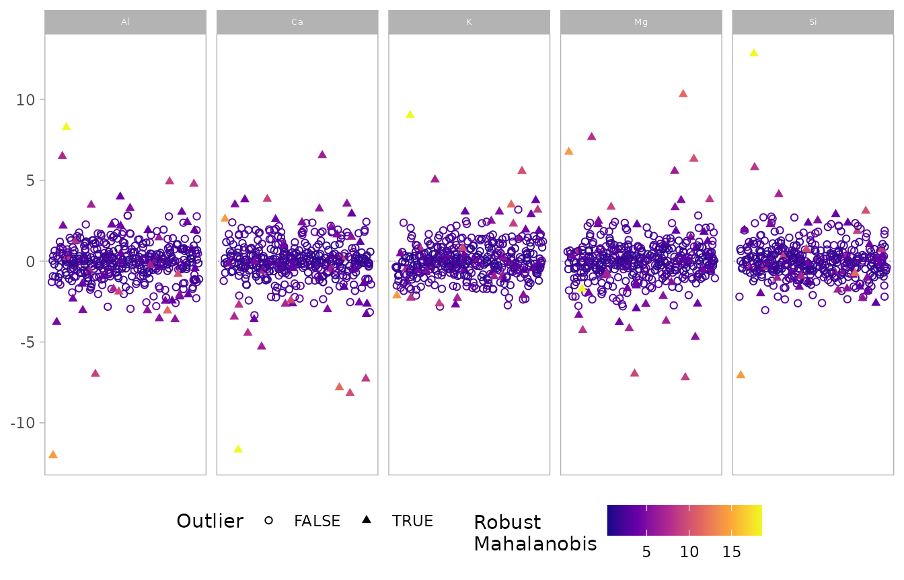
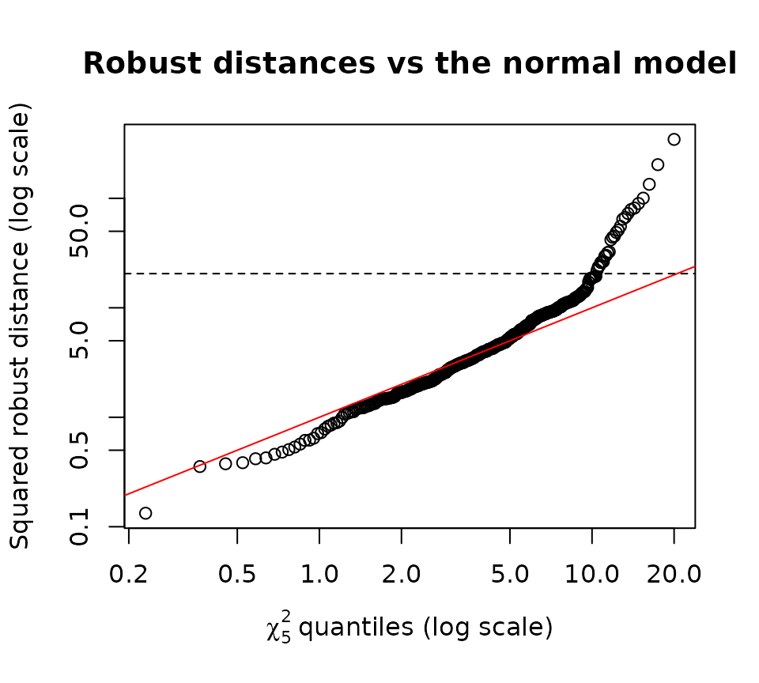
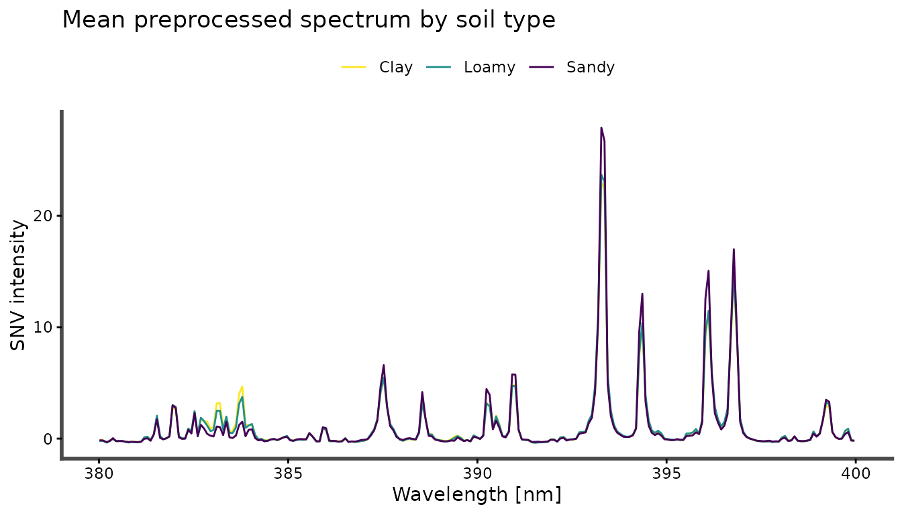

# Preprocessing LIBS spectra

This vignette takes the raw spectra of the `specLIBS` data set through a
preprocessing pipeline: baseline correction, normalization, screening
for outlying shots, and averaging of replicates. Every step is a
modeling choice. For each one, the vignette shows how to check the
choice against the data rather than assuming it.

``` r

library(specProc)
data(specLIBS)

meta <- specLIBS[1:8]
X <- as.matrix(specLIBS[-(1:8)])
wl <- as.numeric(colnames(X))
```

## The data and its structure

`specLIBS` contains 400 spectra of 50 soil samples. Each sample was
measured at 8 locations, and each spectrum has 7152 channels between 199
and 822 nm, stored as raw detector counts.

``` r

table(locations_per_sample = table(meta$Sample))
#> locations_per_sample
#>  8 
#> 50
summary(as.vector(X))
#>    Min. 1st Qu.  Median    Mean 3rd Qu.    Max. 
#>   634.0   764.0   826.0   951.7   928.0 28446.0
```

Two features of the data shape everything that follows:

- **Replicates are nested within samples.** The 8 spectra of a sample
  share its composition and differ only by shot-to-shot variability and
  small-scale heterogeneity. Statistics that treat them as independent
  overstate precision.
- **The counts include a large detector offset.** The smallest count is
  about 630, not zero. Any ratio, relative standard deviation or
  normalization computed on uncorrected counts is diluted by this
  offset.

We track five emission lines throughout, measured as the summed
intensity within ±0.15 nm of the line center:

``` r

lines <- c(`Mg II 279.55` = 279.55, `Si I 288.16` = 288.16, `Ca II 393.37` = 393.37,
           `Al I 396.15` = 396.15, `K I 766.49` = 766.49)

line_areas <- function(M) {
  sapply(lines, function(center) rowSums(M[, abs(wl - center) < 0.15, drop = FALSE]))
}
```

## Step 1: Baseline correction

[`baseline_arpls()`](https://christiangoueguel.com/specProc/reference/baseline_arpls.md)
estimates the continuum with asymmetrically reweighted penalized least
squares. Its smoothing parameter `lambda` sets how stiff the baseline
is: small values follow narrow features and can eat into emission lines,
while large values miss curvature of the continuum.

``` r

zoom <- wl > 385 & wl < 400
spec <- X[1, ]
fits <- sapply(c(1e2, 1e4, 1e6), function(l) {
  unlist(baseline_arpls(matrix(spec, 1), lambda = l, max.iter = 20)$background)
})

matplot(wl[zoom], cbind(spec[zoom], fits[zoom, ]), type = "l", lty = c(1, 1, 2, 3),
        col = c("grey40", "red", "blue", "darkgreen"), lwd = c(1, 2, 2, 2),
        ylim = c(700, 3000), xlab = "Wavelength [nm]", ylab = "Counts (lines truncated)")
legend("topleft", c("spectrum", "lambda = 1e2", "lambda = 1e4", "lambda = 1e6"),
       col = c("grey40", "red", "blue", "darkgreen"), lty = c(1, 1, 2, 3), lwd = 2, bty = "n")
```



With `lambda = 1e2`, the baseline rises into the base of the Ca and Al
lines and removes part of their area. Since the baseline is an estimate,
check how sensitive the quantity you care about is to `lambda`:

``` r

sens <- sapply(c(1e3, 1e4, 1e5, 1e6, 1e7), function(l) {
  bg <- as.matrix(baseline_arpls(X[1:8, ], lambda = l, max.iter = 20)$background)
  colMeans(line_areas(X[1:8, ] - bg))
})
colnames(sens) <- paste0("lambda=", c("1e3", "1e4", "1e5", "1e6", "1e7"))
round(sens)
#>              lambda=1e3 lambda=1e4 lambda=1e5 lambda=1e6 lambda=1e7
#> Mg II 279.55      48336      48423      48648      49153      49500
#> Si I 288.16       20437      20509      20484      20438      20503
#> Ca II 393.37      45902      46114      46151      46155      46204
#> Al I 396.15       28128      28182      28282      28281      28311
#> K I 766.49         3313       3325       3328       3405       3445
```

Across four orders of magnitude of `lambda`, the areas of the strong
lines change by less than 2%. The weak K line, which sits on a
relatively larger continuum, changes by about 4%. The line areas are
therefore robust to this choice for strong lines, but not entirely for
weak ones. We use `lambda = 1e5`, the smallest value at which the
baseline stays clear of the line wings in the plot above. For your own
data, run the same check on a few representative spectra.

``` r

Xb <- as.matrix(baseline_arpls(X, lambda = 1e5, max.iter = 20)$correction)
```

The alternatives are
[`baseline_als()`](https://christiangoueguel.com/specProc/reference/baseline_als.md)
(asymmetric least squares, with an explicit asymmetry parameter `p`) and
[`baseline_lsp()`](https://christiangoueguel.com/specProc/reference/baseline_lsp.md)
(iterative polynomial fitting). All three return the corrected spectra
together with the estimated background.

## Step 2: Normalization

Normalization aims to remove multiplicative, shot-to-shot fluctuations
in the amount of ablated material and plasma conditions. It’s often
judged by the relative standard deviation (RSD) of lines across
replicates alone. That criterion is incomplete, because a transformation
that shrinks every spectrum toward a common shape also reduces RSD,
while destroying the between-sample differences we want to measure.

A better criterion compares both sources of variation. The **intraclass
correlation** (ICC) is the fraction of total variance that lies between
samples rather than between replicates of a sample. The higher it is,
the better a line discriminates between samples relative to its
measurement noise. We estimate it from a one-way random-effects ANOVA:

``` r

icc <- function(v, group) {
  if (stats::var(v) == 0) return(NA_real_)
  fit <- stats::anova(stats::lm(v ~ factor(group)))
  k <- mean(table(group))
  msb <- fit[1, "Mean Sq"]
  msw <- fit[2, "Mean Sq"]
  (msb - msw) / (msb + (k - 1) * msw)
}
rsd <- function(v, group) {
  median(tapply(v, group, function(z) sd(z) / mean(z) * 100))
}
```

We compare no normalization, total-area normalization, SNV, MSC, and
internal standardization to the Si I 288.16 nm line:

``` r

si_cols <- colnames(X)[abs(wl - 288.16) < 0.15]
candidates <- list(
  `baseline only` = Xb,
  `area` = as.matrix(normalize(as.data.frame(Xb), method = "area")),
  `SNV` = as.matrix(snv(Xb)$correction),
  `MSC` = as.matrix(msc(Xb)$correction),
  `internal std. (Si)` = as.matrix(normalize(as.data.frame(Xb), method = "internal",
                                             wlength = si_cols))
)

evaluate <- function(M) {
  A <- line_areas(M)
  data.frame(
    line = colnames(A),
    RSD = apply(A, 2, rsd, group = meta$Sample),
    ICC = apply(A, 2, icc, group = meta$Sample)
  )
}
scores <- do.call(rbind, lapply(names(candidates), function(nm) {
  cbind(normalization = nm, evaluate(candidates[[nm]]))
}))
#> Warning in anova.lm(stats::lm(v ~ factor(group))): ANOVA F-tests on an
#> essentially perfect fit are unreliable
```

``` r

wide <- function(stat) {
  out <- tapply(scores[[stat]], list(scores$normalization, scores$line), identity)
  round(out[names(candidates), names(lines)], 2)
}
wide("RSD")   # median within-sample RSD (%)
#>                    Mg II 279.55 Si I 288.16 Ca II 393.37 Al I 396.15 K I 766.49
#> baseline only              5.66        8.19         6.73        7.07      12.33
#> area                       4.60        6.67         5.44        5.28      12.63
#> SNV                        3.26        5.66         3.79        4.36      15.56
#> MSC                        3.29        5.55         3.80        4.17      12.61
#> internal std. (Si)         6.31        0.00         7.42        6.37      13.14
wide("ICC")   # fraction of variance between samples
#>                    Mg II 279.55 Si I 288.16 Ca II 393.37 Al I 396.15 K I 766.49
#> baseline only              0.90        0.77         0.81        0.79       0.86
#> area                       0.56        0.63         0.70        0.68       0.47
#> SNV                        0.80        0.49         0.60        0.61       0.54
#> MSC                        0.79        0.54         0.66        0.64       0.51
#> internal std. (Si)         0.76        0.00         0.41        0.33       0.66
```

The two criteria disagree, and the disagreement is informative:

- **SNV and MSC give the best repeatability.** They reduce the replicate
  RSD of the Mg, Ca and Al lines by about 40% compared with baseline
  correction alone.
- **They also lower the ICC.** A lower ICC means the between-sample
  variance shrank even more than the within-sample variance.
  Normalization removes multiplicative variation, and part of the
  multiplicative variation between samples is systematic: soils of
  different texture ablate and emit differently.
- **Replicates alone cannot say whether that variation is useful.** If
  the between-sample intensity differences are a matrix effect unrelated
  to the property of interest, removing them helps. If they carry
  information about it, removing them hurts. Only a validated model of
  that property can decide; the calibration vignette does this for clay
  content.
- **The weak K line is a special case.** SNV increases its RSD: dividing
  by the whole-spectrum standard deviation adds that statistic’s noise
  to a line that is itself noisy.
- **Internal standardization by Si is not usable here.** It sets the Si
  line to a constant, so its own RSD and ICC are meaningless. It also
  assumes the silicon content is constant across samples, which is false
  for soils ranging from clay to sand. It lowers the ICC of every other
  line.

No normalization is universally best, so choose one on data from the
matrix at hand, and confirm the choice against the end goal. We continue
with SNV, the most repeatable option, and revisit the choice in the
calibration vignette:

``` r

Xn <- candidates$SNV
```

## Step 3: Screening outlying shots

A misfired or defocused shot can bias a sample’s mean spectrum. Outliers
must be judged relative to the other shots of the *same sample*, because
the differences between samples are real signal. We therefore remove
each sample’s median from its line intensities, and look for shots that
are outlying in this within-sample deviation space.

``` r

A <- line_areas(Xn)
deviation <- A - apply(A, 2, function(v) ave(v, meta$Sample, FUN = median))
colnames(deviation) <- sub(" .*", "", colnames(deviation))
```

[`plot_outliers()`](https://christiangoueguel.com/specProc/reference/plot_outliers.md)
computes robust (MCD) Mahalanobis distances, which account for the
correlation between lines. It then displays the standardized deviation
of every shot for each variable:

``` r

plot_outliers(deviation, quan = 0.75, show.mahal = TRUE)
```



The default cutoff of
[`plot_outliers()`](https://christiangoueguel.com/specProc/reference/plot_outliers.md)
flags a large share of the shots:

``` r

screen <- plot_outliers(deviation, quan = 0.75, show.outlier = FALSE, show.mahal = FALSE)
table(flagged = screen$outlier)
#> flagged
#> FALSE  TRUE 
#>   356    44
```

That is about 11% of the shots, far more than the few gross errors one
would expect from misfires. Before discarding anything, compare the
distribution of the squared robust distances with the χ² distribution
they would follow if the within-sample deviations were multivariate
normal:

``` r

d2 <- screen$mahalanobis^2
p <- ncol(deviation)
qqplot(stats::qchisq(stats::ppoints(length(d2)), df = p), d2, log = "xy",
       xlab = expression(chi[5]^2 ~ "quantiles (log scale)"),
       ylab = "Squared robust distance (log scale)",
       main = "Robust distances vs the normal model")
abline(0, 1, col = "red")
abline(h = stats::qchisq(0.999, p), lty = 2)
```



The bulk of the shots follows the reference line: the median distance
matches its χ² expectation. The upper tail is much heavier than the
normal model predicts. Most of these shots are not errors: they reflect
genuine heterogeneity of the soil at the scale of the laser spot.
Discarding them would bias each sample’s mean toward its most
homogeneous spots.

A defensible rule is to remove only the gross outliers, beyond the 99.9%
quantile of the χ² distribution, and to report how many shots were
removed:

``` r

flagged <- d2 > stats::qchisq(0.999, p)
sum(flagged)
#> [1] 26
table(shots_kept = table(meta$Sample[!flagged]))
#> shots_kept
#>  2  4  5  6  7  8 
#>  1  2  2  2  2 41
sort(table(meta$Sample[flagged]), decreasing = TRUE)[1:5]
#> 
#> MRI007 MRI001 MRI004 MRI010 MRI016 
#>      6      4      4      3      3
```

Most samples keep all 8 shots. The few samples that lose several shots
are heterogeneous and deserve inspection: their mean spectrum rests on
fewer measurements and is less certain.

## Step 4: Averaging replicates

With the screened shots,
[`average()`](https://christiangoueguel.com/specProc/reference/average.md)
reduces each sample to one mean spectrum. It is implemented in C++ and
handles the full matrix in a fraction of a second:

``` r

Xs <- average(cbind(Sample = meta$Sample[!flagged], as.data.frame(Xn[!flagged, ])), Sample)
dim(Xs)
#> [1]   50 7153
```

The mean of the remaining shots still includes the heavy-tailed but
legitimate variability discussed above. If you prefer not to screen at
all, the per-sample median of each channel is a robust alternative to
the mean, but it is less efficient when the data are close to normal.

## The result

The preprocessed, sample-level data set is ready for exploratory
analysis or calibration:

``` r

samples <- meta[match(Xs$Sample, meta$Sample), ]
by_type <- average(cbind(Type = samples$Type, Xs[-1]), Type)
keep <- names(by_type)[-1][wl > 380 & wl < 400]
plot_spectra(by_type[c("Type", keep)], id = Type) +
  ggplot2::theme(legend.position = "top") +
  ggplot2::labs(color = NULL, y = "SNV intensity", title = "Mean preprocessed spectrum by soil type")
```



The companion vignettes use this pipeline to fit emission lines
([`vignette("line-fitting", package = "specProc")`](https://christiangoueguel.com/specProc/articles/line-fitting.md))
and to build a calibration model for clay content
([`vignette("calibration", package = "specProc")`](https://christiangoueguel.com/specProc/articles/calibration.md)).
