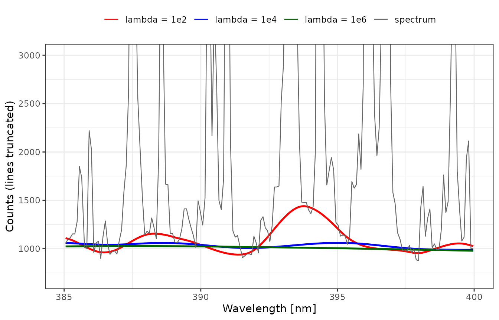
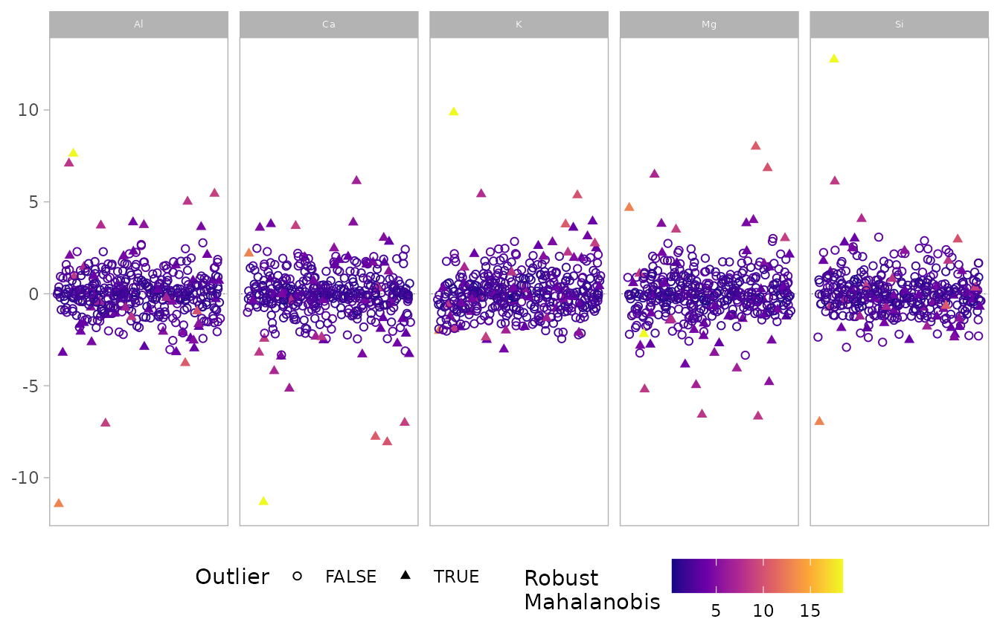
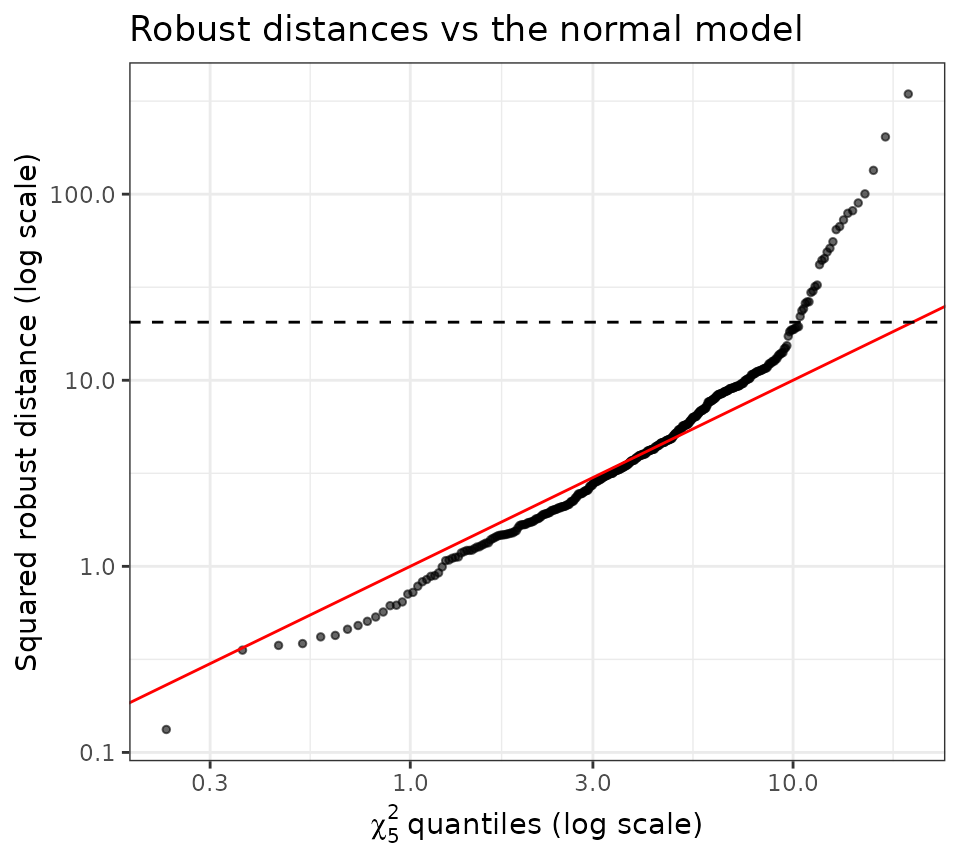
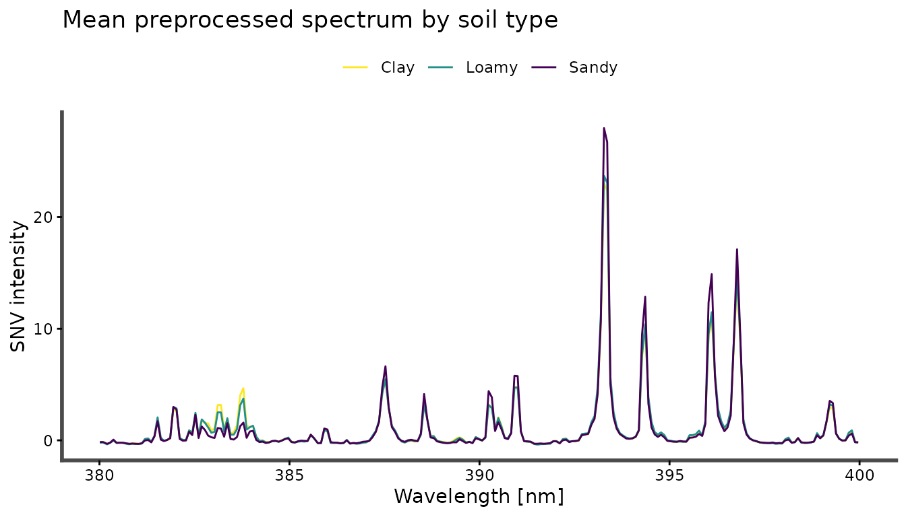

# Preprocessing LIBS spectra

This vignette takes the raw spectra of the `specLIBS` data set through a
preprocessing pipeline: baseline correction, normalization, screening
for outlying shots, and averaging of replicates. Every step is a
modeling choice. For each one, the vignette shows how to check the
choice against the data rather than assuming it.

The preprocessing steps are written as
[recipes](https://recipes.tidymodels.org) steps
([`step_baseline()`](https://christiangoueguel.com/specProc/reference/step_baseline.md),
[`step_snv()`](https://christiangoueguel.com/specProc/reference/step_snv.md),
[`step_msc()`](https://christiangoueguel.com/specProc/reference/step_msc.md),
[`step_line_ratio()`](https://christiangoueguel.com/specProc/reference/step_line_ratio.md),
[`step_reject_shots()`](https://christiangoueguel.com/specProc/reference/step_reject_shots.md)),
so the same pipeline can later be estimated on calibration data and
applied to new spectra, or tuned within a tidymodels workflow.

``` r

library(specProc)
library(recipes)
library(dplyr)
library(tidyr)
library(ggplot2)

data(specLIBS)
meta_cols <- c("Sample", "Location", "Clay", "Sand", "Silt", "Texture", "Structure", "Type")
channels <- setdiff(names(specLIBS), meta_cols)
wl <- as.numeric(channels)
```

## The data and its structure

`specLIBS` contains 400 spectra of 50 soil samples. Each sample was
measured at 8 locations, and each spectrum has 7152 channels between 199
and 822 nm, stored as raw detector counts.

``` r

specLIBS |> count(Sample, name = "locations") |> count(locations, name = "samples")
#> # A tibble: 1 × 2
#>   locations samples
#>       <int>   <int>
#> 1         8      50

specLIBS |>
  select(all_of(channels)) |>
  unlist(use.names = FALSE) |>
  summary()
#>    Min. 1st Qu.  Median    Mean 3rd Qu.    Max. 
#>   634.0   764.0   826.0   951.7   928.0 28446.0
```

Two features of the data shape everything that follows:

- **Replicates are nested within samples.** The 8 spectra of a sample
  share its composition and differ only by shot-to-shot variability and
  small-scale heterogeneity. Statistics that treat them as independent
  overstate precision.
- **The counts include a large detector offset.** The smallest count is
  about 630, not zero. Any ratio, relative standard deviation or
  normalization computed on uncorrected counts is diluted by this
  offset.

We track five emission lines throughout, measured as the summed
intensity within ±0.15 nm of the line center:

``` r

lines <- c(`Mg II 279.55` = 279.55, `Si I 288.16` = 288.16, `Ca II 393.37` = 393.37,
           `Al I 396.15` = 396.15, `K I 766.49` = 766.49)

# Line areas of a table of spectra that has a Sample column
line_areas <- function(spectra) {
  areas <- lapply(lines, function(center) {
    rowSums(spectra[channels[abs(wl - center) < 0.15]])
  })
  bind_cols(select(spectra, Sample), as_tibble(areas))
}
```

## Step 1: Baseline correction

[`step_baseline()`](https://christiangoueguel.com/specProc/reference/step_baseline.md)
estimates the continuum of each spectrum, by default with asymmetrically
reweighted penalized least squares
([`baseline_arpls()`](https://christiangoueguel.com/specProc/reference/baseline_arpls.md)).
Its smoothing parameter `lambda` sets how stiff the baseline is: small
values follow narrow features and can eat into emission lines, while
large values miss curvature of the continuum. To look at the estimated
baseline itself, we call
[`baseline_arpls()`](https://christiangoueguel.com/specProc/reference/baseline_arpls.md)
on the first spectrum:

``` r

spectrum1 <- specLIBS[1, channels]
fitted_baselines <- lapply(c(`1e2` = 1e2, `1e4` = 1e4, `1e6` = 1e6), function(l) {
  unlist(baseline_arpls(spectrum1, lambda = l, max.iter = 20)$background)
})

tibble(wavelength = wl, spectrum = unlist(spectrum1), !!!fitted_baselines) |>
  filter(wavelength > 385, wavelength < 400) |>
  pivot_longer(-wavelength, names_to = "curve", values_to = "counts") |>
  mutate(curve = if_else(curve == "spectrum", curve, paste("lambda =", curve))) |>
  ggplot(aes(wavelength, counts, colour = curve, linewidth = curve == "spectrum")) +
  geom_line() +
  scale_linewidth_manual(values = c(`TRUE` = 0.4, `FALSE` = 0.9), guide = "none") +
  scale_colour_manual(values = c(spectrum = "grey40", `lambda = 1e2` = "red",
                                 `lambda = 1e4` = "blue", `lambda = 1e6` = "darkgreen")) +
  coord_cartesian(ylim = c(700, 3000)) +
  labs(x = "Wavelength [nm]", y = "Counts (lines truncated)", colour = NULL) +
  theme_bw() +
  theme(legend.position = "top")
```



With `lambda = 1e2`, the baseline rises into the base of the Ca and Al
lines and removes part of their area. Since the baseline is an estimate,
check how sensitive the quantity you care about is to `lambda`. We bake
the first sample’s 8 spectra through a one-step recipe for each value:

``` r

first_sample <- specLIBS |> filter(Sample == first(Sample))

baseline_recipe <- function(data, lambda) {
  recipe(~ ., data = data) |>
    update_role(all_of(meta_cols), new_role = "id") |>
    step_baseline(all_predictors(), lambda = lambda, options = list(max.iter = 20))
}

sensitivity <- tibble(lambda = c(1e3, 1e4, 1e5, 1e6, 1e7)) |>
  mutate(areas = lapply(lambda, function(l) {
    baseline_recipe(first_sample, l) |>
      prep() |>
      bake(new_data = NULL) |>
      line_areas() |>
      summarise(across(-Sample, mean))
  })) |>
  unnest(areas)

sensitivity |>
  mutate(lambda = format(lambda, scientific = TRUE), across(-lambda, round))
#> # A tibble: 5 × 6
#>   lambda `Mg II 279.55` `Si I 288.16` `Ca II 393.37` `Al I 396.15` `K I 766.49`
#>   <chr>           <dbl>         <dbl>          <dbl>         <dbl>        <dbl>
#> 1 1e+03           48336         20437          45902         28128         3313
#> 2 1e+04           48423         20509          46114         28182         3325
#> 3 1e+05           48648         20484          46151         28282         3328
#> 4 1e+06           49153         20438          46155         28281         3405
#> 5 1e+07           49500         20503          46204         28311         3445
```

Across four orders of magnitude of `lambda`, the areas of the strong
lines change by less than 3%. The weak K line, which sits on a
relatively larger continuum, changes by about 4%. The line areas are
therefore robust to this choice for strong lines, but not entirely for
weak ones. We use `lambda = 1e5`, the smallest value at which the
baseline stays clear of the line wings in the plot above. For your own
data, run the same check on a few representative spectra.

``` r

baselined <- baseline_recipe(specLIBS, 1e5) |>
  prep() |>
  bake(new_data = NULL)
```

[`step_baseline()`](https://christiangoueguel.com/specProc/reference/step_baseline.md)
also offers asymmetric least squares (`method = "als"`, with an explicit
asymmetry parameter `p`) and iterative polynomial fitting
(`method = "lsp"`), the methods of
[`baseline_als()`](https://christiangoueguel.com/specProc/reference/baseline_als.md)
and
[`baseline_lsp()`](https://christiangoueguel.com/specProc/reference/baseline_lsp.md).
Baseline correction works on each spectrum alone, so it estimates
nothing from the training data; `lambda` can nevertheless be tuned with
[`tune::tune()`](https://hardhat.tidymodels.org/reference/tune.html)
when the pipeline is part of a model.

## Step 2: Normalization

Normalization aims to remove multiplicative, shot-to-shot fluctuations
in the amount of ablated material and plasma conditions. It’s often
judged by the relative standard deviation (RSD) of lines across
replicates alone. That criterion is incomplete, because a transformation
that shrinks every spectrum toward a common shape also reduces RSD,
while destroying the between-sample differences we want to measure.

A better criterion compares both sources of variation. The **intraclass
correlation** (ICC) is the fraction of total variance that lies between
samples rather than between replicates of a sample. The higher it is,
the better a line discriminates between samples relative to its
measurement noise. We estimate it from a one-way random-effects ANOVA:

``` r

icc <- function(v, group) {
  # constant (up to rounding) within the data: no variance to decompose
  if (stats::sd(v) <= 1e-8 * abs(mean(v))) return(NA_real_)
  fit <- stats::anova(stats::lm(v ~ factor(group)))
  k <- mean(table(group))
  msb <- fit[1, "Mean Sq"]
  msw <- fit[2, "Mean Sq"]
  (msb - msw) / (msb + (k - 1) * msw)
}
rsd <- function(v, group) {
  median(tapply(v, group, function(z) sd(z) / mean(z) * 100))
}
```

We compare no normalization, total-area normalization, SNV, MSC, and
internal standardization to the Si I 288.16 nm line. SNV, MSC and the
internal standard
([`step_line_ratio()`](https://christiangoueguel.com/specProc/reference/step_line_ratio.md),
which divides each spectrum by the area of a reference line) are recipe
steps added after the baseline; area normalization uses
[`normalize()`](https://christiangoueguel.com/specProc/reference/normalize.md):

``` r

normalized <- function(step, ...) {
  baseline_recipe(specLIBS, 1e5) |>
    step(all_predictors(), ...) |>
    prep() |>
    bake(new_data = NULL)
}
candidates <- list(
  `baseline only` = baselined,
  `area` = bind_cols(select(baselined, Sample),
                     normalize(baselined[channels], method = "area")),
  `SNV` = normalized(step_snv),
  `MSC` = normalized(step_msc),
  `internal std. (Si)` = normalized(step_line_ratio, reference = 288.16, window = 0.15)
)

scores <- candidates |>
  lapply(line_areas) |>
  bind_rows(.id = "normalization") |>
  pivot_longer(all_of(names(lines)), names_to = "line") |>
  mutate(normalization = factor(normalization, levels = names(candidates)),
         line = factor(line, levels = names(lines))) |>
  group_by(normalization, line) |>
  summarise(RSD = rsd(value, Sample), ICC = icc(value, Sample), .groups = "drop")
```

``` r

wide <- function(stat) {
  scores |>
    select(normalization, line, all_of(stat)) |>
    pivot_wider(names_from = line, values_from = all_of(stat)) |>
    mutate(across(-normalization, \(v) round(v, 2))) |>
    as.data.frame()
}
wide("RSD")   # median within-sample RSD (%)
#>        normalization Mg II 279.55 Si I 288.16 Ca II 393.37 Al I 396.15
#> 1      baseline only         5.66        8.19         6.73        7.07
#> 2               area         4.60        6.67         5.44        5.28
#> 3                SNV         3.26        5.66         3.79        4.36
#> 4                MSC         3.29        5.55         3.80        4.17
#> 5 internal std. (Si)         6.66        0.84         7.60        6.49
#>   K I 766.49
#> 1      12.33
#> 2      12.63
#> 3      15.56
#> 4      12.61
#> 5      13.50
wide("ICC")   # fraction of variance between samples
#>        normalization Mg II 279.55 Si I 288.16 Ca II 393.37 Al I 396.15
#> 1      baseline only         0.90        0.77         0.81        0.79
#> 2               area         0.56        0.63         0.70        0.68
#> 3                SNV         0.80        0.49         0.60        0.61
#> 4                MSC         0.79        0.54         0.66        0.64
#> 5 internal std. (Si)         0.76        0.28         0.41        0.32
#>   K I 766.49
#> 1       0.86
#> 2       0.47
#> 3       0.54
#> 4       0.51
#> 5       0.66
```

The two criteria disagree, and the disagreement is informative:

- **SNV and MSC give the best repeatability.** They reduce the replicate
  RSD of the Mg, Ca and Al lines by about 40% compared with baseline
  correction alone.
- **They also lower the ICC.** A lower ICC means the between-sample
  variance shrank even more than the within-sample variance.
  Normalization removes multiplicative variation, and part of the
  multiplicative variation between samples is systematic: soils of
  different texture ablate and emit differently.
- **Replicates alone cannot say whether that variation is useful.** If
  the between-sample intensity differences are a matrix effect unrelated
  to the property of interest, removing them helps. If they carry
  information about it, removing them hurts. Only a validated model of
  that property can decide; the calibration vignette does this for clay
  content.
- **The weak K line is a special case.** SNV increases its RSD: dividing
  by the whole-spectrum standard deviation adds that statistic’s noise
  to a line that is itself noisy.
- **Internal standardization by Si is not usable here.** It makes the Si
  line nearly constant (the residual RSD comes from the slightly
  different windows of the step and of our line areas), so its own RSD
  and ICC are meaningless. It also assumes the silicon content is
  constant across samples, which is false for soils ranging from clay to
  sand. It lowers the ICC of every other line.

No normalization is universally best, so choose one on data from the
matrix at hand, and confirm the choice against the end goal. We continue
with SNV, the most repeatable option, and revisit the choice in the
calibration vignette. Note that
[`step_msc()`](https://christiangoueguel.com/specProc/reference/step_msc.md)
estimates its reference spectrum from the data it is prepped on, so in a
model it must be prepped on calibration data only; within a workflow,
this happens automatically.

``` r

normalized_snv <- candidates$SNV
```

## Step 3: Screening outlying shots

A misfired or defocused shot can bias a sample’s mean spectrum. Outliers
must be judged relative to the other shots of the *same sample*, because
the differences between samples are real signal. We therefore remove
each sample’s median from its line intensities, and look for shots that
are outlying in this within-sample deviation space.

``` r

deviation <- normalized_snv |>
  line_areas() |>
  group_by(Sample) |>
  mutate(across(everything(), \(v) v - median(v))) |>
  ungroup() |>
  select(-Sample) |>
  rename_with(\(nm) sub(" .*", "", nm))
```

[`plot_outliers()`](https://christiangoueguel.com/specProc/reference/plot_outliers.md)
computes robust (MCD) Mahalanobis distances, which account for the
correlation between lines. It then displays the standardized deviation
of every shot for each variable:

``` r

plot_outliers(deviation, quan = 0.75, show.mahal = TRUE)
```



The default cutoff of
[`plot_outliers()`](https://christiangoueguel.com/specProc/reference/plot_outliers.md)
flags a large share of the shots:

``` r

screen <- plot_outliers(deviation, quan = 0.75, show.outlier = FALSE, show.mahal = FALSE)
count(screen, flagged = outlier)
#> # A tibble: 2 × 2
#>   flagged     n
#>   <lgl>   <int>
#> 1 FALSE     356
#> 2 TRUE       44
```

That is about 11% of the shots, far more than the few gross errors one
would expect from misfires. Before discarding anything, compare the
distribution of the squared robust distances with the χ² distribution
they would follow if the within-sample deviations were multivariate
normal:

``` r

p <- ncol(deviation)
qq <- tibble(
  observed = sort(screen$mahalanobis^2),
  theoretical = stats::qchisq(stats::ppoints(length(observed)), df = p)
)
ggplot(qq, aes(theoretical, observed)) +
  geom_point(size = 1, alpha = 0.6) +
  geom_abline(colour = "red") +
  geom_hline(yintercept = stats::qchisq(0.999, p), linetype = "dashed") +
  scale_x_log10() +
  scale_y_log10() +
  labs(x = expression(chi[5]^2 ~ "quantiles (log scale)"),
       y = "Squared robust distance (log scale)",
       title = "Robust distances vs the normal model") +
  theme_bw()
```



The bulk of the shots follows the reference line: the median distance
matches its χ² expectation. The upper tail is much heavier than the
normal model predicts. Most of these shots are not errors: they reflect
genuine heterogeneity of the soil at the scale of the laser spot.
Discarding them would bias each sample’s mean toward its most
homogeneous spots.

A defensible rule is to remove only the gross outliers, beyond the 99.9%
quantile of the χ² distribution, and to report how many shots were
removed:

``` r

shots <- normalized_snv |>
  mutate(flagged = screen$mahalanobis^2 > stats::qchisq(0.999, p))

sum(shots$flagged)
#> [1] 26
shots |> filter(!flagged) |> count(Sample, name = "shots_kept") |> count(shots_kept)
#> # A tibble: 6 × 2
#>   shots_kept     n
#>        <int> <int>
#> 1          2     1
#> 2          4     2
#> 3          5     2
#> 4          6     2
#> 5          7     2
#> 6          8    41
shots |> filter(flagged) |> count(Sample, sort = TRUE) |> head(5)
#> # A tibble: 5 × 2
#>   Sample     n
#>   <chr>  <int>
#> 1 MRI007     6
#> 2 MRI001     4
#> 3 MRI004     4
#> 4 MRI010     3
#> 5 MRI016     3
```

Most samples keep all 8 shots. The few samples that lose several shots
are heterogeneous and deserve inspection: their mean spectrum rests on
fewer measurements and is less certain.

### Whole-spectrum screening with `reject_shots()`

The screen above looks at five lines.
[`reject_shots()`](https://christiangoueguel.com/specProc/reference/reject_shots.md)
looks at whole spectra instead, with two robust z-scores computed within
each sample: the total intensity of each shot, which flags weak or
missed plasmas, and its correlation with the median spectrum of the
sample, which flags shots of a different shape (another mineral grain, a
contaminated spot). The total intensity is meaningful only before
normalization, since SNV gives every spectrum a mean of zero, so we
screen the baseline-corrected spectra:

``` r

whole <- reject_shots(baselined, Sample)
count(whole, .reason)
#> # A tibble: 4 × 2
#>   .reason                    n
#>   <chr>                  <int>
#> 1 correlation               21
#> 2 intensity                  4
#> 3 intensity, correlation     6
#> 4 NA                       369
count(whole, lines = shots$flagged, whole_spectrum = .rejected)
#> # A tibble: 4 × 3
#>   lines whole_spectrum     n
#>   <lgl> <lgl>          <int>
#> 1 FALSE FALSE            351
#> 2 FALSE TRUE              23
#> 3 TRUE  FALSE             18
#> 4 TRUE  TRUE               8
```

The two screens flag different shots, because they look at different
things: a shot can have normal intensities for the five lines and a
different spectrum elsewhere, or the reverse. With 8 shots per sample,
the median and MAD of each sample are themselves uncertain, so a cutoff
of 3.5 (the default) still flags some legitimate heterogeneity; raise
`cutoff` to keep only the gross outliers. Whatever the screen, report
how many shots it removed.

## Step 4: Averaging replicates

With the screened shots,
[`average()`](https://christiangoueguel.com/specProc/reference/average.md)
reduces each sample to one mean spectrum. It is implemented in C++ and
handles the full matrix in a fraction of a second:

``` r

sample_spectra <- shots |>
  filter(!flagged) |>
  select(Sample, all_of(channels)) |>
  average(Sample)
dim(sample_spectra)
#> [1]   50 7153
```

The mean of the remaining shots still includes the heavy-tailed but
legitimate variability discussed above. If you prefer not to screen at
all, the per-sample median of each channel is a robust alternative to
the mean, but it is less efficient when the data are close to normal.

## The result

The preprocessed, sample-level data set is ready for exploratory
analysis or calibration:

``` r

zoom <- channels[wl > 380 & wl < 400]
sample_spectra |>
  left_join(distinct(specLIBS, Sample, Type), by = "Sample") |>
  select(Type, all_of(zoom)) |>
  average(Type) |>
  plot_spectra(id = Type) +
  theme(legend.position = "top") +
  labs(color = NULL, y = "SNV intensity", title = "Mean preprocessed spectrum by soil type")
```



The same pipeline, written as one recipe, can be estimated on
calibration spectra and applied to new ones:

``` r

pipeline <- recipe(~ ., data = specLIBS) |>
  update_role(all_of(meta_cols), new_role = "id") |>
  step_baseline(all_predictors(), lambda = 1e5, options = list(max.iter = 20)) |>
  step_reject_shots(all_predictors(), sample = Sample) |>
  step_snv(all_predictors())
pipeline
#> 
#> ── Recipe ──────────────────────────────────────────────────────────────────────
#> 
#> ── Inputs
#> Number of variables by role
#> predictor: 7152
#> id:           8
#> 
#> ── Operations
#> • Baseline correction on: all_predictors()
#> • Shot rejection (intensity, correlation) on: all_predictors()
#> • Standard normal variate on: all_predictors()
```

[`step_reject_shots()`](https://christiangoueguel.com/specProc/reference/step_reject_shots.md)
removes rows, so it is skipped when new data are baked (`skip = TRUE`):
the rejected shots are left out of the model fit, but a prediction is
still made for every new spectrum. Keep the shots of a sample together
when resampling, for example with
`rsample::group_vfold_cv(group = Sample)`. To model sample means rather
than shots, screen and average before the recipe, as in Steps 3 and 4.

The companion vignettes use this pipeline to fit emission lines
([`vignette("line-fitting", package = "specProc")`](https://christiangoueguel.com/specProc/articles/line-fitting.md))
and to build a calibration model for clay content
([`vignette("calibration", package = "specProc")`](https://christiangoueguel.com/specProc/articles/calibration.md)).
