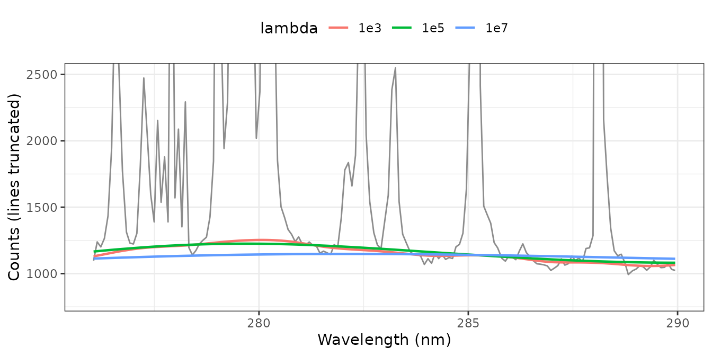
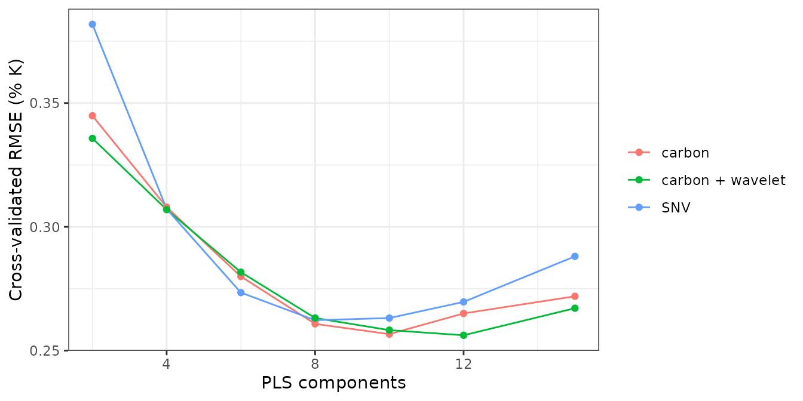
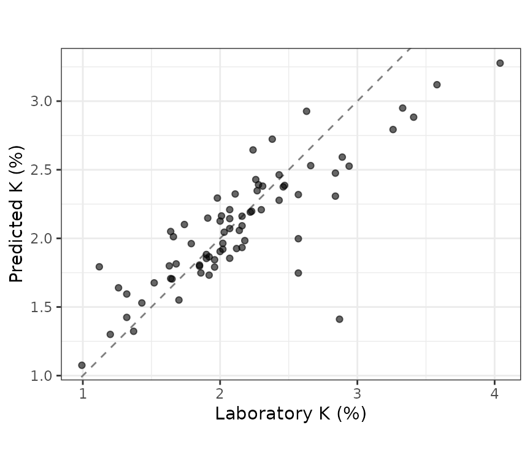

# 2. Preprocessing with recipe steps

Preprocessing turns raw spectra into variables ready for modeling. In
specProc, each preprocessing method is also a
[recipes](https://recipes.tidymodels.org) step (`step_*()`). A recipe is
estimated on training data
([`prep()`](https://recipes.tidymodels.org/reference/prep.html)) and
applied unchanged to new spectra
([`bake()`](https://recipes.tidymodels.org/reference/bake.html)), and
within a tidymodels workflow it is re-estimated in every resample and
can be tuned with the model. This vignette builds a recipe for the
forage spectra, and uses it to predict potassium.

``` r

suppressPackageStartupMessages(library(mixOmics))
library(specProc)
library(recipes)
library(parsnip)
library(plsmod)
library(workflows)
library(tune)
library(rsample)
library(yardstick)
library(dplyr)
library(purrr)
library(ggplot2)
# mixOmics (the PLS engine) and MASS, which it attaches, have functions
# named like those of the tidyverse and tidymodels: use the latter
select <- dplyr::select
map <- purrr::map
tune <- tune::tune

data("forageLIBS")
spectra_id <- forageLIBS |> select(1:2) |> names()
minerals <- forageLIBS |> select(3:14) |> names()
spectra <- forageLIBS |> select(-all_of(c(spectra_id, minerals)))
wl <- as.numeric(names(spectra))
```

The recipe predicts K from the spectral channels. The identifiers and
the other elements keep a role of their own, so they are carried along
but not used as predictors:

``` r

base <- recipe(K ~ ., data = forageLIBS) |>
  update_role(all_of(spectra_id), all_of(setdiff(minerals, "K")), new_role = "id")
```

## Baseline correction

The continuum emission of the plasma and the detector offset add a
smooth background to every spectrum.
[`step_baseline()`](https://christiangoueguel.com/specProc/reference/step_baseline.md)
removes it, by default with asymmetrically reweighted penalized least
squares
([`baseline_arpls()`](https://christiangoueguel.com/specProc/reference/baseline_arpls.md)).
Its parameter `lambda` sets the stiffness of the baseline: too small, it
cuts into the lines; too large, it misses the curvature of the
continuum.
[`baseline_arpls()`](https://christiangoueguel.com/specProc/reference/baseline_arpls.md)
shows the baseline itself:

``` r

region <- wl > 276 & wl < 290
fitted_baselines <- map(c(`1e3` = 1e3, `1e5` = 1e5, `1e7` = 1e7), \(lambda) {
  unlist(baseline_arpls(spectra[1, ], lambda = lambda, max.iter = 20)$background)[region]
})
first_spectrum <- tibble(wavelength = wl[region], counts = unlist(spectra[1, region]))

tibble(wavelength = wl[region], !!!fitted_baselines) |>
  tidyr::pivot_longer(-wavelength, names_to = "lambda", values_to = "counts") |>
  ggplot(aes(wavelength, counts)) +
  geom_line(data = first_spectrum, colour = "grey55") +
  geom_line(aes(colour = lambda), linewidth = 0.8) +
  coord_cartesian(ylim = c(800, 2500)) +
  labs(x = "Wavelength (nm)", y = "Counts (lines truncated)") +
  theme_bw() +
  theme(legend.position = "top")
```



With `lambda = 1e7`, the baseline is too stiff to follow the broad hump
of the continuum under the Mg lines near 280 nm; with `1e3`, it starts
to rise into the lines. `1e5` follows the continuum without touching
them. `lambda` can also be tuned with the model (`lambda = tune()`, with
the range of
[`baseline_lambda()`](https://christiangoueguel.com/specProc/reference/baseline_lambda.md)).

``` r

corrected <- base |>
  step_baseline(all_predictors(), lambda = 1e5, options = list(max.iter = 20))
```

[`step_baseline()`](https://christiangoueguel.com/specProc/reference/step_baseline.md)
corrects each spectrum on its own and estimates nothing from the
training data, so it gives the same result inside or outside a
resampling loop. To avoid repeating it in every recipe and every
resample below, we apply it once and start the following recipes from
the corrected spectra:

``` r

corrected_data <- corrected |> prep() |> bake(new_data = NULL)
base_corrected <- recipe(K ~ ., data = corrected_data) |>
  update_role(all_of(spectra_id), all_of(setdiff(minerals, "K")), new_role = "id")
```

## Normalization

The intensity of every line changes from spectrum to spectrum with the
ablated mass and the plasma conditions. Normalization divides each
spectrum by a quantity that follows these changes:

| Step | Divides each spectrum by |
|----|----|
| [`step_spectral_norm()`](https://christiangoueguel.com/specProc/reference/step_spectral_norm.md) | its total area, or its L1, L2 or maximum norm |
| [`step_snv()`](https://christiangoueguel.com/specProc/reference/step_snv.md) | its standard deviation, after centering (standard normal variate) |
| [`step_msc()`](https://christiangoueguel.com/specProc/reference/step_msc.md) | a regression on the mean spectrum (multiplicative scatter correction) |
| [`step_emsc()`](https://christiangoueguel.com/specProc/reference/step_emsc.md) | an extended model with a polynomial baseline |
| [`step_line_ratio()`](https://christiangoueguel.com/specProc/reference/step_line_ratio.md) | the intensity of a reference line (internal standard) |

A good normalization brings the line intensities closer to the
concentrations.
[`step_line_intensities()`](https://christiangoueguel.com/specProc/reference/step_line_intensities.md)
replaces the channels by the intensities of chosen lines, so we compare
the normalizations by the correlation of each line with the laboratory
concentration of its element:

``` r

lines <- c(K = 769.896, Mg = 285.213, Ca = 317.933, Na = 589.592, Mn = 257.610, Fe = 259.940)
normalizations <- list(
  none = identity,
  area = \(r) step_spectral_norm(r, all_predictors(), method = "area"),
  SNV = \(r) step_snv(r, all_predictors()),
  MSC = \(r) step_msc(r, all_predictors()),
  `C I 247.86` = \(r) step_line_ratio(r, all_predictors(), reference = 247.856, window = 0.15)
)

imap(normalizations, \(normalize, name) {
  intensities <- base_corrected |>
    normalize() |>
    step_line_intensities(all_predictors(), lines = lines) |>
    prep() |>
    bake(new_data = NULL)
  map_dbl(names(lines), \(e) cor(intensities[[paste0("line_", e)]], forageLIBS[[e]],
                                 use = "complete.obs")) |>
    set_names(names(lines))
}) |>
  bind_rows(.id = "normalization") |>
  mutate(across(-normalization, \(r) round(r, 2)))
#> # A tibble: 5 × 7
#>   normalization     K    Mg    Ca    Na    Mn    Fe
#>   <chr>         <dbl> <dbl> <dbl> <dbl> <dbl> <dbl>
#> 1 none           0.54  0.42  0.5   0.76  0.7   0.92
#> 2 area           0.55  0.55  0.73  0.81  0.75  0.91
#> 3 SNV            0.63  0.48  0.65  0.8   0.75  0.92
#> 4 MSC            0.63  0.46  0.63  0.8   0.75  0.92
#> 5 C I 247.86     0.76  0.66  0.75  0.8   0.75  0.92
```

Normalizing to the carbon line C I 247.86 nm gives the highest
correlations for K, Mg and Ca. Carbon is the main element of the organic
matrix, and its content varies little between forages: it is an internal
standard. The other normalizations help less. The correlations of Na, Mn
and Fe change little: their concentrations vary over a much wider range
than the normalization factor.

## Other steps

| Purpose | Steps |
|----|----|
| Smoothing, derivatives | [`step_savgol()`](https://christiangoueguel.com/specProc/reference/step_savgol.md) |
| Compression | [`step_wavelet()`](https://christiangoueguel.com/specProc/reference/step_wavelet.md) (wavelet coefficients), [`step_line_intensities()`](https://christiangoueguel.com/specProc/reference/step_line_intensities.md) (line intensities) |
| Scaling | [`step_pareto_scale()`](https://christiangoueguel.com/specProc/reference/step_pareto_scale.md), [`step_poisson_scale()`](https://christiangoueguel.com/specProc/reference/step_poisson_scale.md) |
| Removing unwanted variation | [`step_epo()`](https://christiangoueguel.com/specProc/reference/step_epo.md), [`step_glsw()`](https://christiangoueguel.com/specProc/reference/step_glsw.md), [`step_osc()`](https://christiangoueguel.com/specProc/reference/step_osc.md), [`step_direct_osc()`](https://christiangoueguel.com/specProc/reference/step_direct_osc.md), [`step_projected_osc()`](https://christiangoueguel.com/specProc/reference/step_projected_osc.md), [`step_opls()`](https://christiangoueguel.com/specProc/reference/step_opls.md), [`step_o2pls()`](https://christiangoueguel.com/specProc/reference/step_o2pls.md), [`step_y_gradient_glsw()`](https://christiangoueguel.com/specProc/reference/step_y_gradient_glsw.md) |
| Robust transformations, PCA and PLS | [`step_robust_bcyj()`](https://christiangoueguel.com/specProc/reference/step_robust_bcyj.md), [`step_robpca()`](https://christiangoueguel.com/specProc/reference/step_robpca.md), [`step_rospca()`](https://christiangoueguel.com/specProc/reference/step_rospca.md), [`step_macropca()`](https://christiangoueguel.com/specProc/reference/step_macropca.md), [`step_cellpca()`](https://christiangoueguel.com/specProc/reference/step_cellpca.md), [`step_rsimpls()`](https://christiangoueguel.com/specProc/reference/step_rsimpls.md) |
| Replicate shots | [`step_reject_shots()`](https://christiangoueguel.com/specProc/reference/step_reject_shots.md) |

For example,
[`step_wavelet()`](https://christiangoueguel.com/specProc/reference/step_wavelet.md)
keeps the approximation coefficients of a discrete wavelet transform, a
smoothed spectrum with 8 times fewer values at `level = 3`:

``` r

base_corrected |>
  step_wavelet(all_predictors(), level = 3) |>
  prep() |>
  bake(new_data = NULL) |>
  select(starts_with("wav_")) |>
  ncol()
#> [1] 894
```

Steps that use the outcome, such as
[`step_opls()`](https://christiangoueguel.com/specProc/reference/step_opls.md)
or
[`step_osc()`](https://christiangoueguel.com/specProc/reference/step_osc.md),
must be estimated on training data only. Within a workflow, this is
automatic.

## A model for potassium

We keep 20% of the samples for testing. The data hold a few repeated
samples, so the splits keep the spectra of a sample together:

``` r

set.seed(1)
split <- group_initial_split(corrected_data, group = Sample, prop = 0.8)
training_set <- training(split)
folds <- group_vfold_cv(training_set, group = Sample, v = 5)
```

The model is a partial least squares (PLS) regression, from the mixOmics
engine of parsnip, with its number of components tuned. We compare three
recipes: baseline correction followed by SNV, by the carbon internal
standard, or by the carbon standard and a wavelet compression:

``` r

carbon_step <- \(r) step_line_ratio(r, all_predictors(), reference = 247.856, window = 0.15)

recipes <- list(
  SNV = base_corrected |> step_snv(all_predictors()),
  carbon = base_corrected |> carbon_step(),
  `carbon + wavelet` = base_corrected |> carbon_step() |>
    step_wavelet(all_predictors(), level = 3)
)

# mixOmics scales every predictor by default; scale = FALSE only centers
pls_model <- pls(num_comp = tune()) |>
  set_mode("regression") |>
  set_engine("mixOmics", scale = FALSE)
```

``` r

tuned <- map(recipes, \(rec) {
  tune_grid(workflow(rec, pls_model), resamples = folds,
            grid = tibble(num_comp = c(2, 4, 6, 8, 10, 12, 15)),
            metrics = metric_set(rmse, rsq))
})

map(tuned, \(res) show_best(res, metric = "rmse", n = 1)) |>
  bind_rows(.id = "recipe") |>
  select(recipe, num_comp, rmse = mean, std_err)
#> # A tibble: 3 × 4
#>   recipe           num_comp  rmse std_err
#>   <chr>               <dbl> <dbl>   <dbl>
#> 1 SNV                     8 0.262  0.0187
#> 2 carbon                 10 0.257  0.0183
#> 3 carbon + wavelet       12 0.256  0.0224
```

``` r

map(tuned, collect_metrics) |>
  bind_rows(.id = "recipe") |>
  filter(.metric == "rmse") |>
  ggplot(aes(num_comp, mean, colour = recipe)) +
  geom_line() +
  geom_point() +
  labs(x = "PLS components", y = "Cross-validated RMSE (% K)", colour = NULL) +
  theme_bw()
```



The three recipes give similar errors once the number of components is
tuned: PLS finds the potassium information in all of them, and the
normalization matters less for a multivariate model than for a single
line. The carbon + wavelet recipe is the best by a small margin. We
refit it on the whole training set with its best number of components,
and evaluate it once on the test samples:

``` r

final <- workflow(recipes[[best_recipe]], pls_model) |>
  finalize_workflow(select_best(tuned[[best_recipe]], metric = "rmse")) |>
  last_fit(split, metrics = metric_set(rmse, rsq))
collect_metrics(final)
#> # A tibble: 2 × 4
#>   .metric .estimator .estimate .config        
#>   <chr>   <chr>          <dbl> <chr>          
#> 1 rmse    standard       0.321 pre0_mod0_post0
#> 2 rsq     standard       0.694 pre0_mod0_post0
```

The test error, 0.32% K, is somewhat larger than the cross-validated one
(0.26%): with 74 test spectra, it is itself uncertain.

``` r

collect_predictions(final) |>
  ggplot(aes(K, .pred)) +
  geom_abline(colour = "grey50", linetype = "dashed") +
  geom_point(alpha = 0.6) +
  coord_equal() +
  labs(x = "Laboratory K (%)", y = "Predicted K (%)") +
  theme_bw()
```



The fitted workflow applies every step, with the values estimated on the
training data, to new spectra:
`predict(extract_workflow(final), new_data)`. The prepped recipe also
shows what each step estimated, with
[`tidy()`](https://generics.r-lib.org/reference/tidy.html). The next
vignette,
[`vignette("calibration")`](https://christiangoueguel.com/specProc/articles/calibration.md),
builds univariate calibration curves and computes the figures of merit
of both kinds of models.
