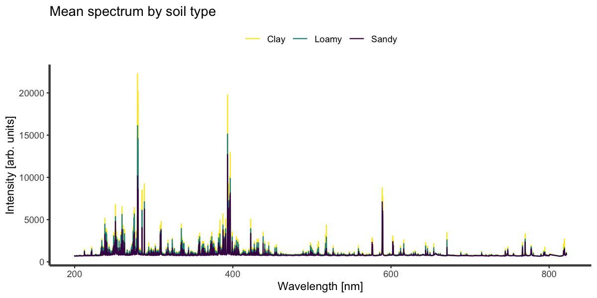
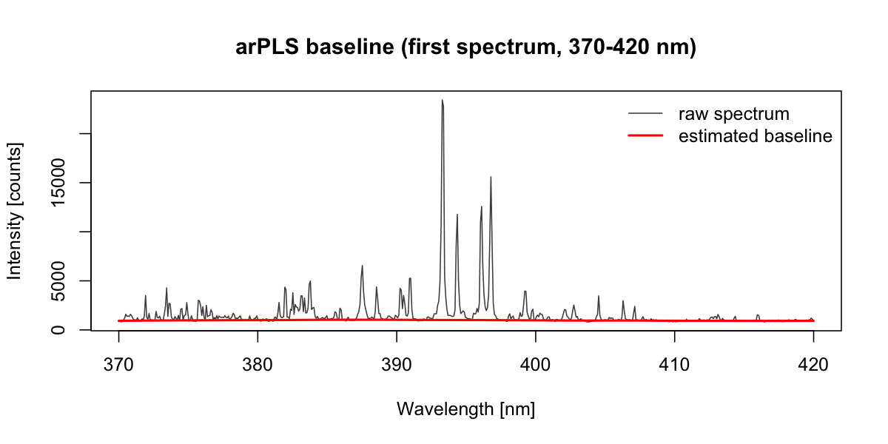
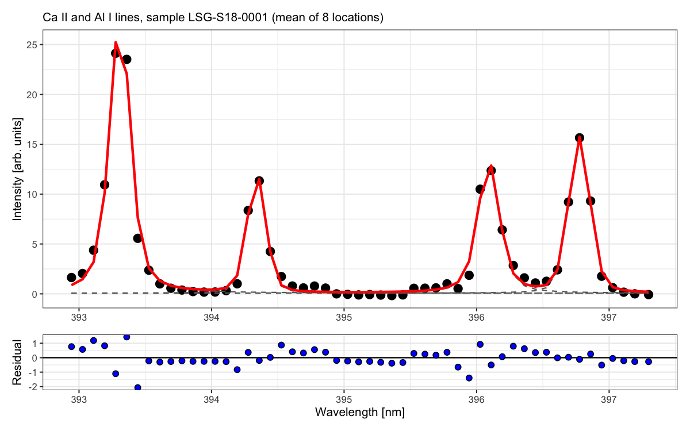
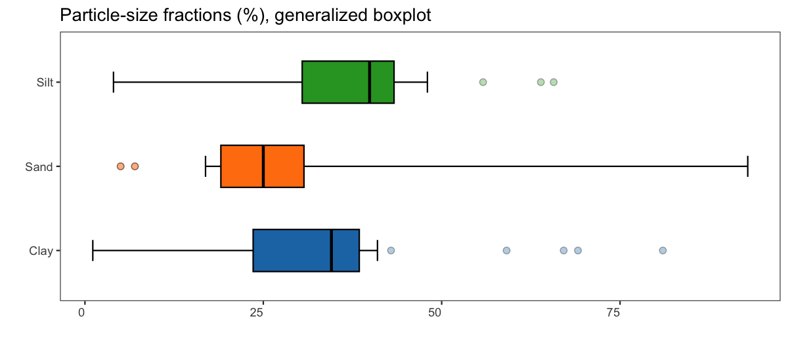

# specProc

**specProc** is an R package for preprocessing and exploring emission
spectra, with a focus on laser-induced breakdown spectroscopy (LIBS). It
covers the full chain between raw detector counts and a data matrix
ready for modeling:

- **Baseline correction**: asymmetric least squares, arPLS, and
  iterative polynomial fitting.
- **Normalization and scaling**: SNV, MSC, area, background and
  internal-standard normalization; Pareto, Poisson and min-max scaling.
- **Removing unwanted variation**: OSC (three algorithms), direct
  orthogonalization, DOSC, NAS, O2PLS, projected OSC, EPO, GLSW.
- **Calibration transfer** between instruments: PDS, GLSW.
- **Line fitting**: exact Voigt, pseudo-Voigt, Gaussian and Lorentzian
  profiles, for single or overlapping lines.
- **Robust statistics and outlier detection**: biweight estimators,
  Rousseeuw–Croux Sn/Qn, bias-corrected MAD, medcouple-based skewness
  and tail weights, adjusted and generalized boxplots, directional
  outlyingness.

The computationally heavy steps are written in C++: penalized baselines
use a banded solver, the Voigt profile uses the Faddeeva function, and
the large matrix decompositions use Eigen. This keeps the package
practical for data sets with thousands of spectra and channels.

## Installation

specProc is not yet on CRAN. Install the development version from
GitHub:

``` r

# install.packages("remotes")
remotes::install_github("ChristianGoueguel/specProc", build_vignettes = TRUE)
```

A C++ compiler is needed to build the package from source (Rtools on
Windows, Xcode Command Line Tools on macOS).
[`opls()`](https://christiangoueguel.com/specProc/reference/opls.md)
additionally needs the Bioconductor package ropls:
`BiocManager::install("ropls")`.

## Design principles

- **Tidy in, tidy out.** Spectra are stored one per row, and the column
  names are the wavelengths. Functions accept matrices, data frames or
  tibbles and return tibbles.
- **Preprocessing parameters are returned, not hidden.** Centers,
  scales, reference spectra, filter matrices and loadings come back with
  the result. You can then estimate a transformation on calibration data
  and apply exactly the same transformation to new data.
- **Robust alternatives are available alongside the classical
  estimators.** Emission spectra contain outlying shots, saturated
  channels and heavy tails, and the robust estimators are designed for
  them.
- **The numerics are tested against references.** The test suite (more
  than 400 expectations) checks results against analytic values, dense
  reference solvers and independent implementations, such as the
  Bioconductor ropls package for OPLS.

## Example data

The package ships with `specLIBS`: LIBS spectra of **50 soil samples**,
each measured at **8 locations**. The spectra have 7152 channels between
199 and 822 nm, stored as raw counts, together with the clay, sand and
silt content of each sample.

``` r

library(specProc)
data(specLIBS)

meta <- specLIBS[1:8]                       # sample information
X <- as.matrix(specLIBS[-(1:8)])            # 400 x 7152 intensity matrix
wl <- as.numeric(colnames(X))               # wavelengths (nm)

dim(X)
#> [1]  400 7152
table(soil_type = meta$Type) / 8            # number of samples per soil type
#> soil_type
#>  Clay Loamy Sandy 
#>     6    37     7
```

The design is **nested**: the 8 spectra of a sample are repeated
measurements of the same material, not independent observations.
Treating them as 400 independent samples inflates the apparent sample
size and biases cross-validated errors downward. The worked example
below uses the sample as the unit of analysis wherever it matters.

``` r

by_type <- average(cbind(Type = meta$Type, as.data.frame(X)), Type)
plot_spectra(by_type, id = Type) +
  ggplot2::theme(legend.position = "top") +
  ggplot2::labs(color = NULL, title = "Mean spectrum by soil type")
```



## A worked example

### 1. Baseline correction

LIBS spectra sit on a continuum from bremsstrahlung and recombination
radiation.
[`baseline_arpls()`](https://christiangoueguel.com/specProc/reference/baseline_arpls.md)
estimates it with asymmetrically reweighted penalized least squares.
Positive residuals (the emission lines) are downweighted, so the
baseline follows the continuum instead of the peaks. The smoothing
parameter `lambda` controls how stiff the baseline is.

``` r

bl <- baseline_arpls(X, lambda = 1e5, max.iter = 20)
Xc <- as.matrix(bl$correction)
```



The baseline is a model estimate, and the choice of `lambda` propagates
into line areas. Report the value you used, and check how sensitive your
downstream results are to it.

### 2. Normalization and shot-to-shot repeatability

Laser–sample coupling changes from shot to shot, so the whole spectrum
fluctuates in intensity. Normalization aims to remove this
multiplicative effect. The relative standard deviation (RSD) of a line
across the 8 locations of a sample measures how well it works. The lower
the RSD, the more repeatable the measurement:

``` r

line_area <- function(M, center, half_width = 0.15) {
  rowSums(M[, abs(wl - center) < half_width, drop = FALSE])
}
within_rsd <- function(v) {
  median(tapply(v, meta$Sample, function(z) sd(z) / mean(z) * 100))
}

Xsnv <- as.matrix(snv(Xc)$correction)
Xarea <- as.matrix(normalize(as.data.frame(Xc), method = "area"))

tibble::tibble(
  preprocessing = c("raw", "baseline", "baseline + area", "baseline + SNV"),
  `median RSD of Ca II 393.37 nm (%)` = round(c(
    within_rsd(line_area(X, 393.37)),
    within_rsd(line_area(Xc, 393.37)),
    within_rsd(line_area(Xarea, 393.37)),
    within_rsd(line_area(Xsnv, 393.37))
  ), 2)
)
#> # A tibble: 4 × 2
#>   preprocessing   `median RSD of Ca II 393.37 nm (%)`
#>   <chr>                                         <dbl>
#> 1 raw                                            6.19
#> 2 baseline                                       6.73
#> 3 baseline + area                                5.44
#> 4 baseline + SNV                                 3.79
```

On this data set, SNV reduces the typical shot-to-shot RSD of the Ca II
line by about 40%. Baseline subtraction alone slightly increases the
RSD. This is expected: the raw line area includes the detector offset
and continuum, a large and relatively stable component that dilutes the
relative variation. Removing it exposes the true variability of the
line, which normalization then has to correct. Which normalization works
best depends on the matrix and the line, so compare the options on
replicate spectra rather than assuming one.

### 3. Screening outlying shots

A misfired or defocused shot can bias a sample’s mean spectrum. Compare
each shot with the other shots of the same sample, using a robust
z-score (median and MAD) of the total emitted intensity:

``` r

total <- rowSums(X)
robust_z <- ave(total, meta$Sample, FUN = function(v) (v - median(v)) / mad(v))
table(flagged = abs(robust_z) > 3.5)
#> flagged
#> FALSE  TRUE 
#>   384    16
```

The median and MAD are used because, with 8 shots per sample, a single
aberrant shot shifts the mean and inflates the standard deviation enough
to hide itself. `zscore(robust = TRUE)`, `iqr_outliers(skew = TRUE)`
(medcouple-adjusted fences) and
[`directional_outlyingness()`](https://christiangoueguel.com/specProc/reference/directional_outlyingness.md)
provide the same screening for a single vector.

### 4. Averaging replicates

After screening, reduce each sample to one spectrum.
[`average()`](https://christiangoueguel.com/specProc/reference/average.md)
computes group means in C++:

``` r

keep <- abs(robust_z) <= 3.5
Xs <- average(cbind(Sample = meta$Sample[keep], as.data.frame(Xsnv[keep, ])), Sample)
samples <- meta[match(Xs$Sample, meta$Sample), c("Sample", "Clay", "Sand", "Silt", "Type")]
dim(Xs)
#> [1]   50 7153
```

### 5. Fitting emission lines

The Ca II 393.37 / 396.85 nm and Al I 394.40 / 396.15 nm lines overlap
in the 393–397 nm window.
[`multipeak_fit()`](https://christiangoueguel.com/specProc/reference/multipeak_fit.md)
fits them jointly as a sum of exact Voigt profiles on a common baseline.
Each line’s center, Gaussian and Lorentzian widths (FWHM) and area are
estimated by Levenberg–Marquardt least squares.

``` r

window <- names(Xs)[-1][wl > 392.9 & wl < 397.3]
fit <- multipeak_fit(
  Xs[1, c("Sample", window)],
  peaks = c(393.37, 394.40, 396.15, 396.85),
  profiles = "voigt",
  id = "Sample"
)
fit$tidied[[1]]
#> # A tibble: 17 × 5
#>    term  estimate std.error  statistic   p.value
#>    <chr>    <dbl>     <dbl>      <dbl>     <dbl>
#>  1 y0      0.0712   0.232        0.307 7.61e-  1
#>  2 xc_1  393.       0.00246 159628.    6.64e-161
#>  3 wG_1    0.129    0.0257       5.00  1.50e-  5
#>  4 wL_1    0.0943   0.0265       3.56  1.06e-  3
#>  5 A_1     6.68     0.394       17.0   9.28e- 19
#>  6 xc_2  394.       0.00530  74474.    5.52e-149
#>  7 wG_2    0.144    0.0423       3.39  1.70e-  3
#>  8 wL_2    0.0374   0.0569       0.658 5.15e-  1
#>  9 A_2     2.27     0.342        6.65  9.48e-  8
#> 10 xc_3  396.       0.00534  74156.    6.44e-149
#> 11 wG_3    0.141    0.0466       3.03  4.52e-  3
#> 12 wL_3    0.0894   0.0536       1.67  1.04e-  1
#> 13 A_3     3.26     0.393        8.29  7.14e- 10
#> 14 xc_4  397.       0.00426  93151.    1.75e-152
#> 15 wG_4    0.162    0.0314       5.15  9.44e-  6
#> 16 wL_4    0.0442   0.0428       1.03  3.08e-  1
#> 17 A_4     3.41     0.346        9.84  9.64e- 12
```

``` r

plot_fit(fit, title = "Ca II and Al I lines, sample LSG-S18-0001 (mean of 8 locations)")
```



Read the parameter table critically:

- **The standard errors are conditional on the model.** They assume
  independent, homoscedastic Gaussian errors. LIBS noise is closer to
  Poisson, and residuals are correlated along the wavelength axis, so
  treat these standard errors as lower bounds. The spread of the
  parameters across the 8 replicate locations is a more honest measure
  of uncertainty.
- **Some parameters are poorly identified.** The Lorentzian widths of
  the weaker lines are not significantly different from zero. The data
  cannot separate Stark from Doppler/instrumental broadening for those
  lines. Consider fixing them, or using a simpler profile.

The exact Voigt profile is also available directly.
[`voigt_profile()`](https://christiangoueguel.com/specProc/reference/voigt_profile.md)
uses the Faddeeva function and is accurate to about 1e-10. The faster
[`pseudo_voigt_profile()`](https://christiangoueguel.com/specProc/reference/pseudo_voigt_profile.md)
approximation deviates from it by up to about 1%:

``` r

x <- seq(-2, 2, length.out = 400)
v <- voigt_profile(x, y0 = 0, xc = 0, wG = 0.6, wL = 0.4, A = 1)
pv <- pseudo_voigt_profile(x, y0 = 0, xc = 0, wG = 0.6, wL = 0.4, A = 1)$y
max(abs(v - pv)) / max(v)
#> [1] 0.01234509
```

### 6. Descriptive statistics: classical and robust

The texture fractions are bounded (0–100%), skewed, and contain a few
extreme samples. The robust summary reports the median, MAD, Sn and Qn,
biweight estimators, and medcouple-based measures of skewness and tail
weight:

``` r

summary_stats(samples[c("Clay", "Sand", "Silt")])
#> # A tibble: 3 × 14
#>   variable  mean  mode median   IQR    sd variance    cv   min   max range
#>   <chr>    <dbl> <dbl>  <dbl> <dbl> <dbl>    <dbl> <dbl> <dbl> <dbl> <dbl>
#> 1 Clay      31.8  35.1   34.6  14.9  16.1     260.  50.6   1.1  81    79.9
#> 2 Sand      33.6  19     25    11.6  25.2     637.  75.1   5    92.9  87.9
#> 3 Silt      34.6  39.9   39.9  12.9  15.4     237.  44.5   4    65.7  61.7
#> # ℹ 3 more variables: skewness <dbl>, kurtosis <dbl>, count <int>
summary_stats(samples[c("Clay", "Sand", "Silt")], robust = TRUE)
#> # A tibble: 3 × 13
#>   variable median   mad    Qn    Sn medcouple   LMC   RMC biloc biscale bivar
#>   <chr>     <dbl> <dbl> <dbl> <dbl>     <dbl> <dbl> <dbl> <dbl>   <dbl> <dbl>
#> 1 Clay       34.6  6.75  8.26  7.15     -0.45  0.23 -0.3   34.2   11.2  126. 
#> 2 Sand       25    8.9   8.47  9.42      0.06  0.02  0.85  22.9    9.1   82.8
#> 3 Silt       39.9  6.08  8.26  8.22     -0.5   0.44  0.02  40.0    8.54  72.9
#> # ℹ 2 more variables: rcv <dbl>, count <int>
```

The medcouple (MC) is a robust measure of skewness, bounded in \[−1,
1\]. For Clay and Silt it is strongly negative (left skew). Where the
mean and median, or the SD and robust scale, disagree, a few
observations are driving the classical estimates.

The generalized boxplot (Bruffaerts et al., 2014) fits a Tukey g-and-h
distribution, so its whiskers adapt to both skewness (*g*) and tail
heaviness (*h*). Its fences are placed so that, under the fitted model,
the chosen proportion `alpha` of observations falls outside them:

``` r

generalized_boxplot(samples[c("Clay", "Sand", "Silt")], xlabels.angle = 0) +
  ggplot2::coord_flip() +
  ggplot2::labs(title = "Particle-size fractions (%), generalized boxplot")
```



### 7. Correlation: why robustness matters

How strongly do line intensities track clay content? Compare Pearson’s
correlation with the biweight midcorrelation, which downweights
observations far from the bulk of the data:

``` r

Xmat <- as.matrix(Xs[-1])
lines_df <- data.frame(
  Clay = samples$Clay,
  `Mg II 279.55` = line_area(Xmat, 279.55),
  `Si I 288.16` = line_area(Xmat, 288.16),
  `Ca II 393.37` = line_area(Xmat, 393.37),
  `Al I 396.15` = line_area(Xmat, 396.15),
  `K I 766.49` = line_area(Xmat, 766.49),
  check.names = FALSE
)
pearson <- correlation(lines_df, Clay)
bicor <- correlation(lines_df, Clay, method = "bicor")
merge(pearson[1:2], bicor[1:2], by = "variable", suffixes = c("_pearson", "_bicor"))
#>       variable .correlation_pearson .correlation_bicor
#> 1  Al I 396.15           -0.6442892         -0.2391099
#> 2 Ca II 393.37           -0.5734797         -0.4272420
#> 3   K I 766.49            0.7676607          0.5171088
#> 4 Mg II 279.55            0.7565064          0.3375982
#> 5  Si I 288.16           -0.5498840         -0.3494116
```

The two coefficients disagree sharply for some lines, notably Mg, which
means a handful of extreme-texture samples drive the Pearson values.
Neither number is “the” correlation. The gap tells you to look at the
scatter plots, and to be cautious about extrapolating to the bulk of the
data.
[`correlation()`](https://christiangoueguel.com/specProc/reference/correlation.md)
also provides Spearman, Kendall and Chatterjee’s ξ, which captures
non-monotonic dependence.

### 8. Removing unwanted variation

Remaining shot-to-shot differences within a sample are nuisance
variation. External parameter orthogonalization (EPO) estimates the
dominant directions of such variation from a *clutter matrix* and
projects them out. The clutter matrix here is the deviation of each
spectrum from its sample mean:

``` r

sample_means <- apply(Xsnv, 2, function(v) ave(v, meta$Sample))
clutter <- Xsnv - sample_means

sd_ca <- function(M) median(tapply(line_area(M, 393.37), meta$Sample, sd))
sapply(c(0, 1, 2, 3, 5), function(k) {
  M <- if (k == 0) Xsnv else as.matrix(epo(Xsnv, ncomp = k, clutter = clutter)$correction)
  c(ncomp = k, within_sample_sd = round(sd_ca(M), 3))
})
#>                   [,1]  [,2]  [,3]  [,4]  [,5]
#> ncomp            0.000 1.000 2.000 3.000 5.000
#> within_sample_sd 1.933 1.636 1.014 0.912 0.839
```

Here the clutter directions are estimated from the same spectra they are
evaluated on, so this reduction is optimistic. In practice, estimate the
EPO projection (or a
[`glsw()`](https://christiangoueguel.com/specProc/reference/glsw.md)
filter) on calibration samples only, and choose `ncomp` by
cross-validation with folds formed by sample.

The same rule applies to supervised filters that use the response:
[`osc()`](https://christiangoueguel.com/specProc/reference/osc.md),
[`direct_osc()`](https://christiangoueguel.com/specProc/reference/direct_osc.md),
[`direct_orthogonal()`](https://christiangoueguel.com/specProc/reference/direct_orthogonal.md),
[`nas()`](https://christiangoueguel.com/specProc/reference/nas.md),
[`o2pls()`](https://christiangoueguel.com/specProc/reference/o2pls.md)
and
[`projected_osc()`](https://christiangoueguel.com/specProc/reference/projected_osc.md).
Refit them inside each cross-validation fold. If a filter is fitted once
on all the data before cross-validating, the estimated prediction error
is biased downward. Each function returns what you need to apply the
fitted filter to new spectra: loadings, weights, centers and scales.

## Learn more

The vignettes develop the example above in more depth:

- [`vignette("preprocessing", package = "specProc")`](https://christiangoueguel.com/specProc/articles/preprocessing.md):
  choosing and checking each preprocessing step against replicate data.
- [`vignette("line-fitting", package = "specProc")`](https://christiangoueguel.com/specProc/articles/line-fitting.md):
  choosing a line profile, and the sources of uncertainty in fitted line
  areas.
- [`vignette("calibration", package = "specProc")`](https://christiangoueguel.com/specProc/articles/calibration.md):
  predicting soil clay content with a compositional (log-ratio) PLS
  model, and estimating prediction error without leakage.

They are also available as [articles on the package
website](https://christiangoueguel.com/specProc/articles/).

## Function overview

| Task | Functions |
|----|----|
| Baseline correction | [`baseline_arpls()`](https://christiangoueguel.com/specProc/reference/baseline_arpls.md), [`baseline_als()`](https://christiangoueguel.com/specProc/reference/baseline_als.md), [`baseline_lsp()`](https://christiangoueguel.com/specProc/reference/baseline_lsp.md) |
| Normalization | [`snv()`](https://christiangoueguel.com/specProc/reference/snv.md), [`msc()`](https://christiangoueguel.com/specProc/reference/msc.md), [`normalize()`](https://christiangoueguel.com/specProc/reference/normalize.md) |
| Scaling and centering | [`center()`](https://christiangoueguel.com/specProc/reference/center.md), [`pareto_scale()`](https://christiangoueguel.com/specProc/reference/pareto_scale.md), [`poisson_scale()`](https://christiangoueguel.com/specProc/reference/poisson_scale.md), [`minmax()`](https://christiangoueguel.com/specProc/reference/minmax.md) |
| Orthogonal filtering | [`osc()`](https://christiangoueguel.com/specProc/reference/osc.md), [`direct_osc()`](https://christiangoueguel.com/specProc/reference/direct_osc.md), [`direct_orthogonal()`](https://christiangoueguel.com/specProc/reference/direct_orthogonal.md), [`nas()`](https://christiangoueguel.com/specProc/reference/nas.md), [`projected_osc()`](https://christiangoueguel.com/specProc/reference/projected_osc.md), [`o2pls()`](https://christiangoueguel.com/specProc/reference/o2pls.md), [`opls()`](https://christiangoueguel.com/specProc/reference/opls.md) |
| Interference removal | [`epo()`](https://christiangoueguel.com/specProc/reference/epo.md), [`glsw()`](https://christiangoueguel.com/specProc/reference/glsw.md), [`y_gradient_glsw()`](https://christiangoueguel.com/specProc/reference/y_gradient_glsw.md) |
| Calibration transfer | [`pds()`](https://christiangoueguel.com/specProc/reference/pds.md) |
| Line profiles | [`voigt_profile()`](https://christiangoueguel.com/specProc/reference/voigt_profile.md), [`pseudo_voigt_profile()`](https://christiangoueguel.com/specProc/reference/pseudo_voigt_profile.md), [`gaussian_profile()`](https://christiangoueguel.com/specProc/reference/gaussian_profile.md), [`lorentzian_profile()`](https://christiangoueguel.com/specProc/reference/lorentzian_profile.md) |
| Line fitting | [`peak_fit()`](https://christiangoueguel.com/specProc/reference/peak_fit.md), [`multipeak_fit()`](https://christiangoueguel.com/specProc/reference/multipeak_fit.md), [`plot_fit()`](https://christiangoueguel.com/specProc/reference/plot_fit.md) |
| Location and scale | [`biweight_location()`](https://christiangoueguel.com/specProc/reference/biweight_location.md), [`biweight_scale()`](https://christiangoueguel.com/specProc/reference/biweight_scale.md), [`biweight_midvariance()`](https://christiangoueguel.com/specProc/reference/biweight_midvariance.md), [`rousseeuw_croux()`](https://christiangoueguel.com/specProc/reference/rousseeuw_croux.md), [`umad()`](https://christiangoueguel.com/specProc/reference/umad.md) |
| Association | [`correlation()`](https://christiangoueguel.com/specProc/reference/correlation.md), [`biweight_midcovariance()`](https://christiangoueguel.com/specProc/reference/biweight_midcovariance.md), [`biweight_midcorrelation()`](https://christiangoueguel.com/specProc/reference/biweight_midcorrelation.md) |
| Skewness and tail weight | [`medcouple_weight()`](https://christiangoueguel.com/specProc/reference/medcouple_weight.md), [`quantile_weight()`](https://christiangoueguel.com/specProc/reference/quantile_weight.md), [`tukey_gh()`](https://christiangoueguel.com/specProc/reference/tukey_gh.md) |
| Outlier detection | [`zscore()`](https://christiangoueguel.com/specProc/reference/zscore.md), [`iqr_outliers()`](https://christiangoueguel.com/specProc/reference/iqr_outliers.md), [`directional_outlyingness()`](https://christiangoueguel.com/specProc/reference/directional_outlyingness.md), [`plot_outliers()`](https://christiangoueguel.com/specProc/reference/plot_outliers.md) |
| Exploration | [`summary_stats()`](https://christiangoueguel.com/specProc/reference/summary_stats.md), [`adjusted_boxplot()`](https://christiangoueguel.com/specProc/reference/adjusted_boxplot.md), [`generalized_boxplot()`](https://christiangoueguel.com/specProc/reference/generalized_boxplot.md), [`plot_spectra()`](https://christiangoueguel.com/specProc/reference/plot_spectra.md), [`average()`](https://christiangoueguel.com/specProc/reference/average.md) |
| Transformation to normality | [`robust_bcyj()`](https://christiangoueguel.com/specProc/reference/robust_bcyj.md) |

### Robust estimators at a glance

For estimators of scale, the breakdown point is the largest fraction of
contaminated observations the estimator can tolerate. The efficiency is
its asymptotic efficiency relative to the standard deviation for normal
data.

| Estimator | Function | Breakdown point | Efficiency |
|----|----|----|----|
| Standard deviation | [`stats::sd()`](https://rdrr.io/r/stats/sd.html) | 0% | 100% |
| MAD (bias-corrected) | [`umad()`](https://christiangoueguel.com/specProc/reference/umad.md) | 50% | 37% |
| Rousseeuw–Croux Sn | `rousseeuw_croux(estimator = "Sn")` | 50% | 58% |
| Rousseeuw–Croux Qn | `rousseeuw_croux(estimator = "Qn")` | 50% | 82% |
| Biweight midvariance | [`biweight_midvariance()`](https://christiangoueguel.com/specProc/reference/biweight_midvariance.md), [`biweight_scale()`](https://christiangoueguel.com/specProc/reference/biweight_scale.md) | high | ≈ 87% |

[`umad()`](https://christiangoueguel.com/specProc/reference/umad.md) and
[`rousseeuw_croux()`](https://christiangoueguel.com/specProc/reference/rousseeuw_croux.md)
include finite-sample bias corrections (Park et al., 2020; Akinshin,
2022), so they are also unbiased at the normal distribution for small
samples, such as the 8 replicates per sample.

## Performance

Timings on the full `specLIBS` data set (400 spectra × 7152 channels) on
an Apple Silicon desktop:

| Operation | Time |
|----|----|
| [`baseline_arpls()`](https://christiangoueguel.com/specProc/reference/baseline_arpls.md), 400 spectra | 0.6 s |
| [`baseline_als()`](https://christiangoueguel.com/specProc/reference/baseline_als.md), 400 spectra | 0.5 s |
| `epo(ncomp = 3)` | 0.4 s |
| [`snv()`](https://christiangoueguel.com/specProc/reference/snv.md) | 0.08 s |
| [`voigt_profile()`](https://christiangoueguel.com/specProc/reference/voigt_profile.md), 10⁶ points | 0.07 s |

For comparison, one iteration of the dense penalized least-squares solve
for a single 7152-channel spectrum takes about 30 s. The banded solver
does the same computation in linear time.

## References

The main methodological references are:

- Baek, S.-J., et al. (2015). Baseline correction using asymmetrically
  reweighted penalized least squares smoothing. *Analyst*, 140, 250–257.
- Eilers, P.H.C., Boelens, H.F.M. (2005). Baseline correction with
  asymmetric least squares smoothing.
- Roger, J.-M., Chauchard, F., Bellon-Maurel, V. (2003). EPO-PLS
  external parameter orthogonalisation of PLS. *Chemometr. Intell. Lab.
  Syst.*, 66, 191–204.
- Martens, H., et al. (2003). Pre-whitening of data by
  covariance-weighted pre-processing. *J. Chemometrics*, 17, 153–165.
- Trygg, J., Wold, S. (2002). Orthogonal projections to latent
  structures (O-PLS). *J. Chemometrics*, 16, 119–128.
- Weideman, J.A.C. (1994). Computation of the complex error function.
  *SIAM J. Numer. Anal.*, 31, 1497–1518.
- Rousseeuw, P.J., Croux, C. (1993). Alternatives to the median absolute
  deviation. *JASA*, 88, 1273–1283.
- Hubert, M., Vandervieren, E. (2008). An adjusted boxplot for skewed
  distributions. *Comput. Stat. Data Anal.*, 52, 5186–5201.
- Bruffaerts, C., Verardi, V., Vermandele, C. (2014). A generalized
  boxplot for skewed and heavy-tailed distributions. *Stat. Probab.
  Lett.*, 95, 110–117.

Each function’s help page gives the full references for its method.

## Contributing

Bug reports and feature requests are welcome on the [issue
tracker](https://github.com/ChristianGoueguel/specProc/issues). Please
include a minimal reproducible example.

## License

MIT © Christian L. Goueguel
