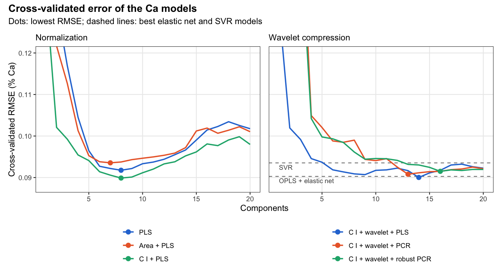

# specProc

**specProc** processes and analyzes emission spectra, streamlining the
pipeline from raw spectra to calibrated concentrations. While
specifically developed for laser-induced breakdown spectroscopy (LIBS),
it seamlessly supports other plasma techniques such as ICP-OES. Select
functions can also be used to process Raman and infrared
spectroscopy data. The package structures data with one spectrum per row
and wavelengths as column names, leveraging a C++ backend to power heavy
computations.

## Installation

``` r

# install.packages("remotes")
remotes::install_github("ChristianGoueguel/specProc", build_vignettes = TRUE)
```

A C++ compiler is needed to build the package from source (Rtools on
Windows, Xcode Command Line Tools on macOS).

## A LIBS workflow

The vignettes follow a typical LIBS analysis, on the `forageLIBS`
spectra of forage samples:

1.  **Fitting emission lines**
    ([`vignette("peak-fitting")`](https://christiangoueguel.com/specProc/articles/peak-fitting.md)):
    line identification, wavelength calibration, line profiles and
    overlapping lines.
2.  **Preprocessing with recipe steps**
    ([`vignette("preprocessing")`](https://christiangoueguel.com/specProc/articles/preprocessing.md)):
    baseline correction, normalization and other `step_*()` functions,
    in a tidymodels workflow.
3.  **Calibration curves and figures of merit**
    ([`vignette("calibration")`](https://christiangoueguel.com/specProc/articles/calibration.md)):
    univariate curves, limits of detection and quantification, and the
    net analyte signal of multivariate models.
4.  **Plasma diagnostics**
    ([`vignette("plasma-diagnostics")`](https://christiangoueguel.com/specProc/articles/plasma-diagnostics.md)):
    electron density, temperature, LTE, self-absorption and
    calibration-free LIBS.

They are also available as [articles on the package
website](https://christiangoueguel.com/specProc/articles/).

## Function overview

| Task | Functions |
|----|----|
| Line identification | [`libs_lines()`](https://christiangoueguel.com/specProc/reference/libs_lines.md), [`plot_lines()`](https://christiangoueguel.com/specProc/reference/plot_lines.md), [`line_finder()`](https://christiangoueguel.com/specProc/reference/line_finder.md) (Shiny app), [`wavelength_calibration()`](https://christiangoueguel.com/specProc/reference/wavelength_calibration.md), [`apply_calibration()`](https://christiangoueguel.com/specProc/reference/apply_calibration.md) |
| Line fitting | [`peak_fit()`](https://christiangoueguel.com/specProc/reference/peak_fit.md), [`multipeak_fit()`](https://christiangoueguel.com/specProc/reference/multipeak_fit.md), [`plot_fit()`](https://christiangoueguel.com/specProc/reference/plot_fit.md), [`line_intensities()`](https://christiangoueguel.com/specProc/reference/line_intensities.md), [`voigt_profile()`](https://christiangoueguel.com/specProc/reference/voigt_profile.md), [`pseudo_voigt_profile()`](https://christiangoueguel.com/specProc/reference/pseudo_voigt_profile.md), [`gaussian_profile()`](https://christiangoueguel.com/specProc/reference/gaussian_profile.md), [`lorentzian_profile()`](https://christiangoueguel.com/specProc/reference/lorentzian_profile.md), [`voigt_fwhm()`](https://christiangoueguel.com/specProc/reference/voigt_fwhm.md) |
| Preprocessing | [`baseline_arpls()`](https://christiangoueguel.com/specProc/reference/baseline_arpls.md), [`baseline_als()`](https://christiangoueguel.com/specProc/reference/baseline_als.md), [`baseline_lsp()`](https://christiangoueguel.com/specProc/reference/baseline_lsp.md), [`snv()`](https://christiangoueguel.com/specProc/reference/snv.md), [`msc()`](https://christiangoueguel.com/specProc/reference/msc.md), [`emsc()`](https://christiangoueguel.com/specProc/reference/emsc.md), [`normalize()`](https://christiangoueguel.com/specProc/reference/normalize.md), [`savitzky_golay()`](https://christiangoueguel.com/specProc/reference/savitzky_golay.md), [`wavelet_features()`](https://christiangoueguel.com/specProc/reference/wavelet_features.md), [`reject_shots()`](https://christiangoueguel.com/specProc/reference/reject_shots.md), [`average()`](https://christiangoueguel.com/specProc/reference/average.md) |
| Recipe steps | [`step_baseline()`](https://christiangoueguel.com/specProc/reference/step_baseline.md), [`step_snv()`](https://christiangoueguel.com/specProc/reference/step_snv.md), [`step_msc()`](https://christiangoueguel.com/specProc/reference/step_msc.md), [`step_emsc()`](https://christiangoueguel.com/specProc/reference/step_emsc.md), [`step_spectral_norm()`](https://christiangoueguel.com/specProc/reference/step_spectral_norm.md), [`step_line_ratio()`](https://christiangoueguel.com/specProc/reference/step_line_ratio.md), [`step_savgol()`](https://christiangoueguel.com/specProc/reference/step_savgol.md), [`step_wavelet()`](https://christiangoueguel.com/specProc/reference/step_wavelet.md), [`step_line_intensities()`](https://christiangoueguel.com/specProc/reference/step_line_intensities.md), [`step_reject_shots()`](https://christiangoueguel.com/specProc/reference/step_reject_shots.md), [`step_opls()`](https://christiangoueguel.com/specProc/reference/step_opls.md), [`step_o2pls()`](https://christiangoueguel.com/specProc/reference/step_o2pls.md), [`step_epo()`](https://christiangoueguel.com/specProc/reference/step_epo.md), [`step_glsw()`](https://christiangoueguel.com/specProc/reference/step_glsw.md), and more |
| Orthogonalization | [`osc()`](https://christiangoueguel.com/specProc/reference/osc.md), [`direct_osc()`](https://christiangoueguel.com/specProc/reference/direct_osc.md), [`projected_osc()`](https://christiangoueguel.com/specProc/reference/projected_osc.md), [`opls()`](https://christiangoueguel.com/specProc/reference/opls.md), [`o2pls()`](https://christiangoueguel.com/specProc/reference/o2pls.md), [`epo()`](https://christiangoueguel.com/specProc/reference/epo.md), [`glsw()`](https://christiangoueguel.com/specProc/reference/glsw.md), [`y_gradient_glsw()`](https://christiangoueguel.com/specProc/reference/y_gradient_glsw.md) |
| Calibration | [`calibration_curve()`](https://christiangoueguel.com/specProc/reference/calibration_curve.md), [`plot_calibration()`](https://christiangoueguel.com/specProc/reference/plot_calibration.md), [`nas()`](https://christiangoueguel.com/specProc/reference/nas.md), [`pds()`](https://christiangoueguel.com/specProc/reference/pds.md) |
| Plasma diagnostics | [`saturation_summary()`](https://christiangoueguel.com/specProc/reference/saturation_summary.md), [`electron_density()`](https://christiangoueguel.com/specProc/reference/electron_density.md), [`boltzmann()`](https://christiangoueguel.com/specProc/reference/boltzmann.md), [`saha_boltzmann()`](https://christiangoueguel.com/specProc/reference/saha_boltzmann.md), [`plot_boltzmann()`](https://christiangoueguel.com/specProc/reference/plot_boltzmann.md), [`mcwhirter_criterion()`](https://christiangoueguel.com/specProc/reference/mcwhirter_criterion.md), [`self_absorption()`](https://christiangoueguel.com/specProc/reference/self_absorption.md), [`correct_self_absorption()`](https://christiangoueguel.com/specProc/reference/correct_self_absorption.md), [`cf_libs()`](https://christiangoueguel.com/specProc/reference/cf_libs.md), [`nist_lines()`](https://christiangoueguel.com/specProc/reference/nist_lines.md), [`starkb_lines()`](https://christiangoueguel.com/specProc/reference/starkb_lines.md) |
| Outliers and robust PCA | [`robpca()`](https://christiangoueguel.com/specProc/reference/robpca.md), [`rospca()`](https://christiangoueguel.com/specProc/reference/rospca.md), [`macropca()`](https://christiangoueguel.com/specProc/reference/macropca.md), [`cellpca()`](https://christiangoueguel.com/specProc/reference/cellpca.md), [`plot_outlier_map()`](https://christiangoueguel.com/specProc/reference/plot_outlier_map.md), [`plot_cell_map()`](https://christiangoueguel.com/specProc/reference/plot_cell_map.md), [`q_residuals()`](https://christiangoueguel.com/specProc/reference/q_residuals.md), [`dmodx()`](https://christiangoueguel.com/specProc/reference/dmodx.md), [`plot_influence()`](https://christiangoueguel.com/specProc/reference/plot_influence.md), [`hotelling_t2()`](https://christiangoueguel.com/specProc/reference/hotelling_t2.md) |
| Robust statistics | [`summary_stats()`](https://christiangoueguel.com/specProc/reference/summary_stats.md), [`biweight_location()`](https://christiangoueguel.com/specProc/reference/biweight_location.md), [`biweight_scale()`](https://christiangoueguel.com/specProc/reference/biweight_scale.md), [`rousseeuw_croux()`](https://christiangoueguel.com/specProc/reference/rousseeuw_croux.md), [`umad()`](https://christiangoueguel.com/specProc/reference/umad.md), [`adjusted_boxplot()`](https://christiangoueguel.com/specProc/reference/adjusted_boxplot.md), [`robust_bcyj()`](https://christiangoueguel.com/specProc/reference/robust_bcyj.md) |
| Visualization | [`plot_spectra()`](https://christiangoueguel.com/specProc/reference/plot_spectra.md), [`plot_embedding()`](https://christiangoueguel.com/specProc/reference/plot_embedding.md), [`plot_loadings()`](https://christiangoueguel.com/specProc/reference/plot_loadings.md), [`plot_contributions()`](https://christiangoueguel.com/specProc/reference/plot_contributions.md) |

See the [reference](https://christiangoueguel.com/specProc/reference/)
for the full list.

## Example: Comparing preprocessing pipelines

Which preprocessing and which model suit a LIBS calibration is an
empirical question. Since every specProc step is a recipe step,
candidate pipelines can be compared on an equal footing: each recipe is
re-estimated in every resample, together with the model. Here we predict
calcium from all 368 `forageLIBS` spectra. Calcium has strong lines in
these spectra (Ca II 393.37 and 396.85 nm, Ca I 422.67 nm), a laboratory
value for every sample, and a calibration error that reaches its minimum
within a few components, so the trade-offs are easy to see.

``` r

data("forageLIBS")
spectra_id <- c("Measurement", "Sample")
minerals <- names(forageLIBS)[3:14]
```

``` r

per_spectrum <- \(data, step, ...) {
  recipe(~ ., data = data) |>
    update_role(all_of(c(spectra_id, minerals)), new_role = "id") |>
    step(all_predictors(), ...) |>
    prep() |>
    bake(new_data = NULL)
}
```

``` r

corrected <- per_spectrum(forageLIBS, step_baseline, lambda = 1e5, options = list(max.iter = 20))
area <- per_spectrum(corrected, step_spectral_norm, method = "area")
carbon <- per_spectrum(corrected, step_line_ratio, reference = 247.856, window = 0.15)
compressed <- per_spectrum(carbon, step_wavelet, level = 3)
```

``` r

ca_recipe <- \(data) {
  recipe(Ca ~ ., data = data) |>
    update_role(all_of(spectra_id), all_of(setdiff(minerals, "Ca")), new_role = "id")
  }
```

The baseline is removed in every pipeline. The steps estimated from the
training data (principal components, orthogonal filter) and the model
parameters are tuned together:

``` r

# mixOmics scales every predictor by default; scale = FALSE only centers
pls_model <- pls(num_comp = tune()) |> set_mode("regression") |> set_engine("mixOmics", scale = FALSE)
pcr_model <- linear_reg() |> set_engine("lm")
enet_model <- linear_reg(penalty = tune(), mixture = tune()) |> set_engine("glmnet")
svr_model <- svm_rbf(cost = tune(), rbf_sigma = tune()) |> set_mode("regression") |> set_engine("kernlab")
```

``` r

components <- tibble(num_comp = 1:20)

pipelines <- list(
  "PLS" = list(ca_recipe(corrected), pls_model, components),
  "Area + PLS" = list(ca_recipe(area), pls_model, components),
  "C I + PLS" = list(ca_recipe(carbon), pls_model, components),
  "C I + wavelet + PLS" = list(ca_recipe(compressed), pls_model, components),
  "C I + wavelet + PCR" = list(ca_recipe(compressed) |> step_center(all_predictors()) |> step_pca(all_predictors(), num_comp = tune()), pcr_model, components),
  "C I + wavelet + robust PCR" = list(ca_recipe(compressed) |> step_robpca(all_predictors(), num_comp = tune(), options = list(kmax = 20)), pcr_model, components),
  "C I + wavelet + OPLS + enet" = list(ca_recipe(compressed) |> step_opls(all_predictors(), num_comp = tune()), enet_model, expand_grid(num_comp = 1:4, penalty = 10^seq(-4, -1, by = 0.5), mixture = c(0.1, 0.5, 1))),
  "C I + wavelet + SVR" = list(ca_recipe(compressed), svr_model,expand_grid(cost = 2^seq(0, 8, by = 2), rbf_sigma = 10^seq(-4.5, -2.5, by = 0.5)))
  )
```

Each pipeline is cross-validated in five repeats of a 5-fold split that
keeps the spectra of a sample in the same fold. The 25 resamples are
spread over parallel workers with the
[future](https://future.futureverse.org) package; tune gives each
resample the same random numbers in parallel as in sequence, so the
results do not depend on the number of workers:

``` r

cv_folds <- \(data) {
  set.seed(2026)
  group_vfold_cv(data, group = Sample, v = 5, repeats = 5)
  }
```

``` r

future::plan("multisession", workers = parallelly::availableCores(omit = 1))
results <- map(pipelines, \(p) {
  rec <- p[[1]]
  tune_grid(
    workflow(rec, p[[2]]), 
    resamples = cv_folds(rec$template), 
    grid = p[[3]],
    metrics = metric_set(rmse, rsq), 
    control = control_grid(save_pred = TRUE)
    )
  })
future::plan("sequential")
```

The cross-validated RMSE of the component-based pipelines as a function
of the number of components: on the left, the normalizations; on the
right, the models of the wavelet coefficients, with the best elastic net
and SVR models (on the same coefficients) as references:



All pipelines are evaluated on the same 25 splits, so they can be
compared split by split. Since the resamples overlap, the standard error
of the mean difference is corrected ([Nadeau and Bengio,
2003](https://doi.org/10.1023/A:1024068626366)):


Contrasts between preprocessing steps and models:

| Contrast | Mean difference (% Ca) | Splits where the first is better | p (corrected) |
|:---|---:|:---|---:|
| C I + PLS vs PLS | -0.0019 | 20 / 25 | 0.24 |
| Area + PLS vs PLS | 0.0018 | 8 / 25 | 0.40 |
| C I + wavelet + PLS vs C I + PLS | 0.0001 | 12 / 25 | 0.96 |
| C I + wavelet + SVR vs C I + wavelet + PLS | 0.0035 | 5 / 25 | 0.36 |

## License

MIT © Christian L. Goueguel
